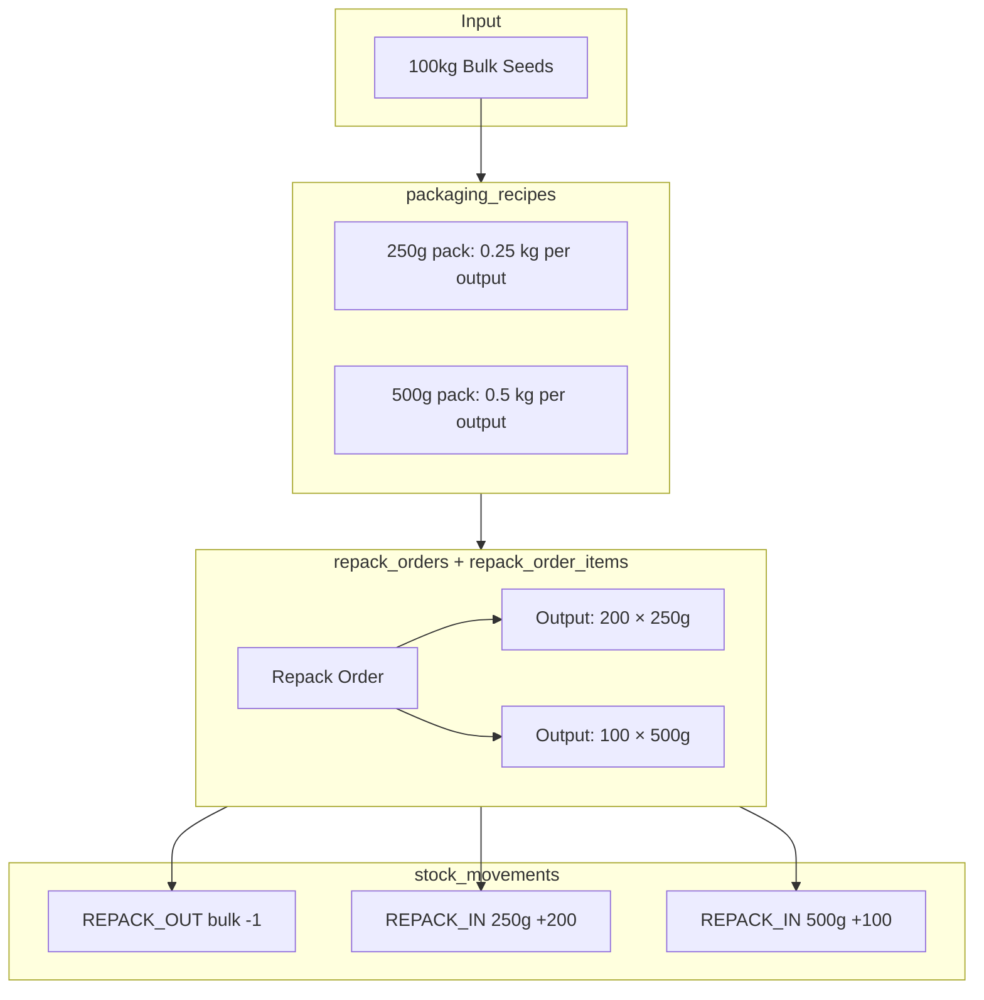

# Bulk Package Entry and Conversion Plan (Repack)

## Current Implementation Summary

- **Product variants** with `unit` (decimal) and `unit_type` (kg, g, piece, pack, bag) - [product_variants migration](backend/src/db/migrations/20260130_add_fields_to_product_variants.sql)
- **warehouse_inventory** at warehouse × product × variant with `stock_count` (integer)
- **stock_movements** - audit trail with types: SALE, RETURN, PURCHASE, ADJUSTMENT, ADJUSTMENT_IN, ADJUSTMENT_OUT, TRANSFER, RECEIPT
- **InventoryService** - no stock change without a stock_movements entry

---

## Design Decisions (Updated)


| Decision          | Choice                                                                              |
| ----------------- | ----------------------------------------------------------------------------------- |
| Movement types    | `REPACK_OUT` (decrease input) and `REPACK_IN` (increase output) in stock_movements  |
| Multi-output flow | Yes - one input (e.g. 100kg bulk) → multiple outputs (200×250g + 100×500g)          |
| Recipe table      | `packaging_recipes` with conversion_ratio for automatic calculation                 |
| Repack orders     | `repack_orders` + `repack_order_items` - header and line items for full audit trail |


---

## Architecture




---

## Implementation Plan

### Phase 1: Database Schema

**1.0 Add `packing_type` and `type` to product_variants**

Add two columns to describe packaging and role:

```sql
ALTER TABLE public.product_variants
ADD COLUMN IF NOT EXISTS packing_type TEXT,  -- Physical pack: bag, box, packet, carton, etc.
ADD COLUMN IF NOT EXISTS type TEXT;          -- Role: bulk, retail, wholesale (for repack input vs output)
```

- **unit** + **unit_type** – size (e.g. unit=10, unit_type=kg → “10 kg”)
- **packing_type** – physical packaging: `bag`, `box`, `packet`, `carton`, etc. (display / clarity)
- **type** – role for repack: `bulk` (repack input), `retail` (sellable output), `wholesale` (optional)

Example: “10 kg bag, bulk” → unit=10, unit_type=kg, packing_type=bag, type=bulk.

Frontend: show both in variant form; use **type** to filter/suggest input (bulk) vs output (retail) in recipes and repack orders.

**1.1 Add REPACK_OUT and REPACK_IN movement types**

Migration to extend `stock_movements` constraint:

```sql
-- Drop and recreate valid_movement_type constraint
ALTER TABLE public.stock_movements DROP CONSTRAINT IF EXISTS valid_movement_type;
ALTER TABLE public.stock_movements ADD CONSTRAINT valid_movement_type
CHECK (movement_type IN ('SALE','RETURN','PURCHASE','ADJUSTMENT','ADJUSTMENT_IN','ADJUSTMENT_OUT','TRANSFER','RECEIPT','REPACK_OUT','REPACK_IN'));
```

**1.2 Create `packaging_recipes` table**

Defines possible outputs from a bulk input. `conversion_ratio` = input quantity (in input variant's unit) consumed per 1 output unit. System calculates output from input automatically.

```sql
CREATE TABLE public.packaging_recipes (
  id UUID PRIMARY KEY DEFAULT uuid_generate_v4(),
  company_id UUID NOT NULL REFERENCES public.companies(id),
  input_product_id UUID NOT NULL REFERENCES public.products(id),
  input_variant_id UUID NOT NULL REFERENCES public.product_variants(id),
  output_product_id UUID NOT NULL REFERENCES public.products(id),
  output_variant_id UUID NOT NULL REFERENCES public.product_variants(id),
  -- Input quantity (in input variant unit) per 1 output unit. E.g. 0.25 = 0.25 kg bulk per 1×250g packet
  conversion_ratio DECIMAL(12,6) NOT NULL,
  created_at TIMESTAMPTZ DEFAULT NOW(),
  UNIQUE(input_variant_id, output_variant_id)
);
```

Example: 250g packet from 100kg bulk → conversion_ratio = 0.25 (kg per output). 1×100kg bag → 100/0.25 = 400 packets.

**1.3 Create `repack_orders` table**

```sql
CREATE TABLE public.repack_orders (
  id UUID PRIMARY KEY DEFAULT uuid_generate_v4(),
  company_id UUID NOT NULL REFERENCES public.companies(id),
  warehouse_id UUID NOT NULL REFERENCES public.warehouses(id),
  status TEXT NOT NULL DEFAULT 'draft',  -- draft, completed, cancelled
  notes TEXT,
  created_by UUID REFERENCES auth.users(id),
  created_at TIMESTAMPTZ DEFAULT NOW()
);
```

**1.4 Create `repack_order_items` table**

```sql
CREATE TABLE public.repack_order_items (
  id UUID PRIMARY KEY DEFAULT uuid_generate_v4(),
  repack_order_id UUID NOT NULL REFERENCES public.repack_orders(id) ON DELETE CASCADE,
  -- Input (consumed)
  input_product_id UUID NOT NULL REFERENCES public.products(id),
  input_variant_id UUID NOT NULL REFERENCES public.product_variants(id),
  input_quantity DECIMAL(12,4) NOT NULL,  -- Units of input variant consumed
  -- Output (produced)
  output_product_id UUID NOT NULL REFERENCES public.products(id),
  output_variant_id UUID NOT NULL REFERENCES public.product_variants(id),
  output_quantity INTEGER NOT NULL       -- Units of output variant produced
);
```

**1.5 Add reference from stock_movements to repack_orders**

- `reference_type = 'repack_order'`, `reference_id = repack_order_id` links movements to the repack order

**1.6 Create RPC for atomic repack**

`process_repack_order(repack_order_id)`:

- Validates status = draft, items exist, recipes valid, sufficient input stock
- For each item: REPACK_OUT (input), REPACK_IN (output)
- Updates warehouse_inventory for all affected variants
- Sets repack_order status = completed
- Transaction-safe

---

### Phase 2: Backend API

**2.1 Packaging recipes CRUD**

- `GET /api/inventory/packaging-recipes` - list recipes (with product/variant names)
- `POST /api/inventory/packaging-recipes` - create recipe (input/output variant, conversion_ratio)
- `PUT /api/inventory/packaging-recipes/:id` - update
- `DELETE /api/inventory/packaging-recipes/:id` - remove

**2.2 Repack orders CRUD**

- `GET /api/inventory/repack-orders` - list (filter by warehouse, status)
- `GET /api/inventory/repack-orders/:id` - get one with items
- `POST /api/inventory/repack-orders` - create (draft with items)
- `PUT /api/inventory/repack-orders/:id` - update draft
- `POST /api/inventory/repack-orders/:id/process` - process (complete) - calls RPC
- `DELETE /api/inventory/repack-orders/:id` - cancel draft

**2.3 InventoryService changes**

- Add `REPACK_OUT` and `REPACK_IN` to movement type union
- Add `processRepackOrder(repackOrderId)` or call RPC

---

### Phase 3: Frontend

**3.1 Packaging recipes page**

- List recipes, create/edit form
- Input: product + variant with type = bulk; output: product + variant with type = retail (or wholesale)
- conversion_ratio; optional: suggest/validate by type
- Optional: derive ratio from variant unit/unit_type (e.g. 250g → 0.25 kg)

**3.2 Repack orders page**

- Create repack order: select warehouse, add line items
- Each line: select input (product+variant), output (product+variant) - filtered by recipes; enter input_quantity OR output_quantity; system calculates the other from conversion_ratio
- Multi-output: multiple lines, same input variant, different output variants (e.g. line1: 50kg → 200×250g, line2: 50kg → 100×500g)
- Validate total input ≤ available bulk stock
- Submit → process → creates REPACK_OUT/REPACK_IN movements

**3.3 Stock Movements**

- Add REPACK_OUT and REPACK_IN to movement type filter
- Show repack_order reference in movement row (link to repack order)

---

## Multi-Output Example

**Scenario**: 100kg bulk seeds → 200×250g + 100×500g

**packaging_recipes**:


| input_variant | output_variant | conversion_ratio |
| ------------- | -------------- | ---------------- |
| 100kg bulk    | 250g pack      | 0.25             |
| 100kg bulk    | 500g pack      | 0.5              |


**repack_order** (warehouse_id, status=draft) + **repack_order_items**:


| input_variant | input_qty | output_variant | output_qty |
| ------------- | --------- | -------------- | ---------- |
| 100kg bulk    | 0.5       | 250g pack      | 200        |
| 100kg bulk    | 0.5       | 500g pack      | 100        |


Input: 0.5 + 0.5 = 1 unit of 100kg bulk = 100kg. Output: 200×250g (50kg) + 100×500g (50kg) = 100kg. Balanced.

**stock_movements** (on process):

- REPACK_OUT: bulk variant, quantity -1, reference_type=repack_order, reference_id=repack_order_id
- REPACK_IN: 250g variant, quantity +200
- REPACK_IN: 500g variant, quantity +100

---

## Key Files


| Layer    | Files                                                                                                                                                        |
| -------- | ------------------------------------------------------------------------------------------------------------------------------------------------------------ |
| DB       | New migration: packing_type + type on product_variants; packaging_recipes, repack_orders, repack_order_items; REPACK_OUT/REPACK_IN; process_repack_order RPC |
| Backend  | InventoryService, inventory controller, new repack routes                                                                                                    |
| Frontend | VariantForm (packing_type + type fields), PackagingRecipes page, RepackOrders page, StockMovements filter, inventory API                                     |


---

## Confusion Avoidance (Quick Reference)


| Term                                    | Meaning                                                                                                              |
| --------------------------------------- | -------------------------------------------------------------------------------------------------------------------- |
| **unit**                                | Numeric size (e.g. 10)                                                                                               |
| **unit_type**                           | Unit of measure: kg, g, piece, liter                                                                                 |
| **packing_type**                        | Physical pack: bag, box, packet, carton                                                                              |
| **type**                                | Role: bulk (repack input), retail (sellable), wholesale                                                              |
| **conversion_ratio**                    | Input quantity (in input variant's unit_type) per 1 output unit. E.g. 0.25 = 0.25 kg bulk consumed per 1×250g packet |
| **input_quantity** (repack_order_items) | Units of input variant (e.g. 0.5 bags of 100kg = 50kg)                                                               |


**Output formula**: `output_qty = (input_qty × input_variant.unit) / conversion_ratio`  
Example: input_qty=1, unit=100, unit_type=kg, conversion_ratio=0.25 → 100/0.25 = 400 packets

**Multi-output**: Sum `input_quantity` per (input_product_id, input_variant_id) across items; validate total ≤ available stock before process.

`**type` column**: Consider `variant_type` or `repack_role` if `type` causes SQL keyword issues; keep naming consistent in code.

---

## Considerations

1. **conversion_ratio**: Must be in same unit as input variant's unit_type. For 100kg bulk: conversion_ratio 0.25 = 0.25 kg per output unit.
2. **Input/Output products**: Can be same product (bulk + retail variants) or different products. Recipes define the mapping.
3. **packing_type vs type**: packing_type = physical (bag/box); type = role (bulk/retail). Use **type** for recipe/repack filters.
4. **RLS**: Add policies for packaging_recipes, repack_orders, repack_order_items (company_id from repack_orders for items).
5. **Integer quantities**: stock_movements.quantity and warehouse_inventory.stock_count are INTEGER. If input_quantity can be fractional (e.g. 0.5 bags), the RPC must either round/aggregate to whole units or validate that total input per variant is a whole number before creating movements.
6. **ARCH_STATE.md**: Document new tables, movement types, and RPC after implementation.

