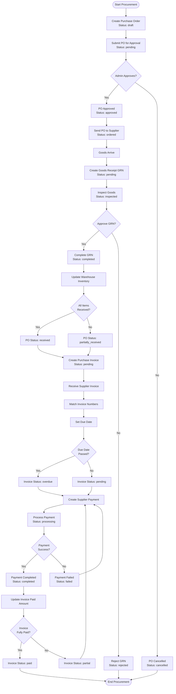

# Complete Procurement Flow Implementation

## Current State Analysis

The system already has:

- Purchase Orders (PO) with status: `draft` → `pending` → `approved` → `ordered` → `partially_received` → `received` → `cancelled`
- Goods Receipts (GRN) with status: `pending` → `inspected` → `approved` → `rejected` → `completed`
- Purchase Invoices with status: `pending` → `partial` → `paid` → `overdue` → `cancelled`
- Supplier Payments with status: `pending` → `processing` → `completed` → `failed` → `cancelled`

## Missing Features & Improvements Needed

### 1. Automated Status Transitions

- PO status should auto-update when GRN is created/completed
- Invoice status should auto-update when payments are made
- PO should auto-transition to `partially_received`/`received` based on GRN completion

### 2. Status Transition Validation

- Prevent invalid status transitions (e.g., can't approve cancelled PO)
- Add validation middleware for status changes
- Ensure business rules are enforced

### 3. Integration Between Steps

- Auto-create invoice from completed GRN
- Auto-update PO `received_quantity` when GRN items are accepted
- Auto-update invoice `paid_amount` and `status` when payments are made
- Auto-mark invoice as `overdue` based on `due_date`

### 4. Missing Workflow Steps

- PO approval workflow (currently exists but may need enhancement)
- GRN inspection workflow (exists but may need approval step)
- Invoice matching with supplier invoice numbers
- Payment reconciliation

### 5. Business Rules & Validations

- Prevent creating GRN for non-approved POs
- Prevent creating invoice for non-completed GRNs
- Prevent over-payment on invoices
- Validate quantities match between PO, GRN, and Invoice

### 6. Notifications & Alerts

- Notify when PO is approved and ready to order
- Notify when GRN is pending inspection
- Notify when invoice is due/overdue
- Notify when payment is completed

## Implementation Plan

### Phase 1: Status Transition Automation

**Files to modify:**

- `backend/src/controllers/goodsReceipts.ts` - Auto-update PO status when GRN is created/completed
- `backend/src/controllers/purchaseInvoices.ts` - Auto-update PO status when invoice is created
- `backend/src/controllers/supplierPayments.ts` - Auto-update invoice status when payment is made

**Key changes:**

1. When GRN is created → Update PO status to `ordered` (if not already)
2. When GRN items are accepted → Update PO item `received_quantity`
3. When GRN is completed → Check if all PO items are fully received:

- If yes → Update PO status to `received`
- If partial → Update PO status to `partially_received`

4. When invoice is created → Link to GRN and PO
5. When payment is made → Update invoice `paid_amount` and `status`:

- If `paid_amount >= total_amount` → Status = `paid`
- If `paid_amount > 0` → Status = `partial`

6. Auto-mark invoices as `overdue` based on `due_date` (cron job or scheduled task)

### Phase 2: Status Transition Validation

**New file:** `backend/src/middleware/procurementValidation.ts`**Features:**

- Validate PO status transitions (e.g., can't approve cancelled PO)
- Validate GRN can only be created for approved/ordered POs
- Validate invoice can only be created for completed GRNs
- Validate payment amount doesn't exceed invoice balance

### Phase 3: Auto-Creation Features

**Files to modify:**

- `backend/src/controllers/purchaseInvoices.ts` - Add endpoint to auto-create invoice from GRN
- `backend/src/controllers/goodsReceipts.ts` - Option to auto-create invoice when GRN is completed

**Features:**

- Auto-generate invoice from completed GRN
- Pre-populate invoice with GRN items and amounts
- Link invoice to PO and GRN

### Phase 4: Business Rules & Validations

**Files to modify:**

- All procurement controllers - Add comprehensive validations

**Validations:**

- PO: Can't modify approved/ordered PO items
- GRN: Can't receive more than ordered quantity
- Invoice: Can't invoice more than received quantity
- Payment: Can't pay more than invoice balance

### Phase 5: Overdue Invoice Detection

**New file:** `backend/src/utils/invoiceScheduler.ts` or use existing cron job system**Features:**

- Scheduled task to check invoices with `due_date < today` and `status = pending`
- Auto-update status to `overdue`
- Optionally send notifications

### Phase 6: Enhanced Workflow Documentation

**New file:** `docs/procurement-workflow.md`**Content:**

- Complete flow diagram
- Status transition rules
- Business rules and validations
- API endpoint documentation

## Detailed Flow Diagram

## Implementation Todos

1. **Status Transition Automation**

- Auto-update PO status when GRN is created/completed
- Auto-update invoice status when payments are made
- Auto-mark invoices as overdue

2. **Status Validation Middleware**

- Create validation middleware for procurement status transitions
- Add business rule validations

3. **Auto-Creation Features**

- Auto-create invoice from completed GRN
- Pre-populate invoice data from GRN

4. **Enhanced Validations**

- Add quantity validations (can't receive more than ordered)