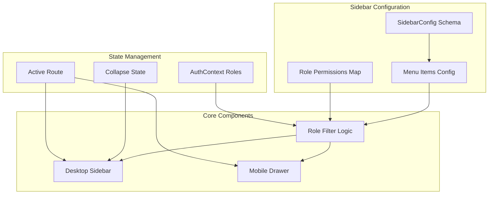

#ERP Sidebar Navigation System Implementation Plan

## Overview

Transform the current hardcoded sidebar in [`frontend/src/pages/admin/Dashboard.tsx`](frontend/src/pages/admin/Dashboard.tsx) into a scalable, config-driven navigation system that supports:

- Multi-role RBAC filtering
- Desktop (expandable/collapsible) and mobile (drawer) variants
- 2-level nesting with proper grouping
- Active route highlighting
- Persistent collapse state

## Architecture




## Implementation Phases

### Phase 1: Configuration Schema & Data Structure

**File:** `frontend/src/config/sidebar.ts` (new)Create TypeScript interfaces and configuration matching the exact hierarchy:

```typescript
interface SidebarMenuItem {
  id: string;
  label: string;
  icon: LucideIcon;
  path?: string;
  roles?: string[]; // Required roles (admin has access to all)
  children?: SidebarMenuItem[];
  badge?: number | string;
}

interface SidebarGroup {
  id: string;
  label: string;
  items: SidebarMenuItem[];
  roles?: string[];
  collapsible?: boolean;
}

interface SidebarConfig {
  groups: SidebarGroup[];
  bottomAnchored?: SidebarGroup; // Settings group
}
```

**Menu Structure:**

- Dashboard (single item)
- Stock/Inventory group (Products, Categories, Warehouses, Stock Adjustment, Stock Transfer, Reports submenu)
- Sales group (Customers, Leads, Quotations, Orders, Order Invoices, Payments, Credit Management, Sales Target, Sales Persons, POS, Reports submenu)
- Procurement group (Suppliers, Purchase Orders, Goods Receipts, Purchase Invoices, Supplier Payments, Reports submenu)
- Reports group (cross-functional reports)
- Settings group (bottom anchored)

**Role Mapping:**

- `admin`: Full access to all items
- `sales`: Sales module + read-only inventory
- `accounts`: Accounts functions + procurement approvals
- `warehouse_manager`: Inventory management + procurement creation
- `procurement`: Procurement module access

### Phase 2: Role-Based Filtering Logic

**File:** `frontend/src/utils/sidebarFilter.ts` (new)Implement filtering function that:

- Checks user roles from `AuthContext` (`hasRole`, `hasAnyRole`)
- Applies admin override (admin sees everything)
- Filters menu items and groups based on role requirements
- Handles nested items (if parent is hidden, hide children)

**Key Logic:**

```typescript
function filterMenuItems(
  items: SidebarMenuItem[],
  userRoles: string[],
  isAdmin: boolean
): SidebarMenuItem[]
```


### Phase 3: Desktop Sidebar Component

**File:** `frontend/src/components/navigation/ERPSidebar.tsx` (new)Features:

- Uses existing `SidebarProvider` from `@/components/ui/sidebar`
- Renders filtered menu groups
- Supports 2-level nesting with `SidebarMenuSub`
- Active route highlighting using `useLocation()`
- Collapse state persistence (localStorage)
- Tooltips when collapsed
- Icon-only mode when collapsed

**Integration:** Replace hardcoded sidebar in `Dashboard.tsx` with `<ERPSidebar />`

### Phase 4: Mobile Drawer Variant

**File:** `frontend/src/components/navigation/ERPSidebarMobile.tsx` (new)Features:

- Uses `Sheet` component from shadcn/ui
- Single-level expansion (no nested drawers)
- Auto-close on route change (`useEffect` watching location)
- Touch-friendly targets
- Bottom navigation integration (if needed)

**Integration:** Conditionally render based on `useIsMobile()` hook

### Phase 5: Route Mapping & Icons

**File:** `frontend/src/config/sidebarRoutes.ts` (new)Map all menu items to actual routes:

- Verify routes exist in `App.tsx`
- Handle dynamic routes (e.g., `/admin/products/:id`)
- Icon mapping (Lucide icons)

**Icons Needed:**

- Dashboard: `LayoutDashboard`
- Products: `Package`
- Categories: `Grid`
- Warehouses: `Warehouse`
- Stock Adjustment: `ClipboardCheck`
- Stock Transfer: `ArrowLeftRight`
- Customers: `Users`
- Orders: `ShoppingCart`
- Sales: `TrendingUp`
- Procurement: `ShoppingBag`
- Reports: `FileText`
- Settings: `Settings`

### Phase 6: State Management & Persistence

**File:** `frontend/src/hooks/useSidebarState.ts` (new)Custom hook for:

- Collapse state (localStorage)
- Active route detection
- Menu expansion state

### Phase 7: Integration & Testing

**Files to Modify:**

- [`frontend/src/pages/admin/Dashboard.tsx`](frontend/src/pages/admin/Dashboard.tsx): Replace hardcoded sidebar
- [`frontend/src/App.tsx`](frontend/src/App.tsx): Verify all routes exist
- [`frontend/src/contexts/AuthContext.tsx`](frontend/src/contexts/AuthContext.tsx): Ensure role methods are accessible

**Testing Checklist:**

- Role-based filtering works correctly
- Admin sees all items
- Multi-role users see combined access
- Desktop collapse/expand works
- Mobile drawer opens/closes correctly
- Active route highlighting works
- Nested menus expand/collapse properly

## File Structure

```javascript
frontend/src/
├── config/
│   ├── sidebar.ts          # Configuration schema & data
│   └── sidebarRoutes.ts     # Route mappings
├── components/
│   └── navigation/
│       ├── ERPSidebar.tsx           # Desktop sidebar
│       ├── ERPSidebarMobile.tsx     # Mobile drawer
│       └── SidebarMenuItem.tsx     # Reusable menu item component
├── utils/
│   └── sidebarFilter.ts    # Role-based filtering logic
└── hooks/
    └── useSidebarState.ts  # Sidebar state management
```


## Key Design Decisions

1. **Config-Driven**: All menu structure in TypeScript config files, no hardcoded JSX
2. **Role Inheritance**: Admin role grants access to all items automatically
3. **Nested Menus**: Max 2 levels (group → item → submenu), handled with `SidebarMenuSub`
4. **State Persistence**: Collapse state saved to localStorage per user
5. **Mobile-First**: Mobile drawer is primary, desktop is enhanced variant
6. **Type Safety**: Full TypeScript coverage with proper interfaces

## Dependencies

- Existing: `@/components/ui/sidebar`, `@/contexts/AuthContext`, `react-router-dom`
- New: None (using existing stack)

## Migration Strategy

1. Create new sidebar components alongside existing code
2. Test with all roles
3. Replace hardcoded sidebar in `Dashboard.tsx`