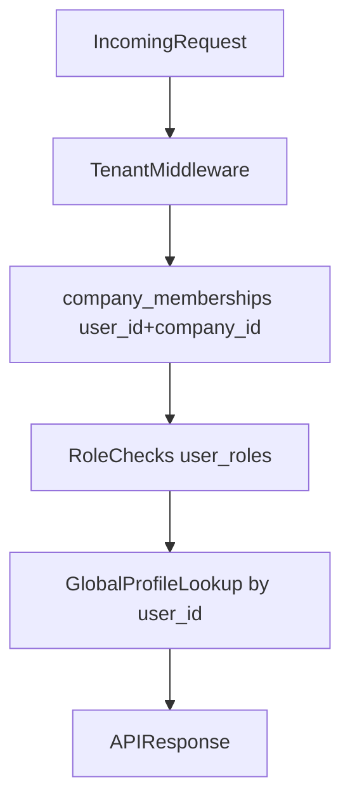

# Global Profiles + Membership-Based Tenant Lookup

## Goal

Adopt a clean multi-tenant model where:

- `profiles` is global (one row per auth user)
- `company_memberships` is the source of tenant access and tenant context
- role checks remain tenant-scoped via `user_roles`

## Scope

- Backend auth/session flow
- Admin user listing flow (`/api/admin/users`)
- DB migration + backfill for profile normalization
- RLS and query adjustments that currently depend on `profiles.company_id`

## Key Files To Update

- [backend/src/middleware/auth.ts](backend/src/middleware/auth.ts)
- [backend/src/controllers/admin.ts](backend/src/controllers/admin.ts)
- [backend/src/controllers/auth.ts](backend/src/controllers/auth.ts)
- [backend/src/utils/roles.ts](backend/src/utils/roles.ts)
- [backend/src/db/schema.sql](backend/src/db/schema.sql)
- [backend/src/db/migrations](backend/src/db/migrations)
- [ARCH_STATE.md](ARCH_STATE.md)

## Implementation Plan

### 1) Lock tenant access to memberships only

- In auth middleware, keep tenant validation strictly on `company_memberships` (`user_id + req.companyId + is_active=true`).
- Remove/avoid any profile-company dependency in authorization decisions.
- Ensure `/api/auth/me` and session sync never reject a valid membership because of profile tenant mismatch.

### 2) Make profile lookups global

- Update profile fetches to use `profiles.id = req.user.id` without tenant filter.
- Remove profile creation from login/session flows (`/api/auth/me`, `sync-session`, middleware paths); profile creation remains register-only.
- When profile is missing at runtime, return a controlled/friendly response and continue membership-based auth checks without tenant mismatch failures.
- Keep tenant-specific info out of `profiles` logic.

### 3) Fix admin users list joining logic

- In `getAllUsers`, use `company_memberships` as the base set.
- Join profiles as optional/global identity data (left join behavior).
- If profile missing, return membership row with safe fallbacks (email/name from available metadata) instead of dropping the user.
- Continue role population from `getUserRolesUtil(user.id, req.companyId)`.

### 4) Data model normalization migration

- Add a migration to normalize `profiles` as global:
  - enforce one profile per auth user id (if not already guaranteed by PK)
  - deprecate `profiles.company_id` usage (and optionally column removal in phased rollout)
- Backfill/repair profile rows for membership users missing profiles via a migration/admin script (not runtime login/session creation).
- Add/verify uniqueness on `company_memberships(user_id, company_id)` and active membership constraints.

### 5) RLS policy review

- Review any `profiles` RLS policy that assumes tenant ownership via `company_id`.
- Replace with global identity-safe policies (self-read/update, admin/service pathways) and keep tenant access governed by membership and role tables.

### 6) Compatibility + rollout safety

- Keep backward-compatible response shape in `/api/admin/users` (`role` + `roles`).
- Add structured logging around:
  - membership resolution failures
  - profile missing outcomes (without autocreate in login/session)
  - admin user list dropped-row counts (should become zero)

### 7) Verification checklist

- User with membership in multiple companies appears correctly in each tenant user-role page.
- User with missing profile but active membership still appears in `/api/admin/users`.
- `/api/auth/me` works when switching tenants for same auth user.
- Role-protected endpoints (`requireRole`) continue to pass/fail correctly per tenant.
- No cross-tenant data leakage in user listing.

## Data Flow (Target)

## ARCH_STATE Follow-up

Because this changes tenant/auth data model behavior, update [ARCH_STATE.md](ARCH_STATE.md) with:

- profiles now global identity
- tenant access source of truth = company_memberships
- any new migration/env/deployment notes.

