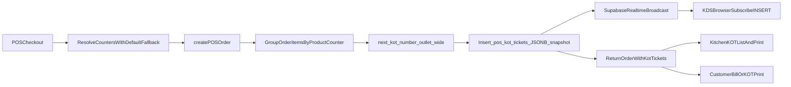

# End-to-End KOT Implementation Plan

## Scope
Deliver a full KOT implementation across database, backend, frontend, and integration layers with:
- resettable KOT numbering (`daily|weekly|monthly|yearly|never`) — **product requirement: numbers are globally unique per outlet per calendar day** (one sequence per outlet per day; `counter_id` is **not** part of the sequence key). Other reset frequencies remain available in settings for future use, but **day-level uniqueness for the outlet is the invariant** for routing and display.
- multiple tickets per order by food counter (each ticket row still has `counter_id` for kitchen routing; **only the numeric sequence is outlet-wide**).
- **product-level** counter mapping (not variant-level).
- ticket items stored as `JSONB` snapshot in `pos_kot_tickets` (no separate ticket-items table); **snapshot is the kitchen source of truth** — print and KDS must not depend on further joins for line labels.
- **Supabase Realtime** on `pos_kot_tickets` so KDS receives new tickets on `INSERT`; **on WebSocket reconnect**, KDS must **immediately** `GET` open tickets to backfill anything missed while offline.
- Schema naming: use **`outlet_id`** (UUID FK to `warehouses` / POS outlet) **instead of `warehouse_id`** on all new KOT tables and filters, consistent with POS terminology (`orders.outlet_id`, POS payloads).

## Architecture Flow

## Database Changes (Migration)
- Add one new migration file in `[backend/src/db/migrations/]` (timestamped naming style).
- Create `public.pos_food_counters` **before** `pos_kot_settings` (settings references counters).
  - `company_id`, `outlet_id`, `name`, `code`, `is_active`, `sort_order`.
  - unique `(company_id, outlet_id, code)`.
- Create `public.pos_kot_settings`
  - `company_id`, `outlet_id` (FK to `public.warehouses(id)` or your canonical outlets table — **same entity POS uses as outlet**), `reset_frequency`, `timezone`, optional display format fields.
  - **`default_counter_id`** `UUID NOT NULL REFERENCES public.pos_food_counters(id) ON DELETE RESTRICT` — kitchen station used when a product has **no** row in `product_food_counters`. Must reference a `pos_food_counters` row whose `outlet_id` matches this settings row’s `outlet_id` (enforce via trigger or validated on write in API).
  - unique `(company_id, outlet_id)`.
- Create `public.product_food_counters`
  - `company_id`, `product_id`, `counter_id` (FK to `pos_food_counters`).
  - unique `(company_id, product_id)` — company-wide product→counter; counters themselves are scoped by `outlet_id` so each outlet’s counter set is distinct.
- Create `public.pos_kot_sequence_state`
  - **Sequence key (no `counter_id`)**: `company_id`, `outlet_id`, `reset_frequency`, `bucket_start` only.
  - stores `last_value`.
  - **Rationale**: KOT number is **globally unique per outlet per period bucket**; multiple counters share one incrementing sequence for that outlet/day (per stakeholder decision #3).
- Create `public.pos_kot_tickets`
  - `company_id`, `order_id`, `outlet_id`, `counter_id` (which station this ticket is for)
  - `kot_number_seq`, `kot_number_text`, `status`
  - `ticket_items_snapshot JSONB` (array of item objects)
  - print fields (`printed_at`, `printed_count`) and audit timestamps.
- Add SQL functions:
  - `kot_bucket_start(...)` for frequency/timezone bucket calculation.
  - `next_kot_number(...)` — upserts `pos_kot_sequence_state` on **`(company_id, outlet_id, reset_frequency, bucket_start)`** only; returns next seq + formatted text. **Do not** include `counter_id` in the conflict target.
- Add `CHECK`s, indexes, triggers (`set_updated_at`) and full RLS policies using active membership pattern.
- **Realtime (same migration or a small follow-up migration)**:
  - Add `public.pos_kot_tickets` to the `supabase_realtime` publication (idempotent `DO` block via `pg_publication_tables`).
  - RLS controls visible rows; client filter uses `outlet_id=eq.${outletId}` (and optional `counter_id` for counter-only displays).
  - Optional `REPLICA IDENTITY FULL` only if `UPDATE` payloads need complete old row; otherwise default is acceptable for INSERT-first KDS.

## Backend spec (KotService)
- New module `[backend/src/services/core/KotService.ts]` (or equivalent) exposing **`KotService.generateTickets()`** used from POS order creation path.
- **`generateTickets()` snapshot rules (mandatory)**:
  - Build `ticket_items_snapshot` as a **self-contained** JSON array: each element includes at least `order_item_id`, `product_id`, `variant_id`, `quantity`, modifiers snapshot, and **kitchen display name**.
  - **Kitchen line label**: resolve display text using **`variant.name` first** (primary kitchen-facing name). If `variant.name` is null/empty, fall back to `product.name`. **Do not** rely on `products.name` at print time for the common case — the snapshot must already contain the final string fields the printer/KDS will render.
  - Rationale: ticket JSONB is the **source of truth** for kitchen and for `[backend/src/controllers/invoices.ts]` ticket-based thermal HTML — **no further DB lookups required at print time** for line titles.
- **Unmapped products (decided — default counter fallback)**:
  - For each line item, resolve `counter_id` as: `product_food_counters.counter_id` for `(company_id, product_id)` if present; otherwise use **`pos_kot_settings.default_counter_id`** for that `outlet_id`.
  - If `pos_kot_settings` row is missing or `default_counter_id` is not configured for the outlet, **reject** order creation with a clear error (“configure KOT default counter for this outlet”) — only configuration is hard-required, not per-product mapping.
  - Optionally persist on each snapshot line a boolean `used_default_counter: true` for audit/debug (recommended).
- **Ticket creation**:
  - Group resolved line items by `counter_id`.
  - For **each** counter group, allocate **one** `kot_number_seq` via `next_kot_number` (**shared sequence per outlet per bucket** — same sequence for all counters that day).
  - Insert one `pos_kot_tickets` row per counter with `ticket_items_snapshot` containing only that counter’s lines.
- Reprint: same `kot_number_text`, no sequence bump.

## Backend Changes (routes/controllers)
- Extend POS order flow in `[backend/src/controllers/pos.ts]`:
  - load `pos_kot_settings` for `outlet_id` → `KotService.generateTickets()` (resolve counter per line, default fallback) → insert tickets after `order_items` exist (needs `order_item_id` in snapshot — fetch inserted rows by `order_id` + line keys).
- Add new controller/routes (query params use `outlet_id`):
  - `GET /api/pos/kot/tickets` (`outlet_id`, `status`, `from`, `to`, optional `counter_id`)
  - `GET /api/pos/kot/tickets/:id`
  - `PATCH /api/pos/kot/tickets/:id/status`
  - `POST /api/pos/kot/tickets/:id/reprint`
- Update print controller in `[backend/src/controllers/invoices.ts]`:
  - ticket-based kitchen HTML reads **only** `ticket_items_snapshot` + header fields on `pos_kot_tickets` (and static company/outlet strings if needed).
- Register routes and mount in `[backend/src/index.ts]`.

## Frontend Changes
- Add KOT API client `[frontend/src/api/kot.ts]` using `outlet_id` query params aligned with POS outlet selector.
- POS settings/admin UI: KOT settings + food counters + **required `default_counter_id` per outlet** + optional **product → counter** overrides; optional warnings when fast-moving menu products lack explicit mapping (informational only).
- `[frontend/src/pages/pos/CreatePOSOrder.tsx]`:
  - handle API error when KOT settings / default counter not configured for outlet
  - on success, show tickets returned + print actions.
- **KDS (Kitchen Display) Realtime** (`[frontend/src/pages/pos/KitchenKDS.tsx]` or equivalent):
  - Subscribe to `postgres_changes` on `public.pos_kot_tickets` for `INSERT` and `UPDATE` as needed.
  - Channel naming: `pos_kot_tickets-${companyId}` (tenant scoped); filter `company_id=eq.${companyId}` and `outlet_id=eq.${outletId}`; optional `counter_id` filter for station-specific displays.
  - **Initial hydrate**: `GET /api/pos/kot/tickets?outlet_id=...&status=open` (or equivalent “open” filter).
  - **WebSocket reconnect / resubscribe (mandatory)**:
    - Use the Realtime channel **`subscribe` status callback** (e.g. `SUBSCRIBED`) and/or client-level reconnect hooks if available in your `supabase-js` version.
    - **Every time** the subscription reaches `SUBSCRIBED` after a drop (including first connect and every reconnect), **immediately** fire the same **standard `GET`** used for initial hydrate to **refetch all open tickets** and merge/replace local state so nothing missed offline is lost.
    - Optionally debounce duplicate `SUBSCRIBED` bursts (e.g. 300ms) to avoid double-fetch while keeping correctness.
  - Cleanup: `removeChannel` on unmount.

## Integration Details
- Receipt numbering stays independent from KOT numbering.
- Sequence: **outlet-wide**, **not** per-counter; tickets still carry `counter_id` for routing.
- Realtime: KDS users must pass RLS SELECT on `pos_kot_tickets`; backend continues using service role for writes.
- POS `outlet_id` in API body already exists on orders — align ticket `outlet_id` with `orders.outlet_id` / selected POS outlet.

## Testing and Rollout
- Migration: concurrent `next_kot_number` for same outlet+bucket → unique monotonic seq; different counters on same order get **distinct** seq values if issued sequentially (same sequence).
- Functional: multi-counter order → multiple ticket rows; each snapshot only contains relevant lines; labels in JSON use `variant.name` rule.
- Default counter: order with **no** `product_food_counters` row for a product → ticket lines route to **default counter**; snapshot includes `used_default_counter` when implemented.
- Misconfiguration: **no** `pos_kot_settings` or **no** `default_counter_id` for outlet → **hard fail** with readable error until operator configures outlet KOT settings.
- Realtime: POS insert → KDS `INSERT` event; simulate disconnect → reconnect → **GET refetch** restores gap.
- `ARCH_STATE.md`: document new tables, routes, Realtime publication, outlet_id naming, **default-counter fallback policy**, and sequence semantics.

## Deliverables
- Migration: schema + `outlet_id` + outlet-wide sequence + RLS + Realtime publication.
- Backend: `KotService.generateTickets()` + default-counter fallback + POS integration + ticket print from snapshot only.
- Frontend: mapping UI + KDS with Realtime + **reconnect refetch**.
- ARCH_STATE + test notes.
