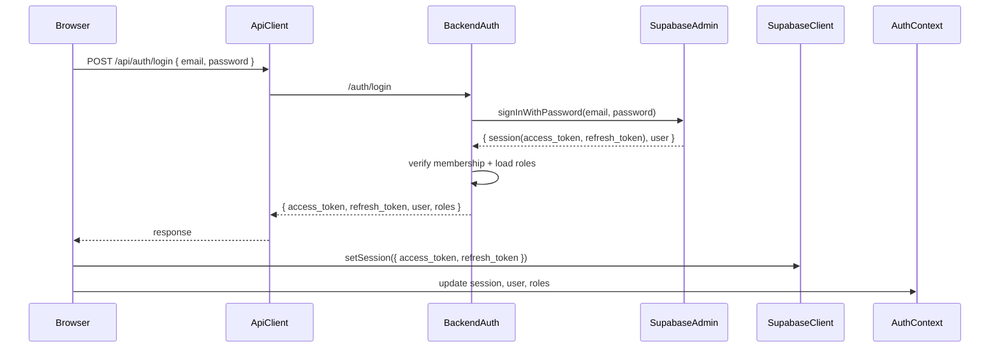

## Refactor Login Flow To Backend-Only Supabase Auth


### 1. Clarify current vs target auth flow


- **Review current backend login** in `backend/src/controllers/auth.ts` (`login`):
- Currently accepts `{ email, password, supabase_token }`.
- For the regular flow it calls `supabase.auth.signInWithPassword` (anon client) and returns `{ token, user }`.
- Also has a branch that validates an existing `supabase_token` via `verifySupabaseJwt`.
- **Review current frontend login** in `frontend/src/contexts/AuthContext.tsx` (`signIn`):
- First calls `supabase.auth.signInWithPassword({ email, password })` from the browser.
- Then calls `apiClient.post('/auth/login', { email, password })` to load roles/company context.
- Stores `supabase_token` from the browser Supabase session.
- **Target behavior**:
- Frontend sends **only** `email` and `password` to `/api/auth/login`.
- Backend uses the **service role Supabase client** to call `signInWithPassword`.
- Backend enforces company membership and loads roles exactly as today.
- Backend returns `{ access_token, refresh_token, user, roles }` (and company_id), which the frontend uses to hydrate Supabase via `supabase.auth.setSession` and to update `AuthContext`.



### 2. Backend: update `/auth/login` controller to own Supabase login


- **File**: `backend/src/controllers/auth.ts`
- **Goals**:
- Ensure *all* credential verification is done on the server using the **service role client** (`supabaseAdmin`).
- Continue to enforce **company membership** and **RBAC** exactly as now.
- Return both `access_token` and `refresh_token` to the frontend.
- **Steps**:


1. **Adjust imports if needed**:


    - Confirm `supabaseAdmin` is imported at the top (it already is).


2. **Regular login path (email + password)**:


    - Replace the current call:
    - `const { data: authData, error: authError } = await supabase.auth.signInWithPassword({ email, password });`
    - With a call to the **admin client**:
    - `const { data: authData, error: authError } = await supabaseAdmin.auth.signInWithPassword({ email, password });`
    - Keep error handling semantics the same (still return 401 on authError with the same message format).


3. **Preserve profile + membership logic** (no behavioral changes):


    - Keep the existing logic that:
    - Fetches the `profiles` row for `authData.user.id` and errors if missing.
    - Ensures the user has an active membership in `company_memberships` for `req.companyId`.
    - Updates `profiles.company_id` if needed.
    - Loads roles via `getUserRoles(authData.user.id, activeCompanyId)` and derives `primaryRole`.


4. **Change the login response shape** for the regular flow:


    - Currently returns `{ token: authData.session.access_token, user: { ... } }`.
    - Change to return both tokens and roles explicitly, e.g.:
    - `access_token: authData.session.access_token`
    - `refresh_token: authData.session.refresh_token`
    - `user: { id, email, first_name, last_name, phone, role, roles, company_id }`
    - Ensure this structure matches what the frontend will expect.


5. **Token-login branch (email + supabase_token)**:


    - Option A (minimal change): keep this branch intact for now, but update its response to also return fields named `access_token` and `refresh_token` (with `refresh_token` as `null`) in addition to `user` and `roles`.
    - Option B (if you want to simplify): deprecate this branch behind a comment but keep behavior unchanged, since the frontend won’t send `supabase_token` anymore.


6. **Do not change**:


    - `getMembership`, `ensureMembership`, `verifySupabaseJwt`, or any RBAC helpers.
    - `protect` middleware or how `req.user` / `req.companyId` are derived.


### 3. Frontend: refactor `signIn` in `AuthContext` to use backend only


- **File**: `frontend/src/contexts/AuthContext.tsx`
- **Goals**:
- Remove all direct credential-based calls from the browser to Supabase.
- Use only `/api/auth/login` as the entry point for email/password.
- Still hydrate the local Supabase client for realtime/storage via `supabase.auth.setSession`.
- **Steps**:


1. **Update `signIn` to only call backend**:


    - Remove the first block that does:
       ```ts
                            
                                                        const { data, error } = await supabase.auth.signInWithPassword({ email, password });
                            
       ```


    - Replace the body with:
    - `const { data: loginData } = await apiClient.post('/auth/login', { email, password });`
    - Extract from `loginData.data`:
        - `access_token`, `refresh_token`.
        - `user` object including `roles` and `company_id`.


2. **Hydrate Supabase client with server-issued tokens**:


    - After a successful `/auth/login` response, call:
       ```ts
                            
                                                        const { data: supaSession, error: setError } = await supabase.auth.setSession({
                            
                                                          access_token,
                            
                                                          refresh_token,
                            
                                                        });
                            
       ```


    - If `setError` is non-null, show a toast and abort login.
    - Use the returned `supaSession.user` and `supaSession.session` to update `setUser` and `setSession` in the context, or fall back to `supabase.auth.getSession()` if preferred.


3. **Store tokens as before**:


    - Store `access_token` in `localStorage` under `supabase_token` as today so `apiClient` continues to work:
       ```ts
                            
                                                        localStorage.setItem('supabase_token', access_token);
                            
       ```


    - You may optionally store `refresh_token` in memory only; token refresh logic is already using Supabase JS and cached `supabase_token`, so no change is required there.


4. **Keep role/profile handling identical**:


    - Reuse the existing logic that reads `userProfile` from `loginData.data.user` and derives roles:
    - `userRoles`, `primaryRole`, `setIsAdmin`, `setIsSales`, etc.
    - Keep warehouse loading logic unchanged, but now use the `userProfile.id` (and/or `supaSession.user.id`) instead of `data.user.id` from the old Supabase browser login.


5. **Error handling**:


    - On any `/auth/login` error:
    - Show the backend-provided message if present.
    - Clear any partial Supabase state via `clearLocalSession()`.
    - Do **not** call `supabase.auth.signOut()` here anymore unless `setSession` had been called.


6. **Navigation + UX**:


    - Keep the same behavior: toast `Successfully signed in!`, set `sessionStorage.setItem('from_login', 'true')`, and `navigate('/')`.


### 4. Optional: simplify sign-up auto-login (keep within current scope)


- **File**: `frontend/src/contexts/AuthContext.tsx` (`signUp`)
- **Observation**: `signUp` currently:
- Calls backend `/auth/register`.
- Then calls `supabase.auth.signInWithPassword` in the browser and again hits `/auth/login`.
- **Minimal adjustment (optional)**:
- After a successful `/auth/register`, directly reuse the new `signIn(email, password)` implementation instead of another direct Supabase call.
- This ensures that even registration-triggered login also goes through the backend-only path.


### 5. Testing & verification


- **Backend tests**:
- Attempt login with valid credentials + valid company subdomain:
    - Expect 200 with `{ access_token, refresh_token, user: { roles, company_id } }`.
- Attempt login with invalid password:
    - Expect 401 and no tokens.
- Attempt login for a user who is not a member of the current company (different subdomain):
    - Expect 403 as before.
- **Frontend tests**:
- Clear `localStorage` and log in:
    - Confirm `supabase_token` is set to `access_token` from backend.
    - Confirm `AuthContext.user`, `session`, `roles`, `isAdmin/isSales` update as before.
    - Confirm `apiClient` sends `Authorization: Bearer <access_token>` and `X-Tenant-Subdomain`.
- Hit a protected endpoint and ensure the `protect` middleware still passes with the new tokens.
- Verify token refresh continues to work (e.g., leave app open near token expiry and check logs for `Session refreshed successfully`).