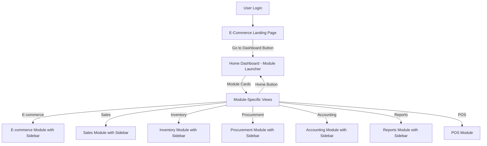
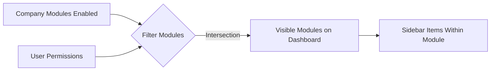

# Multi-Tenant Navigation Architecture Implementation Plan

## Architecture Overview



## Permission & Module Filtering Flow



---

## Phase 1: Database Schema Updates

### 1.1 Create Permissions Table

Create [`backend/src/db/migrations/091_create_permissions.sql`](backend/src/db/migrations/091_create_permissions.sql):

```sql
-- Granular permissions table
CREATE TABLE IF NOT EXISTS public.permissions (
    id UUID PRIMARY KEY DEFAULT uuid_generate_v4(),
    code VARCHAR(100) UNIQUE NOT NULL,
    module VARCHAR(50) NOT NULL,
    action VARCHAR(50) NOT NULL,
    description TEXT,
    created_at TIMESTAMP WITH TIME ZONE DEFAULT CURRENT_TIMESTAMP
);

-- Seed default permissions
INSERT INTO public.permissions (code, module, action, description) VALUES
-- E-commerce
('ecommerce.read', 'ecommerce', 'read', 'View e-commerce dashboard and orders'),
('ecommerce.write', 'ecommerce', 'write', 'Manage e-commerce products and settings'),
('ecommerce.delete', 'ecommerce', 'delete', 'Delete e-commerce data'),

-- Sales
('sales.read', 'sales', 'read', 'View sales orders and customers'),
('sales.write', 'sales', 'write', 'Create and update sales orders'),
('sales.delete', 'sales', 'delete', 'Delete sales orders'),
('sales.approve', 'sales', 'approve', 'Approve sales orders'),

-- Inventory
('inventory.read', 'inventory', 'read', 'View inventory and products'),
('inventory.write', 'inventory', 'write', 'Manage inventory and products'),
('inventory.delete', 'inventory', 'delete', 'Delete inventory items'),
('inventory.adjust', 'inventory', 'adjust', 'Adjust stock levels'),
('inventory.transfer', 'inventory', 'transfer', 'Transfer stock between warehouses'),

-- Procurement
('procurement.read', 'procurement', 'read', 'View purchase orders and suppliers'),
('procurement.write', 'procurement', 'write', 'Create purchase orders'),
('procurement.delete', 'procurement', 'delete', 'Delete purchase orders'),
('procurement.approve', 'procurement', 'approve', 'Approve purchase orders'),

-- Accounting
('accounting.read', 'accounting', 'read', 'View financial data'),
('accounting.write', 'accounting', 'write', 'Manage accounting entries'),
('accounting.reconcile', 'accounting', 'reconcile', 'Reconcile accounts'),

-- Reports
('reports.read', 'reports', 'read', 'View all reports'),
('reports.export', 'reports', 'export', 'Export reports'),

-- POS
('pos.access', 'pos', 'access', 'Access POS system'),

-- Settings (Admin only)
('settings.read', 'settings', 'read', 'View system settings'),
('settings.write', 'settings', 'write', 'Manage system settings');

CREATE INDEX idx_permissions_module ON public.permissions(module);
CREATE INDEX idx_permissions_code ON public.permissions(code);
```

### 1.2 Create Roles Table

Create [`backend/src/db/migrations/092_create_roles.sql`](backend/src/db/migrations/092_create_roles.sql):

```sql
-- Roles table (replaces enum)
CREATE TABLE IF NOT EXISTS public.roles (
    id UUID PRIMARY KEY DEFAULT uuid_generate_v4(),
    name VARCHAR(100) UNIQUE NOT NULL,
    display_name VARCHAR(100) NOT NULL,
    description TEXT,
    company_id UUID REFERENCES public.companies(id),
    is_system_role BOOLEAN DEFAULT false,
    created_at TIMESTAMP WITH TIME ZONE DEFAULT CURRENT_TIMESTAMP
);

-- Seed system roles (company_id = NULL for global roles)
INSERT INTO public.roles (name, display_name, description, is_system_role) VALUES
('admin', 'Administrator', 'Full system access', true),
('sales', 'Sales Executive', 'Sales and customer management', true),
('accounts', 'Accountant', 'Financial management', true),
('warehouse_manager', 'Warehouse Manager', 'Inventory and warehouse operations', true),
('procurement', 'Procurement Officer', 'Purchase orders and suppliers', true);

CREATE INDEX idx_roles_company_id ON public.roles(company_id);
```

### 1.3 Create Role Permissions Mapping

Create [`backend/src/db/migrations/093_create_role_permissions.sql`](backend/src/db/migrations/093_create_role_permissions.sql):

```sql
-- Role to permissions mapping
CREATE TABLE IF NOT EXISTS public.role_permissions (
    id UUID PRIMARY KEY DEFAULT uuid_generate_v4(),
    role_id UUID NOT NULL REFERENCES public.roles(id) ON DELETE CASCADE,
    permission_id UUID NOT NULL REFERENCES public.permissions(id) ON DELETE CASCADE,
    created_at TIMESTAMP WITH TIME ZONE DEFAULT CURRENT_TIMESTAMP,
    UNIQUE(role_id, permission_id)
);

-- Seed default role permissions
-- Admin gets all permissions
INSERT INTO public.role_permissions (role_id, permission_id)
SELECT r.id, p.id
FROM public.roles r
CROSS JOIN public.permissions p
WHERE r.name = 'admin';

-- Sales Executive permissions
INSERT INTO public.role_permissions (role_id, permission_id)
SELECT r.id, p.id
FROM public.roles r, public.permissions p
WHERE r.name = 'sales' AND p.code IN (
    'sales.read', 'sales.write', 'sales.delete',
    'inventory.read',
    'pos.access',
    'reports.read'
);

-- Accountant permissions
INSERT INTO public.role_permissions (role_id, permission_id)
SELECT r.id, p.id
FROM public.roles r, public.permissions p
WHERE r.name = 'accounts' AND p.code IN (
    'accounting.read', 'accounting.write', 'accounting.reconcile',
    'sales.read',
    'procurement.read',
    'reports.read', 'reports.export'
);

-- Warehouse Manager permissions
INSERT INTO public.role_permissions (role_id, permission_id)
SELECT r.id, p.id
FROM public.roles r, public.permissions p
WHERE r.name = 'warehouse_manager' AND p.code IN (
    'inventory.read', 'inventory.write', 'inventory.adjust', 'inventory.transfer',
    'procurement.read',
    'reports.read'
);

-- Procurement Officer permissions
INSERT INTO public.role_permissions (role_id, permission_id)
SELECT r.id, p.id
FROM public.roles r, public.permissions p
WHERE r.name = 'procurement' AND p.code IN (
    'procurement.read', 'procurement.write', 'procurement.approve',
    'inventory.read',
    'reports.read'
);

CREATE INDEX idx_role_permissions_role_id ON public.role_permissions(role_id);
CREATE INDEX idx_role_permissions_permission_id ON public.role_permissions(permission_id);
```

### 1.4 Create User Roles Table

Create [`backend/src/db/migrations/094_create_user_roles.sql`](backend/src/db/migrations/094_create_user_roles.sql):

```sql
-- User to roles mapping (replaces single role in profiles)
CREATE TABLE IF NOT EXISTS public.user_roles (
    id UUID PRIMARY KEY DEFAULT uuid_generate_v4(),
    user_id UUID NOT NULL REFERENCES auth.users(id) ON DELETE CASCADE,
    role_id UUID NOT NULL REFERENCES public.roles(id) ON DELETE CASCADE,
    company_id UUID NOT NULL REFERENCES public.companies(id) ON DELETE CASCADE,
    is_primary BOOLEAN DEFAULT false,
    created_at TIMESTAMP WITH TIME ZONE DEFAULT CURRENT_TIMESTAMP,
    UNIQUE(user_id, role_id, company_id)
);

-- Migrate existing users from profiles.role to user_roles
INSERT INTO public.user_roles (user_id, role_id, company_id, is_primary)
SELECT 
    p.id,
    r.id,
    p.company_id,
    true
FROM public.profiles p
JOIN public.roles r ON r.name = p.role::text
WHERE p.company_id IS NOT NULL AND r.is_system_role = true;

CREATE INDEX idx_user_roles_user_id ON public.user_roles(user_id);
CREATE INDEX idx_user_roles_company_id ON public.user_roles(company_id);
```

### 1.5 Create Company Modules Table

Create [`backend/src/db/migrations/095_create_company_modules.sql`](backend/src/db/migrations/095_create_company_modules.sql):

```sql
-- Company-level module enablement
CREATE TABLE IF NOT EXISTS public.company_modules (
    id UUID PRIMARY KEY DEFAULT uuid_generate_v4(),
    company_id UUID NOT NULL REFERENCES public.companies(id) ON DELETE CASCADE,
    module_code VARCHAR(50) NOT NULL,
    is_enabled BOOLEAN DEFAULT true,
    settings JSONB DEFAULT '{}',
    created_at TIMESTAMP WITH TIME ZONE DEFAULT CURRENT_TIMESTAMP,
    updated_at TIMESTAMP WITH TIME ZONE DEFAULT CURRENT_TIMESTAMP,
    UNIQUE(company_id, module_code)
);

-- Enable all modules for existing companies by default
INSERT INTO public.company_modules (company_id, module_code, is_enabled)
SELECT c.id, module_code, true
FROM public.companies c
CROSS JOIN (
    VALUES 
        ('ecommerce'),
        ('sales'),
        ('inventory'),
        ('procurement'),
        ('accounting'),
        ('reports'),
        ('pos')
) AS modules(module_code);

CREATE INDEX idx_company_modules_company_id ON public.company_modules(company_id);
CREATE INDEX idx_company_modules_module_code ON public.company_modules(module_code);
```

### 1.6 Create RPC Functions

Create [`backend/src/db/migrations/096_create_permission_functions.sql`](backend/src/db/migrations/096_create_permission_functions.sql):

```sql
-- Function: Get user permissions for a company
CREATE OR REPLACE FUNCTION get_user_permissions(
    p_user_id UUID,
    p_company_id UUID
)
RETURNS TABLE(
    permission_code VARCHAR(100),
    module VARCHAR(50),
    action VARCHAR(50)
) AS $$
BEGIN
    RETURN QUERY
    SELECT DISTINCT p.code, p.module, p.action
    FROM public.permissions p
    JOIN public.role_permissions rp ON p.id = rp.permission_id
    JOIN public.user_roles ur ON rp.role_id = ur.role_id
    WHERE ur.user_id = p_user_id 
      AND ur.company_id = p_company_id;
END;
$$ LANGUAGE plpgsql SECURITY DEFINER;

-- Function: Check if user has specific permission
CREATE OR REPLACE FUNCTION user_has_permission(
    p_user_id UUID,
    p_company_id UUID,
    p_permission_code VARCHAR(100)
)
RETURNS BOOLEAN AS $$
BEGIN
    RETURN EXISTS(
        SELECT 1
        FROM public.permissions p
        JOIN public.role_permissions rp ON p.id = rp.permission_id
        JOIN public.user_roles ur ON rp.role_id = ur.role_id
        WHERE ur.user_id = p_user_id 
          AND ur.company_id = p_company_id
          AND p.code = p_permission_code
    );
END;
$$ LANGUAGE plpgsql SECURITY DEFINER;

-- Function: Get company enabled modules
CREATE OR REPLACE FUNCTION get_company_modules(
    p_company_id UUID
)
RETURNS TABLE(
    module_code VARCHAR(50),
    is_enabled BOOLEAN,
    settings JSONB
) AS $$
BEGIN
    RETURN QUERY
    SELECT cm.module_code, cm.is_enabled, cm.settings
    FROM public.company_modules cm
    WHERE cm.company_id = p_company_id
      AND cm.is_enabled = true;
END;
$$ LANGUAGE plpgsql SECURITY DEFINER;

-- Function: Get accessible modules for user (company enabled + user has permission)
CREATE OR REPLACE FUNCTION get_user_accessible_modules(
    p_user_id UUID,
    p_company_id UUID
)
RETURNS TABLE(
    module_code VARCHAR(50)
) AS $$
BEGIN
    RETURN QUERY
    SELECT DISTINCT p.module::VARCHAR(50)
    FROM public.permissions p
    JOIN public.role_permissions rp ON p.id = rp.permission_id
    JOIN public.user_roles ur ON rp.role_id = ur.role_id
    JOIN public.company_modules cm ON cm.module_code = p.module AND cm.company_id = p_company_id
    WHERE ur.user_id = p_user_id 
      AND ur.company_id = p_company_id
      AND cm.is_enabled = true
      AND p.action = 'read';
END;
$$ LANGUAGE plpgsql SECURITY DEFINER;
```

---

## Phase 2: Frontend Configuration & Hooks

### 2.1 Create Modules Configuration

Create [`frontend/src/config/modules.config.tsx`](frontend/src/config/modules.config.tsx):

```typescript
import { LucideIcon } from 'lucide-react';
import {
  ShoppingBag,
  ShoppingCart,
  Package,
  FileText,
  DollarSign,
  BarChart3,
  Store,
  Settings,
  Users,
  Warehouse,
  Receipt,
  Target,
  TrendingUp,
  Grid,
  ClipboardCheck,
  ArrowLeftRight,
  Building2,
  CreditCard,
  LayoutDashboard,
  UserCheck
} from 'lucide-react';

export interface ModuleKPI {
  label: string;
  key: string;
  formatter?: (value: number | null) => string;
}

export interface ModuleCTA {
  label: string;
  route: string;
  permission?: string;
  variant?: 'primary' | 'secondary';
}

export interface SidebarItem {
  label: string;
  route: string;
  icon: LucideIcon;
  permission?: string;
  badge?: string;
  children?: SidebarItem[];
}

export interface ModuleConfig {
  key: string;
  label: string;
  description: string;
  route: string;
  icon: LucideIcon;
  iconColor?: string;
  permissions: string[];
  showOnDashboard: boolean;
  highlighted?: boolean;
  kpis: ModuleKPI[];
  ctas: ModuleCTA[];
  sidebarItems?: SidebarItem[];
}

export const modulesConfig: Record<string, ModuleConfig> = {
  ecommerce: {
    key: 'ecommerce',
    label: 'E-commerce',
    description: 'Manage online store and orders',
    route: '/ecommerce',
    icon: ShoppingBag,
    iconColor: 'text-purple-600',
    permissions: ['ecommerce.read'],
    showOnDashboard: true,
    kpis: [
      { label: 'Online Orders Today', key: 'orders_today' },
      { label: 'Website Visitors', key: 'visitors' },
      { label: 'Conversion Rate', key: 'conversion_rate', formatter: (v) => `${v}%` }
    ],
    ctas: [
      { label: 'Manage Store', route: '/ecommerce', variant: 'primary' },
      { label: 'View Orders', route: '/ecommerce/orders', variant: 'secondary' }
    ],
    sidebarItems: [
      { label: 'Dashboard', route: '/ecommerce', icon: LayoutDashboard, permission: 'ecommerce.read' },
      { label: 'Products', route: '/ecommerce/products', icon: Package, permission: 'ecommerce.read' },
      { label: 'Orders', route: '/ecommerce/orders', icon: ShoppingCart, permission: 'ecommerce.read' },
      { label: 'Settings', route: '/ecommerce/settings', icon: Settings, permission: 'ecommerce.write' }
    ]
  },
  
  sales: {
    key: 'sales',
    label: 'Sales',
    description: 'Orders, invoices & customers',
    route: '/sales',
    icon: ShoppingCart,
    iconColor: 'text-blue-600',
    permissions: ['sales.read'],
    showOnDashboard: true,
    kpis: [
      { label: 'Today\'s Orders', key: 'orders_today' },
      { label: 'Outstanding Invoices', key: 'outstanding_invoices' },
      { label: 'Monthly Revenue', key: 'monthly_revenue', formatter: (v) => `$${v?.toLocaleString()}` }
    ],
    ctas: [
      { label: 'Go to Sales', route: '/sales', variant: 'primary' },
      { label: 'Create Order', route: '/sales/orders/create', permission: 'sales.write', variant: 'secondary' }
    ],
    sidebarItems: [
      { label: 'Dashboard', route: '/sales', icon: LayoutDashboard, permission: 'sales.read' },
      { label: 'Orders', route: '/sales/orders', icon: ShoppingCart, permission: 'sales.read' },
      { label: 'Customers', route: '/sales/customers', icon: Users, permission: 'sales.read' },
      { label: 'Leads', route: '/sales/leads', icon: UserCheck, permission: 'sales.read' },
      { label: 'Credit Management', route: '/sales/credit-management', icon: CreditCard, permission: 'sales.read' },
      { label: 'Analytics', route: '/sales/analytics', icon: BarChart3, permission: 'sales.read' }
    ]
  },
  
  inventory: {
    key: 'inventory',
    label: 'Inventory',
    description: 'Stock management & warehouses',
    route: '/inventory',
    icon: Package,
    iconColor: 'text-green-600',
    permissions: ['inventory.read'],
    showOnDashboard: true,
    kpis: [
      { label: 'Total Products', key: 'total_products' },
      { label: 'Low Stock Items', key: 'low_stock' },
      { label: 'Total Stock Value', key: 'stock_value', formatter: (v) => `$${v?.toLocaleString()}` }
    ],
    ctas: [
      { label: 'Go to Inventory', route: '/inventory', variant: 'primary' }
    ],
    sidebarItems: [
      { label: 'Dashboard', route: '/inventory', icon: LayoutDashboard, permission: 'inventory.read' },
      { label: 'Products', route: '/inventory/products', icon: Package, permission: 'inventory.read' },
      { label: 'Categories', route: '/inventory/categories', icon: Grid, permission: 'inventory.read' },
      { label: 'Warehouses', route: '/inventory/warehouses', icon: Warehouse, permission: 'inventory.read' },
      { label: 'Stock Adjustment', route: '/inventory/adjust', icon: ClipboardCheck, permission: 'inventory.adjust' },
      { label: 'Stock Transfer', route: '/inventory/transfer', icon: ArrowLeftRight, permission: 'inventory.transfer' },
      { label: 'Stock Movements', route: '/inventory/movements', icon: FileText, permission: 'inventory.read' }
    ]
  },
  
  procurement: {
    key: 'procurement',
    label: 'Procurement',
    description: 'Purchase orders & suppliers',
    route: '/procurement',
    icon: FileText,
    iconColor: 'text-orange-600',
    permissions: ['procurement.read'],
    showOnDashboard: true,
    kpis: [
      { label: 'Open Purchase Orders', key: 'open_pos' },
      { label: 'Pending GRNs', key: 'pending_grns' },
      { label: 'Supplier Outstanding', key: 'supplier_outstanding', formatter: (v) => `$${v?.toLocaleString()}` }
    ],
    ctas: [
      { label: 'Go to Procurement', route: '/procurement', variant: 'primary' }
    ],
    sidebarItems: [
      { label: 'Dashboard', route: '/procurement', icon: LayoutDashboard, permission: 'procurement.read' },
      { label: 'Purchase Orders', route: '/procurement/purchase-orders', icon: FileText, permission: 'procurement.read' },
      { label: 'Suppliers', route: '/procurement/suppliers', icon: Building2, permission: 'procurement.read' },
      { label: 'Goods Receipts', route: '/procurement/goods-receipts', icon: Receipt, permission: 'procurement.read' },
      { label: 'Purchase Invoices', route: '/procurement/purchase-invoices', icon: Receipt, permission: 'procurement.read' },
      { label: 'Supplier Payments', route: '/procurement/supplier-payments', icon: CreditCard, permission: 'procurement.read' }
    ]
  },
  
  accounting: {
    key: 'accounting',
    label: 'Accounting',
    description: 'Financial management & ledgers',
    route: '/accounting',
    icon: DollarSign,
    iconColor: 'text-red-600',
    permissions: ['accounting.read'],
    showOnDashboard: true,
    kpis: [
      { label: 'Receivables', key: 'receivables', formatter: (v) => `$${v?.toLocaleString()}` },
      { label: 'Payables', key: 'payables', formatter: (v) => `$${v?.toLocaleString()}` },
      { label: 'Cash Balance', key: 'cash_balance', formatter: (v) => `$${v?.toLocaleString()}` }
    ],
    ctas: [
      { label: 'Go to Accounting', route: '/accounting', variant: 'primary' }
    ],
    sidebarItems: [
      { label: 'Dashboard', route: '/accounting', icon: LayoutDashboard, permission: 'accounting.read' },
      { label: 'Chart of Accounts', route: '/accounting/chart-of-accounts', icon: FileText, permission: 'accounting.read' },
      { label: 'Journal Entries', route: '/accounting/journal-entries', icon: FileText, permission: 'accounting.write' },
      { label: 'Ledgers', route: '/accounting/ledgers', icon: FileText, permission: 'accounting.read' },
      { label: 'Reconciliation', route: '/accounting/reconciliation', icon: ClipboardCheck, permission: 'accounting.reconcile' }
    ]
  },
  
  reports: {
    key: 'reports',
    label: 'Reports',
    description: 'Analytics & business intelligence',
    route: '/reports',
    icon: BarChart3,
    iconColor: 'text-indigo-600',
    permissions: ['reports.read'],
    showOnDashboard: true,
    kpis: [
      { label: 'Sales Report', key: 'sales_report' },
      { label: 'Inventory Valuation', key: 'inventory_valuation', formatter: (v) => `$${v?.toLocaleString()}` }
    ],
    ctas: [
      { label: 'View Reports', route: '/reports', variant: 'primary' }
    ],
    sidebarItems: [
      { label: 'Dashboard', route: '/reports', icon: LayoutDashboard, permission: 'reports.read' },
      { label: 'Sales Reports', route: '/reports/sales', icon: TrendingUp, permission: 'reports.read' },
      { label: 'Inventory Reports', route: '/reports/inventory', icon: Package, permission: 'reports.read' },
      { label: 'Financial Reports', route: '/reports/financial', icon: DollarSign, permission: 'reports.read' },
      { label: 'Custom Reports', route: '/reports/custom', icon: FileText, permission: 'reports.read' }
    ]
  },
  
  pos: {
    key: 'pos',
    label: 'POS',
    description: 'Point of Sale system',
    route: '/pos',
    icon: Store,
    iconColor: 'text-pink-600',
    permissions: ['pos.access'],
    showOnDashboard: true,
    highlighted: true,
    kpis: [
      { label: 'Today\'s Sales', key: 'pos_sales_today', formatter: (v) => `$${v?.toLocaleString()}` },
      { label: 'Transactions', key: 'pos_transactions' },
      { label: 'Avg Ticket', key: 'pos_avg_ticket', formatter: (v) => `$${v?.toFixed(2)}` }
    ],
    ctas: [
      { label: 'Open POS', route: '/pos', variant: 'primary' }
    ]
  }
};

export const getModuleByRoute = (pathname: string): ModuleConfig | null => {
  const moduleKey = pathname.split('/')[1];
  return modulesConfig[moduleKey] || null;
};

export const getAccessibleModules = (
  userPermissions: string[],
  companyModules: string[]
): ModuleConfig[] => {
  return Object.values(modulesConfig).filter(module => {
    const isEnabledForCompany = companyModules.includes(module.key);
    const hasPermission = module.permissions.some(p => userPermissions.includes(p));
    return module.showOnDashboard && isEnabledForCompany && hasPermission;
  });
};
```

### 2.2 Create Permission Hooks

Create [`frontend/src/hooks/usePermissions.ts`](frontend/src/hooks/usePermissions.ts):

```typescript
import { useEffect, useState } from 'react';
import { useAuth } from '@/contexts/AuthContext';
import { supabase } from '@/integrations/supabase/client';

export interface Permission {
  permission_code: string;
  module: string;
  action: string;
}

export const usePermissions = () => {
  const { user } = useAuth();
  const [permissions, setPermissions] = useState<Permission[]>([]);
  const [loading, setLoading] = useState(true);

  useEffect(() => {
    const fetchPermissions = async () => {
      if (!user) {
        setPermissions([]);
        setLoading(false);
        return;
      }

      try {
        // Get company ID from subdomain or user context
        const companyId = getCompanyIdFromSubdomain();
        
        const { data, error } = await supabase.rpc('get_user_permissions', {
          p_user_id: user.id,
          p_company_id: companyId
        });

        if (error) throw error;
        setPermissions(data || []);
      } catch (error) {
        console.error('Error fetching permissions:', error);
        setPermissions([]);
      } finally {
        setLoading(false);
      }
    };

    fetchPermissions();
  }, [user]);

  return { permissions, loading };
};

export const useCanAccess = (permissionCode: string): boolean => {
  const { permissions } = usePermissions();
  return permissions.some(p => p.permission_code === permissionCode);
};

export const useAccessibleModules = () => {
  const { user } = useAuth();
  const [modules, setModules] = useState<string[]>([]);
  const [loading, setLoading] = useState(true);

  useEffect(() => {
    const fetchModules = async () => {
      if (!user) {
        setModules([]);
        setLoading(false);
        return;
      }

      try {
        const companyId = getCompanyIdFromSubdomain();
        
        const { data, error } = await supabase.rpc('get_user_accessible_modules', {
          p_user_id: user.id,
          p_company_id: companyId
        });

        if (error) throw error;
        setModules(data?.map((m: any) => m.module_code) || []);
      } catch (error) {
        console.error('Error fetching accessible modules:', error);
        setModules([]);
      } finally {
        setLoading(false);
      }
    };

    fetchModules();
  }, [user]);

  return { modules, loading };
};

export const useCompanyModules = () => {
  const [companyModules, setCompanyModules] = useState<string[]>([]);
  const [loading, setLoading] = useState(true);

  useEffect(() => {
    const fetchCompanyModules = async () => {
      try {
        const companyId = getCompanyIdFromSubdomain();
        
        const { data, error } = await supabase.rpc('get_company_modules', {
          p_company_id: companyId
        });

        if (error) throw error;
        setCompanyModules(data?.map((m: any) => m.module_code) || []);
      } catch (error) {
        console.error('Error fetching company modules:', error);
        setCompanyModules([]);
      } finally {
        setLoading(false);
      }
    };

    fetchCompanyModules();
  }, []);

  return { companyModules, loading };
};

// Helper to get company ID from subdomain (already implemented in backend)
function getCompanyIdFromSubdomain(): string {
  // This should match your backend implementation
  // For now, return from localStorage or context
  return localStorage.getItem('company_id') || '';
}
```

### 2.3 Create Module KPI Hook

Create [`frontend/src/hooks/useModuleKPIs.ts`](frontend/src/hooks/useModuleKPIs.ts):

```typescript
import { useQuery } from '@tanstack/react-query';
import apiClient from '@/lib/apiClient';

export interface ModuleKPIData {
  [key: string]: number | null;
}

export const useModuleKPIs = (moduleKey: string) => {
  return useQuery<ModuleKPIData>({
    queryKey: ['module-kpis', moduleKey],
    queryFn: async () => {
      const response = await apiClient.get(`/kpis/${moduleKey}`);
      return response.data.data || {};
    },
    staleTime: 5 * 60 * 1000, // 5 minutes
    enabled: !!moduleKey
  });
};
```

---

## Phase 3: Navigation Components

### 3.1 Create Home Dashboard (Module Launcher)

Create [`frontend/src/pages/HomeDashboard.tsx`](frontend/src/pages/HomeDashboard.tsx):

```typescript
import React from 'react';
import { useNavigate } from 'react-router-dom';
import { Card, CardContent, CardDescription, CardHeader, CardTitle } from '@/components/ui/card';
import { Button } from '@/components/ui/button';
import { Skeleton } from '@/components/ui/skeleton';
import { Alert, AlertDescription } from '@/components/ui/alert';
import { AlertCircle } from 'lucide-react';
import { usePermissions, useCompanyModules } from '@/hooks/usePermissions';
import { useModuleKPIs } from '@/hooks/useModuleKPIs';
import { getAccessibleModules, ModuleConfig } from '@/config/modules.config';
import { useAuth } from '@/contexts/AuthContext';

const ModuleCard: React.FC<{ module: ModuleConfig }> = ({ module }) => {
  const navigate = useNavigate();
  const { data: kpiData, isLoading } = useModuleKPIs(module.key);

  return (
    <Card 
      className={`hover:shadow-lg transition-shadow ${
        module.highlighted ? 'border-pink-500 border-2' : ''
      }`}
    >
      <CardHeader>
        <div className="flex items-center justify-between">
          <div className="flex items-center space-x-3">
            <module.icon className={`h-8 w-8 ${module.iconColor || 'text-gray-600'}`} />
            <div>
              <CardTitle className="text-xl">{module.label}</CardTitle>
              <CardDescription>{module.description}</CardDescription>
            </div>
          </div>
          {module.highlighted && (
            <span className="text-xs bg-pink-100 text-pink-700 px-2 py-1 rounded">Featured</span>
          )}
        </div>
      </CardHeader>
      <CardContent>
        {/* KPIs */}
        <div className="space-y-2 mb-4">
          {module.kpis.map((kpi) => (
            <div key={kpi.key} className="flex justify-between items-center">
              <span className="text-sm text-gray-600">{kpi.label}</span>
              {isLoading ? (
                <Skeleton className="h-4 w-16" />
              ) : (
                <span className="font-semibold">
                  {kpi.formatter ? kpi.formatter(kpiData?.[kpi.key] ?? null) : (kpiData?.[kpi.key] ?? '—')}
                </span>
              )}
            </div>
          ))}
        </div>

        {/* CTAs */}
        <div className="flex gap-2">
          {module.ctas.map((cta, index) => (
            <Button
              key={index}
              variant={cta.variant === 'secondary' ? 'outline' : 'default'}
              size="sm"
              onClick={() => navigate(cta.route)}
              className="flex-1"
            >
              {cta.label}
            </Button>
          ))}
        </div>
      </CardContent>
    </Card>
  );
};

const HomeDashboard: React.FC = () => {
  const { user, signOut } = useAuth();
  const { permissions, loading: permissionsLoading } = usePermissions();
  const { companyModules, loading: modulesLoading } = useCompanyModules();
  const navigate = useNavigate();

  if (permissionsLoading || modulesLoading) {
    return (
      <div className="min-h-screen bg-gray-50 p-8">
        <div className="max-w-7xl mx-auto">
          <Skeleton className="h-12 w-64 mb-8" />
          <div className="grid grid-cols-1 md:grid-cols-2 lg:grid-cols-3 gap-6">
            {[...Array(6)].map((_, i) => (
              <Skeleton key={i} className="h-64" />
            ))}
          </div>
        </div>
      </div>
    );
  }

  const userPermissionCodes = permissions.map(p => p.permission_code);
  const accessibleModules = getAccessibleModules(userPermissionCodes, companyModules);

  return (
    <div className="min-h-screen bg-gray-50">
      {/* Header */}
      <header className="bg-white border-b">
        <div className="max-w-7xl mx-auto px-4 sm:px-6 lg:px-8 py-4">
          <div className="flex justify-between items-center">
            <div>
              <h1 className="text-2xl font-bold text-gray-900">Welcome back</h1>
              <p className="text-gray-600">{user?.email}</p>
            </div>
            <div className="flex gap-2">
              <Button variant="outline" onClick={() => navigate('/')}>
                E-commerce
              </Button>
              <Button variant="ghost" onClick={signOut}>
                Sign Out
              </Button>
            </div>
          </div>
        </div>
      </header>

      {/* Main Content */}
      <main className="max-w-7xl mx-auto px-4 sm:px-6 lg:px-8 py-8">
        <div className="mb-8">
          <h2 className="text-3xl font-bold text-gray-900 mb-2">Your Modules</h2>
          <p className="text-gray-600">Select a module to get started</p>
        </div>

        {accessibleModules.length === 0 ? (
          <Alert>
            <AlertCircle className="h-4 w-4" />
            <AlertDescription>
              You don't have access to any modules. Please contact your administrator.
            </AlertDescription>
          </Alert>
        ) : (
          <div className="grid grid-cols-1 md:grid-cols-2 lg:grid-cols-3 gap-6">
            {accessibleModules.map((module) => (
              <ModuleCard key={module.key} module={module} />
            ))}
          </div>
        )}
      </main>
    </div>
  );
};

export default HomeDashboard;
```

### 3.2 Update E-commerce Landing for Dual Mode

Update [`frontend/src/pages/Index.tsx`](frontend/src/pages/Index.tsx) to detect navigation context:

```typescript
import React, { useEffect, useState } from 'react';
import { useNavigate } from 'react-router-dom';
import { Button } from '@/components/ui/button';
import { useAuth } from '@/contexts/AuthContext';
import Hero from '@/components/home/Hero';
import ValueProps from '@/components/home/ValueProps';
import FeaturedCategories from '@/components/home/FeaturedCategories';
import FeaturedProducts from '@/components/home/FeaturedProducts';
import SpecialsCarousel from '@/components/home/SpecialsCarousel';
import Testimonials from '@/components/home/Testimonials';
import HowItWorks from '@/components/home/HowItWorks';
import Navbar from '@/components/Navbar';
import Footer from '@/components/Footer';
import { Home } from 'lucide-react';

const Index = () => {
  const { user } = useAuth();
  const navigate = useNavigate();
  const [showDashboardButton, setShowDashboardButton] = useState(false);

  useEffect(() => {
    // Show dashboard button if user is logged in and came from login
    if (user) {
      const fromLogin = sessionStorage.getItem('from_login') === 'true';
      setShowDashboardButton(fromLogin || true); // Always show for logged-in users
    }
  }, [user]);

  return (
    <div className="min-h-screen flex flex-col">
      <Navbar />
      
      {/* Dashboard Access Button (shown for logged-in users) */}
      {showDashboardButton && (
        <div className="bg-gradient-to-r from-primary to-primary-light text-white py-3">
          <div className="container mx-auto px-4 flex justify-between items-center">
            <p className="text-sm">Welcome! Access all your business modules from the dashboard.</p>
            <Button 
              variant="secondary" 
              size="sm"
              onClick={() => navigate('/dashboard')}
              className="flex items-center gap-2"
            >
              <Home className="h-4 w-4" />
              Go to Dashboard
            </Button>
          </div>
        </div>
      )}

      <main className="flex-grow">
        <Hero />
        <ValueProps />
        <FeaturedCategories />
        <FeaturedProducts />
        <SpecialsCarousel />
        <HowItWorks />
        <Testimonials />
      </main>
      <Footer />
    </div>
  );
};

export default Index;
```

### 3.3 Create Context-Aware Sidebar

Create [`frontend/src/components/ContextualSidebar.tsx`](frontend/src/components/ContextualSidebar.tsx):

```typescript
import React, { useState } from 'react';
import { Link, useLocation } from 'react-router-dom';
import { Button } from '@/components/ui/button';
import { PanelLeft, X } from 'lucide-react';
import { getModuleByRoute } from '@/config/modules.config';
import { useCanAccess } from '@/hooks/usePermissions';

const ContextualSidebar: React.FC = () => {
  const location = useLocation();
  const [isOpen, setIsOpen] = useState(true);
  
  // Detect current module from route
  const currentModule = getModuleByRoute(location.pathname);
  
  // Don't show sidebar on dashboard or if no module detected
  if (!currentModule || location.pathname === '/dashboard') {
    return null;
  }

  const sidebarItems = currentModule.sidebarItems || [];

  return (
    <>
      {/* Desktop Sidebar */}
      <div className={`hidden lg:block fixed inset-y-0 left-0 bg-white border-r transition-all duration-200 ${
        isOpen ? 'w-64' : 'w-16'
      }`}>
        <div className="flex flex-col h-full">
          {/* Logo & Toggle */}
          <div className="flex items-center justify-between h-16 border-b px-4">
            {isOpen && (
              <div className="flex items-center gap-2">
                <currentModule.icon className={`h-6 w-6 ${currentModule.iconColor}`} />
                <span className="font-semibold">{currentModule.label}</span>
              </div>
            )}
            <Button
              variant="ghost"
              size="icon"
              onClick={() => setIsOpen(!isOpen)}
              className="h-7 w-7"
            >
              {isOpen ? <X className="h-4 w-4" /> : <PanelLeft className="h-4 w-4" />}
            </Button>
          </div>

          {/* Navigation Items */}
          <nav className="flex-1 p-4 space-y-1 overflow-y-auto">
            {sidebarItems.map((item) => {
              const hasAccess = item.permission ? useCanAccess(item.permission) : true;
              if (!hasAccess) return null;

              const isActive = location.pathname === item.route;

              return (
                <Link
                  key={item.route}
                  to={item.route}
                  className={`flex items-center px-4 py-2 text-sm font-medium rounded-md transition-all ${
                    isActive
                      ? 'bg-primary text-white'
                      : 'text-gray-600 hover:bg-gray-100'
                  } ${isOpen ? '' : 'justify-center'}`}
                  title={!isOpen ? item.label : undefined}
                >
                  <item.icon className="h-5 w-5" />
                  {isOpen && <span className="ml-3">{item.label}</span>}
                  {isOpen && item.badge && (
                    <span className="ml-auto bg-red-500 text-white text-xs px-2 py-0.5 rounded-full">
                      {item.badge}
                    </span>
                  )}
                </Link>
              );
            })}
          </nav>
        </div>
      </div>

      {/* Mobile Bottom Navigation */}
      <div className="lg:hidden fixed bottom-0 left-0 right-0 bg-white border-t z-50">
        <nav className="flex justify-around px-2 py-2">
          {sidebarItems.slice(0, 5).map((item) => {
            const hasAccess = item.permission ? useCanAccess(item.permission) : true;
            if (!hasAccess) return null;

            const isActive = location.pathname === item.route;

            return (
              <Link
                key={item.route}
                to={item.route}
                className={`flex flex-col items-center px-2 py-1 rounded-md ${
                  isActive ? 'text-primary' : 'text-gray-600'
                }`}
              >
                <item.icon className="h-5 w-5" />
                <span className="text-xs mt-0.5">{item.label}</span>
              </Link>
            );
          })}
        </nav>
      </div>
    </>
  );
};

export default ContextualSidebar;
```

### 3.4 Create Module Layout Wrapper

Create [`frontend/src/layouts/ModuleLayout.tsx`](frontend/src/layouts/ModuleLayout.tsx):

```typescript
import React from 'react';
import { Outlet, useNavigate } from 'react-router-dom';
import { Button } from '@/components/ui/button';
import { Home, LogOut } from 'lucide-react';
import { useAuth } from '@/contexts/AuthContext';
import ContextualSidebar from '@/components/ContextualSidebar';

const ModuleLayout: React.FC = () => {
  const navigate = useNavigate();
  const { signOut } = useAuth();

  return (
    <div className="min-h-screen bg-gray-50">
      <ContextualSidebar />

      {/* Main Content Area */}
      <div className="lg:pl-64 min-h-screen">
        {/* Top Header */}
        <header className="bg-white border-b px-4 h-16 flex items-center justify-between sticky top-0 z-40">
          <Button
            variant="outline"
            size="sm"
            onClick={() => navigate('/dashboard')}
            className="flex items-center gap-2"
          >
            <Home className="h-4 w-4" />
            Home
          </Button>

          <Button
            variant="ghost"
            size="sm"
            onClick={signOut}
            className="text-red-600"
          >
            <LogOut className="h-4 w-4 mr-2" />
            Sign Out
          </Button>
        </header>

        {/* Page Content */}
        <main className="p-4 lg:p-8">
          <Outlet />
        </main>
      </div>
    </div>
  );
};

export default ModuleLayout;
```

---

## Phase 4: Routing Updates

### 4.1 Update App.tsx Routing

Update [`frontend/src/App.tsx`](frontend/src/App.tsx) to include new routes:

Key changes:

- Add `/dashboard` route for HomeDashboard
- Wrap module routes with ModuleLayout
- Update admin routes to use new structure
- Remove old AdminDashboard layout, replace with ModuleLayout
- Keep sales routes as-is for now (will migrate later)
```typescript
// Add imports
import HomeDashboard from './pages/HomeDashboard';
import ModuleLayout from './layouts/ModuleLayout';

// In Routes:
<Route path="/dashboard" element={<ProtectedRoute><HomeDashboard /></ProtectedRoute>} />

{/* Inventory Module */}
<Route path="/inventory" element={<ProtectedRoute><ModuleLayout /></ProtectedRoute>}>
  <Route index element={<InventoryDashboard />} />
  <Route path="products" element={<ProductList />} />
  <Route path="categories" element={<CategoryList />} />
  {/* ... other inventory routes */}
</Route>

{/* Procurement Module */}
<Route path="/procurement" element={<ProtectedRoute><ModuleLayout /></ProtectedRoute>}>
  <Route index element={<ProcurementDashboard />} />
  <Route path="purchase-orders" element={<PurchaseOrders />} />
  {/* ... other procurement routes */}
</Route>

{/* Similar structure for accounting, reports, ecommerce modules */}
```


---

## Phase 5: Backend KPI Endpoints

### 5.1 Create KPI Controller

Create [`backend/src/controllers/kpiController.ts`](backend/src/controllers/kpiController.ts):

```typescript
import { Request, Response } from 'express';
import { supabase } from '../config/supabase';

export const getModuleKPIs = async (req: Request, res: Response) => {
  const { moduleKey } = req.params;
  const companyId = req.user?.company_id;
  const today = new Date().toISOString().split('T')[0];

  try {
    let kpiData = {};

    switch (moduleKey) {
      case 'sales':
        // Today's orders count
        const { count: ordersToday } = await supabase
          .from('orders')
          .select('*', { count: 'exact', head: true })
          .eq('company_id', companyId)
          .gte('created_at', today);

        // Outstanding invoices
        const { count: outstandingInvoices } = await supabase
          .from('invoices')
          .select('*', { count: 'exact', head: true })
          .eq('company_id', companyId)
          .eq('status', 'pending');

        // Monthly revenue
        const monthStart = new Date();
        monthStart.setDate(1);
        const { data: revenueData } = await supabase
          .from('orders')
          .select('total_amount')
          .eq('company_id', companyId)
          .gte('created_at', monthStart.toISOString());

        const monthlyRevenue = revenueData?.reduce((sum, o) => sum + (o.total_amount || 0), 0) || 0;

        kpiData = {
          orders_today: ordersToday,
          outstanding_invoices: outstandingInvoices,
          monthly_revenue: monthlyRevenue
        };
        break;

      case 'inventory':
        // Total products
        const { count: totalProducts } = await supabase
          .from('products')
          .select('*', { count: 'exact', head: true })
          .eq('company_id', companyId);

        // Low stock items
        const { count: lowStock } = await supabase
          .from('warehouse_inventory')
          .select('*', { count: 'exact', head: true })
          .eq('company_id', companyId)
          .lt('stock_count', 10);

        // Stock value (placeholder - needs proper calculation)
        const { data: stockData } = await supabase
          .from('products')
          .select('price')
          .eq('company_id', companyId);

        const stockValue = stockData?.reduce((sum, p) => sum + (p.price || 0), 0) || 0;

        kpiData = {
          total_products: totalProducts,
          low_stock: lowStock,
          stock_value: stockValue
        };
        break;

      // Add cases for other modules...
      default:
        kpiData = {};
    }

    res.json({ success: true, data: kpiData });
  } catch (error) {
    console.error('Error fetching KPIs:', error);
    res.status(500).json({ success: false, message: 'Failed to fetch KPIs' });
  }
};
```

---

## Phase 6: Migration & Testing

### 6.1 Database Migration Script

Create [`backend/src/db/apply-permissions-migration.ts`](backend/src/db/apply-permissions-migration.ts):

```typescript
import { promises as fs } from 'fs';
import path from 'path';
import { supabase } from '../config/supabase';

const migrations = [
  '091_create_permissions.sql',
  '092_create_roles.sql',
  '093_create_role_permissions.sql',
  '094_create_user_roles.sql',
  '095_create_company_modules.sql',
  '096_create_permission_functions.sql'
];

async function applyMigrations() {
  for (const migration of migrations) {
    console.log(`Applying ${migration}...`);
    const sql = await fs.readFile(path.join(__dirname, 'migrations', migration), 'utf-8');
    
    const { error } = await supabase.rpc('exec_sql', { sql_string: sql });
    
    if (error) {
      console.error(`Error applying ${migration}:`, error);
      throw error;
    }
    
    console.log(`✓ ${migration} applied successfully`);
  }
  
  console.log('All migrations applied successfully!');
}

applyMigrations();
```

### 6.2 Testing Checklist

**User Access Tests:**

- [ ] Admin user sees all modules on dashboard
- [ ] Sales user only sees Sales, POS, Reports modules
- [ ] Warehouse manager sees Inventory, Procurement modules
- [ ] User with no permissions sees empty state

**Company Module Tests:**

- [ ] Disable "Procurement" for Company A → User doesn't see it
- [ ] Enable "POS" for Company B → User with pos.access sees it

**Navigation Tests:**

- [ ] User logs in → E-commerce landing page
- [ ] Click "Go to Dashboard" → Module launcher
- [ ] Click module card → Module view with sidebar
- [ ] Click "Home" button → Back to dashboard
- [ ] Sidebar shows only within modules, not on dashboard

**Multi-Role Tests:**

- [ ] User with [sales, warehouse_manager] sees merged permissions
- [ ] Primary role displays correctly in profile

**Permission Tests:**

- [ ] User without inventory.write cannot see "Add Product" button
- [ ] User without sales.delete cannot delete orders
- [ ] RLS policies block unauthorized database access

---

## Implementation Timeline

### Week 1: Database & Backend Foundation

1. Day 1-2: Create all database migrations (Phase 1)
2. Day 3-4: Create RPC functions and test permission queries
3. Day 5: Create backend KPI endpoints

### Week 2: Frontend Configuration & Hooks

1. Day 1-2: Build modules.config.ts with all module definitions
2. Day 3: Create permission hooks (usePermissions, useCanAccess, etc.)
3. Day 4: Create useModuleKPIs hook
4. Day 5: Test hooks with mock data

### Week 3: Components & Routing

1. Day 1-2: Build HomeDashboard (module launcher)
2. Day 3: Build ContextualSidebar component
3. Day 4: Create ModuleLayout wrapper
4. Day 5: Update App.tsx routing structure

### Week 4: Integration & Polish

1. Day 1: Update e-commerce landing for dual mode
2. Day 2: Migrate existing admin routes to new structure
3. Day 3-4: End-to-end testing with different roles
4. Day 5: UI polish, loading states, error handling

---

## Key Files to Create/Modify

### New Files (23 total):

- 6 SQL migration files
- [`modules.config.tsx`](frontend/src/config/modules.config.tsx)
- [`usePermissions.ts`](frontend/src/hooks/usePermissions.ts)
- [`useModuleKPIs.ts`](frontend/src/hooks/useModuleKPIs.ts)
- [`HomeDashboard.tsx`](frontend/src/pages/HomeDashboard.tsx)
- [`ContextualSidebar.tsx`](frontend/src/components/ContextualSidebar.tsx)
- [`ModuleLayout.tsx`](frontend/src/layouts/ModuleLayout.tsx)
- [`kpiController.ts`](backend/src/controllers/kpiController.ts)
- Module dashboard pages (InventoryDashboard.tsx, ProcurementDashboard.tsx, etc.)

### Modified Files:

- [`App.tsx`](frontend/src/App.tsx) - routing updates
- [`Index.tsx`](frontend/src/pages/Index.tsx) - dual-mode e-commerce landing
- [`AuthContext.tsx`](frontend/src/contexts/AuthContext.tsx) - fetch permissions on login
- Existing admin pages - route path updates

---

## Deployment Considerations

1. **Database Backup**: Backup production database before migrations
2. **Migration Order**: Apply migrations 091-096 sequentially
3. **RLS Policies**: Update existing RLS policies to use new permission system
4. **Feature Flag**: Consider using feature flag for gradual rollout
5. **User Communication**: Inform users about new navigation structure
6. **Role Migration**: Verify all existing users get proper roles assigned
7. **Company Setup**: Ensure all companies have modules enabled

---

## Scalability & Future Enhancements

- **Custom Modules**: Allow companies to create custom modules
- **Module Ordering**: Let users customize module order on dashboard
- **Favorites**: Add module pinning/favorites feature
- **Quick Actions**: Global quick actions bar (Cmd+K menu)
- **Mobile App**: Consider React Native app with same permission system
- **Analytics**: Track module usage per company
- **i18n**: Internationalize module labels and descriptions