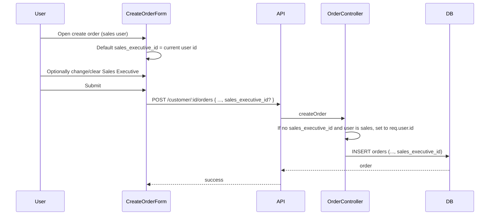

# Add sales_executive_id to Orders

## Summary

- Add optional **sales_executive_id** to the orders table (FK to auth.users).
- When creating an order, allow selecting a sales executive or leaving it empty; if the current user is a sales executive and no value is sent, default **sales_executive_id** to their id.
- Show the sales executive in the orders list (new column).

---

## 1. Database

**New migration** (e.g. `backend/src/db/migrations/YYYYMMDD_add_sales_executive_id_to_orders.sql`):

- Add column: `sales_executive_id UUID REFERENCES auth.users(id) ON DELETE SET NULL` to `public.orders` (nullable, optional).
- Add index: `CREATE INDEX IF NOT EXISTS idx_orders_sales_executive_id ON public.orders(sales_executive_id);` for filters/reporting.
- Add comment on column for clarity.

No RLS changes: orders remain scoped by company; this column is metadata only.

---

## 2. Backend types

- In [backend/src/types/database.ts](backend/src/types/database.ts), add to the **Order** interface:  
`sales_executive_id: string | null;`

---

## 3. Backend – create order

**File:** [backend/src/controllers/orderController.ts](backend/src/controllers/orderController.ts)

- Destructure **sales_executive_id** from `req.body` (optional).
- Resolve value:
  - If `sales_executive_id` is provided (non-empty), use it (optionally validate that the user exists and is a sales exec in the company if you want strict checks).
  - Else if the current user has the **sales** role (e.g. via `hasAnyRole(req.user, req.companyId, ['sales'])` or existing role check), set `sales_executive_id = req.user.id`.
  - Else leave `sales_executive_id` as `null`.
- Add **sales_executive_id** to the `orderData` object passed to `.from('orders').insert(orderData)`.

Keep existing auth checks (company, customer lookup, etc.) unchanged.

---

## 4. Backend – list orders (sales) and enrich with sales executive name

**File:** [backend/src/controllers/orders.ts](backend/src/controllers/orders.ts) – **getSalesOrders**

- The select already uses `*`, so once the column exists, **sales_executive_id** will be in each order.
- **Enrichment:** After building `ordersWithCustomer`, collect distinct non-null `sales_executive_id` values, fetch profiles in one query:  
`profiles.select('id, first_name, last_name, email').in('id', ids)` (no company filter needed if profiles are global by id; if your schema scopes profiles by company, filter by `company_id` matching `req.companyId`).
- Attach to each order: `sales_executive: { id, first_name, last_name, email }` (or a display name) so the list UI can show the name without extra lookups.

---

## 5. Frontend – sales executives list for Create Order

Sales need to populate the “Sales Executive” dropdown; currently **GET /admin/sales-executives** is admin-only.

**Option A (recommended):** Expose the same list to sales via a dedicated route.

- In [backend/src/routes/orders.ts](backend/src/routes/orders.ts), add:  
`router.get('/sales-executives', protect, requireRole(['admin','sales']), getSalesExecutives);`  
and import **getSalesExecutives** from the admin controller (or a shared service).  
So **GET /api/orders/sales-executives** returns the same payload as the admin endpoint.

**Frontend:** Add a small API helper (e.g. in [frontend/src/api/orders.ts](frontend/src/api/orders.ts) or [frontend/src/api/admin.ts](frontend/src/api/admin.ts)) that calls **GET /orders/sales-executives** (with your API base path). Use it in CreateOrder to load the dropdown options; no change to admin-only routes.

---

## 6. Frontend – Create Order form

**File:** [frontend/src/pages/sales/CreateOrder.tsx](frontend/src/pages/sales/CreateOrder.tsx)

- **Schema:** Add optional field to **orderFormSchema**, e.g.  
`sales_executive_id: z.string().uuid().optional().nullable().or(z.literal(''))`
- **Default when user is sales:** If the current user is a sales executive (e.g. from `useAuth()`: `isSales` or roles include `'sales'`), set the form default for **sales_executive_id** to the current user’s id so it’s pre-selected; otherwise leave empty.
- **UI:** Add an optional “Sales Executive” dropdown (Select):
  - Options: result of GET orders/sales-executives (id as value, display: first_name + last_name or email).
  - Allow clearing selection (“None” or empty) so the user can leave it unassigned.
- **Submit:** Include **sales_executive_id** in the payload sent to **customerService.createOrderForCustomer** (only when not empty; backend will apply default when current user is sales if omitted).

No change to [frontend/src/api/customer.ts](frontend/src/api/customer.ts) contract beyond sending **sales_executive_id** in the body when present.

---

## 7. Frontend – Orders table (list)

**File:** [frontend/src/pages/sales/Orders.tsx](frontend/src/pages/sales/Orders.tsx)

- **Desktop table:** Add a **“Sales Executive”** column (e.g. after Customer or before Actions).  
Cell content: `order.sales_executive` (from backend enrichment) – e.g. “First Last” or email – or “—” when null.
- **Mobile card view:** Add one line showing Sales Executive (e.g. “SE: First Last” or “—”) so it’s visible on small screens.

Backend must return **sales_executive** (or at least **sales_executive_id**) on each order in the list; the enrichment in step 4 provides the name.

---

## 8. Order of implementation

1. Migration: add column and index.
2. Backend types: add **sales_executive_id** to Order.
3. orderController.createOrder: accept and default **sales_executive_id**, insert into orders.
4. getSalesOrders: enrich orders with **sales_executive** (profile) for list UI.
5. Backend route: GET /orders/sales-executives for admin + sales.
6. Frontend CreateOrder: schema, default for sales user, dropdown, include in payload.
7. Frontend Orders list: new column (desktop) and line (mobile).

---

## Data flow (high level)

---

## Files to touch

| Layer | File          | Change   |
| ----- | ------------- | -------- |
| DB    | New migration | Add sale |

