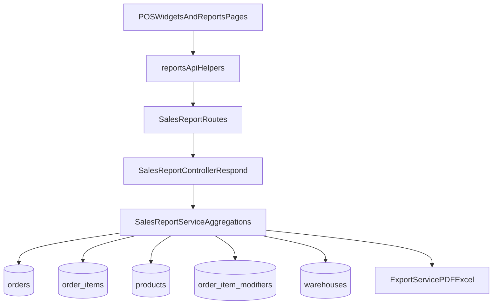

# POS Medium-Effort Reports (Batch B)

## Scope and Defaults

- Deliver each report with: backend endpoint + full page in Sales Reports + POS Analytics widget.
- Reuse existing `ReportQuery` filters (`from_date`, `to_date`, `branch_ids`, `order_source`, `pos_session_id`) and `validateReportQuery` middleware.
- Use default comparison logic: current selected period vs immediately previous equivalent period.
- Keep multi-tenant safeguards identical to existing report services (`company_id`-scoped queries, optional POS/outlet filters).

## Backend Implementation

- Extend [backend/src/services/reports/salesReportService.ts](/Users/rishabhtibrewal/gulf%20frush/fresh-breeze-basket/backend/src/services/reports/salesReportService.ts) with 7 new service functions:
  - `getCategoryBrandSales`
  - `getAverageBasketMetrics`
  - `getModifierAddonRevenue`
  - `getHourlyWeekdayTrendComparison`
  - `getTopBottomMovers`
  - `getOutletComparisonLeaderboard`
  - `getCategoryMarginInsights`
- Reuse current shared order-scoping approach (same pattern used by Batch A services).
- Aggregation notes:
  - Category/brand: aggregate `order_items` joined to `products(category_id, brand_id)` and variants as needed.
  - Margin insight: compute estimated margin using available item-level economics fields (fallback to configured price/cost sources when missing).
  - Basket metrics: per-order rollups (avg items/order, avg basket value, avg unique SKUs/order).
  - Modifier revenue: aggregate from `order_item_modifiers` joined through `order_items -> orders` scope.
  - Trend comparison: build period A + previous-equivalent period B buckets by hour and weekday and return deltas.
  - Movers: period-over-period SKU growth/decline with thresholding to avoid low-volume noise.
  - Outlet leaderboard: outlet-level growth, avg ticket, items/order, ordered with rank.
- Add controllers + export column definitions in [backend/src/controllers/reports/salesReportController.ts](/Users/rishabhtibrewal/gulf%20frush/fresh-breeze-basket/backend/src/controllers/reports/salesReportController.ts) using existing `respond(...)` helper.
- Register routes/permissions in [backend/src/routes/reports/salesReports.ts](/Users/rishabhtibrewal/gulf%20frush/fresh-breeze-basket/backend/src/routes/reports/salesReports.ts).

## Permissions and Migration

- Add idempotent seed migration under `backend/src/db/migrations/` for new view permissions for all 7 reports.
- Grant to roles consistent with Batch A policy (`sales` + `accounts`; admin via bypass).

## Frontend API and Typing

- Extend [frontend/src/api/reports.ts](/Users/rishabhtibrewal/gulf%20frush/fresh-breeze-basket/frontend/src/api/reports.ts) with typed row interfaces and `reportsApi` methods for 7 new endpoints.
- Keep endpoint naming consistent with existing `sales*` report API helpers.

## Full-Page Reports (Reports Module)

- Add report pages under `frontend/src/pages/admin/reports/sales/` for:
  - CategoryBrandSales
  n  - CategoryMarginInsights
  - AverageBasketMetrics
  - ModifierAddonRevenue
  - HourlyWeekdayTrendComparison
  - TopBottomMovers
  - OutletComparisonLeaderboard
- Reuse existing report primitives (`KpiCard`, `ReportFilters`, `ReportTable`, `ExportBar`) and existing chart stack (Chart.js).
- Wire lazy imports + routes in [frontend/src/App.tsx](/Users/rishabhtibrewal/gulf%20frush/fresh-breeze-basket/frontend/src/App.tsx).
- Add dashboard links in [frontend/src/pages/admin/reports/sales/SalesReportsDashboard.tsx](/Users/rishabhtibrewal/gulf%20frush/fresh-breeze-basket/frontend/src/pages/admin/reports/sales/SalesReportsDashboard.tsx).

## POS Analytics Widgets

- Extend POS reports view in [frontend/src/pages/pos/CreatePOSOrder.tsx](/Users/rishabhtibrewal/gulf%20frush/fresh-breeze-basket/frontend/src/pages/pos/CreatePOSOrder.tsx) using same `buildPosReportFilters(reportPeriod)` contract.
- If componentized, follow existing Batch A pattern and add/extend widget container component adjacent to POS page.
- Add dedicated React Query hooks (`queryKey` includes scoped filters), loading/empty/error states, and export actions per widget.
- Enforce admin-only visibility for Outlet Comparison Leaderboard widget and full-page route entry points where needed.

## Validation and Hardening

- Run lint/type checks on touched backend/frontend files.
- Smoke-verify each report using current POS data shape:
  - Non-empty outputs for at least one period in each report.
  - Delta-based reports return both base and comparison periods.
  - Outlet leaderboard hidden for non-admin roles.
- Confirm exports (Excel/PDF) for all new full pages.

## Architecture Update

- Append a new `ARCH_STATE.md` “Recent Changes” entry covering:
  - 7 new endpoints + permissions
  - period-over-period default behavior
  - margin and movers computation caveats/guardrails
  - admin-only outlet leaderboard rule

## Data Flow Diagram

