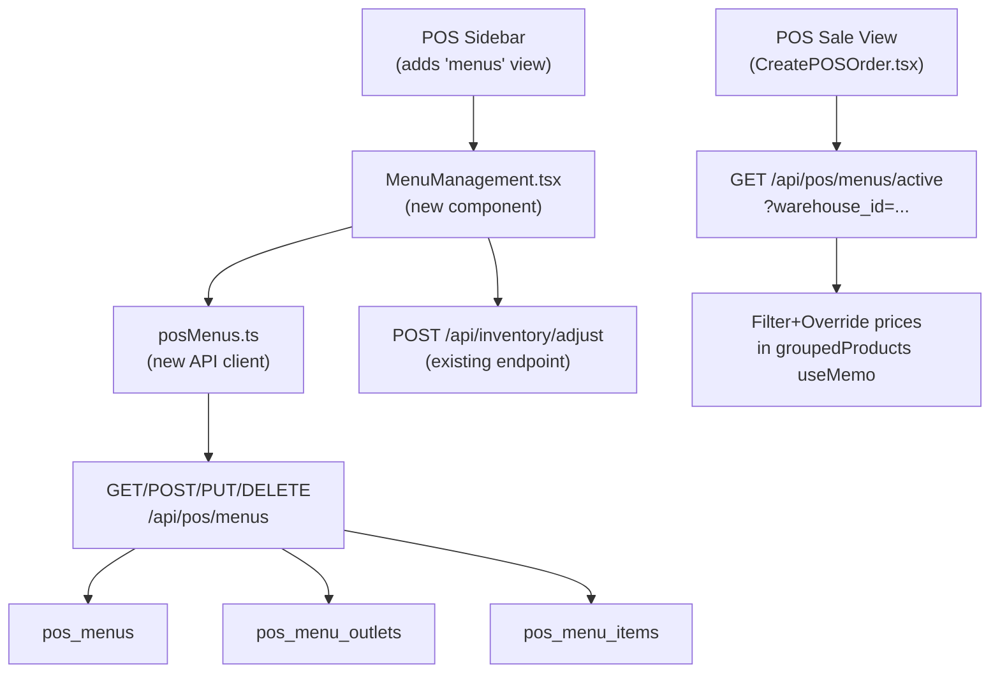

# POS Menu Management System

## Architecture Overview



## 1. Database Migration (via Supabase MCP `apply_migration`)

Three new tables, all with `company_id` for tenant isolation and RLS:

- **`pos_menus`**: `id`, `company_id`, `name`, `description`, `created_at`, `updated_at`
- **`pos_menu_outlets`**: `id`, `company_id`, `menu_id → pos_menus`, `warehouse_id → warehouses`; UNIQUE on `(company_id, warehouse_id)` — enforces one active menu per outlet
- **`pos_menu_items`**: `id`, `company_id`, `menu_id → pos_menus`, `product_id → products`, `variant_id → product_variants`, `is_visible BOOLEAN DEFAULT true`, `pos_price NUMERIC(12,2)` (NULL = use default price), `sort_order INT`; UNIQUE on `(menu_id, variant_id)`

RLS policies on all three: `company_id = current_company_id()`.

## 2. Backend

### New files
- [`backend/src/controllers/posMenuController.ts`](backend/src/controllers/posMenuController.ts) — all handlers
- [`backend/src/routes/posMenus.ts`](backend/src/routes/posMenus.ts) — route definitions

### New endpoints (all behind `protect`, mounted at `/api/pos/menus`)

| Method | Path | Purpose |
|--------|------|---------|
| GET | `/api/pos/menus` | List all menus with their outlet assignments |
| POST | `/api/pos/menus` | Create a new menu |
| GET | `/api/pos/menus/active` | Get active menu+items for `?warehouse_id=xxx` (used by POS sale view) |
| GET | `/api/pos/menus/:id` | Get menu + all menu items |
| PUT | `/api/pos/menus/:id` | Update menu name/description |
| DELETE | `/api/pos/menus/:id` | Delete menu (cascade deletes items+outlet links) |
| PUT | `/api/pos/menus/:id/items` | Bulk upsert menu items (visibility, pos_price, sort_order) |
| POST | `/api/pos/menus/:id/outlets/:warehouseId` | Assign outlet to this menu (upserts `pos_menu_outlets`) |
| DELETE | `/api/pos/menus/:id/outlets/:warehouseId` | Remove outlet assignment |

### Mount in [`backend/src/index.ts`](backend/src/index.ts)
Register the new router alongside existing `/api/pos` routes.

> Inventory updates use the **existing** `POST /api/inventory/adjust` endpoint (calls `adjust_stock` RPC which creates `stock_movements` entry + updates `warehouse_inventory.stock_count`). No new inventory endpoint needed.

## 3. Frontend

### New files
- [`frontend/src/pages/pos/MenuManagement.tsx`](frontend/src/pages/pos/MenuManagement.tsx) — self-contained view component
- [`frontend/src/api/posMenus.ts`](frontend/src/api/posMenus.ts) — typed API wrapper using `apiClient`

### Changes to [`frontend/src/pages/pos/CreatePOSOrder.tsx`](frontend/src/pages/pos/CreatePOSOrder.tsx)

1. **`activeView` type**: add `'menus'` to the union type
2. **`sidebarItems` array**: add entry `{ id: 'menus', icon: <UtensilsCrossed />, label: 'Menus', action: () => setActiveView('menus') }`
3. **Main content area**: add `{activeView === 'menus' && <MenuManagement warehouses={warehouses} />}` block
4. **Active menu filtering in POS sale view**: add a new query:
   ```typescript
   const { data: activeMenu } = useQuery({
     queryKey: ['pos-active-menu', defaultWarehouseId],
     queryFn: () => apiClient.get('/pos/menus/active', { params: { warehouse_id: defaultWarehouseId } }),
     enabled: !!defaultWarehouseId,
   });
   ```
   Then in `groupedProducts` useMemo, if `activeMenu` exists, filter to only `is_visible` variants and apply `pos_price` override.

### `MenuManagement.tsx` UI Layout

**Two-panel layout matching POS dark theme** (`bg-[#0f1117]` / `bg-[#1a1d27]`):

- **Left panel** (menu list, `w-64`):
  - "Create Menu" button at top
  - Each menu card shows name, outlet count badge; clicking selects it for editing
  
- **Right panel** (menu editor, `flex-1`):
  - Header: editable menu name + description, Save button
  - **Outlet Assignment**: toggle row per warehouse — enabling assigns this menu to that outlet (disabling another menu's claim on that outlet)
  - **Warehouse selector** (for inventory view): dropdown of assigned outlets — changes which stock count column is shown
  - **Product table**: search + category filter bar, then scrollable rows:
    - One row per variant: image, product name, variant name/SKU, **Visibility toggle**, **POS Price** input (placeholder = default price), **Stock** input (current `stock_count` for selected warehouse, editable)
    - Inline "Update Stock" saves to `POST /api/inventory/adjust`
  - **Save Menu Items** button — bulk-upserts all changes via `PUT /api/pos/menus/:id/items`

## 4. Files Changed / Created Summary

| File | Action |
|------|--------|
| Supabase migration SQL | Create (via MCP) |
| `backend/src/controllers/posMenuController.ts` | Create |
| `backend/src/routes/posMenus.ts` | Create |
| `backend/src/index.ts` | Edit (mount new router) |
| `frontend/src/api/posMenus.ts` | Create |
| `frontend/src/pages/pos/MenuManagement.tsx` | Create |
| `frontend/src/pages/pos/CreatePOSOrder.tsx` | Edit (sidebar item, view branch, active menu filter) |
