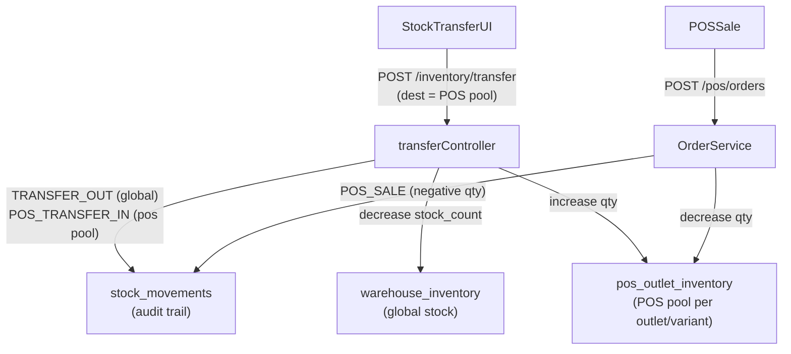

# POS Outlet Inventory Pool

## Architecture



## 1. Database Migration — `20260427_create_pos_outlet_inventory.sql`

New table: `public.pos_outlet_inventory`

```sql
CREATE TABLE IF NOT EXISTS public.pos_outlet_inventory (
  id           UUID PRIMARY KEY DEFAULT gen_random_uuid(),
  company_id   UUID NOT NULL REFERENCES public.companies(id) ON DELETE CASCADE,
  warehouse_id UUID NOT NULL REFERENCES public.warehouses(id) ON DELETE CASCADE,
  product_id   UUID NOT NULL REFERENCES public.products(id) ON DELETE CASCADE,
  variant_id   UUID NOT NULL REFERENCES public.product_variants(id) ON DELETE CASCADE,
  qty          NUMERIC(12,4) NOT NULL DEFAULT 0,
  created_at   TIMESTAMPTZ NOT NULL DEFAULT NOW(),
  updated_at   TIMESTAMPTZ NOT NULL DEFAULT NOW(),
  UNIQUE (company_id, warehouse_id, variant_id)
);
```

- Add RLS: same `company_memberships` pattern as `pos_menu_items`
- Add `updated_at` trigger reusing `public.set_updated_at()`
- Add two new values to `stock_movements.movement_type` CHECK: `POS_TRANSFER_IN`, `POS_SALE`
- Add `'pos_transfer'` to `stock_movements.source_type` CHECK

## 2. Backend — `InventoryService.ts`

Add a method `transferToPosPool(params)`:
- Deducts `qty` from `warehouse_inventory.stock_count` (existing upsert pattern)
- Records `movement_type: TRANSFER_OUT`, `source_type: 'pos_transfer'` in `stock_movements` (global side)
- Upserts into `pos_outlet_inventory` (increase `qty`)
- Records `movement_type: POS_TRANSFER_IN`, `source_type: 'pos_transfer'` in `stock_movements` (pos pool side)
- Both movements share same `reference_id` (a new UUID) and `reference_type: 'pos_transfer'`

Modify existing `handleOrderStockMovement` (or add a parallel method `handlePosOrderStockMovement`):
- When `orderSource === 'pos'` and `pos_outlet_inventory` has a row for `(warehouse_id, variant_id)` → deduct from `pos_outlet_inventory.qty` instead of `warehouse_inventory.stock_count`
- Records `movement_type: POS_SALE` in `stock_movements`
- Falls back to global `warehouse_inventory` if no pos pool row exists (backwards compatible)

## 3. Backend — `inventory.ts` controller + route

Add new controller function `transferToPosPool` for:
- `POST /api/inventory/pos-transfer`
- Body: `{ warehouse_id, items: [{product_id, variant_id, quantity}], notes? }`
- Calls `InventoryService.transferToPosPool`
- Protected by `protect + adminOnly` (same as existing `/transfer`)

Add route in [`backend/src/routes/inventory.ts`](backend/src/routes/inventory.ts).

## 4. Frontend — Stock Transfer UI

The existing [`frontend/src/pages/admin/StockTransfer.tsx`](frontend/src/pages/admin/StockTransfer.tsx) has a 4-step wizard: Source → Destination → Items → Submit.

Add a **transfer mode toggle** at the top: `Standard Transfer` | `To POS Pool`

- In `To POS Pool` mode: Source = regular warehouse selector; Destination = fixed label "POS Outlet Pool" (no warehouse picker needed — the source warehouse IS the POS outlet)
- On submit: calls `POST /api/inventory/pos-transfer` instead of `/api/inventory/transfer`
- After success: invalidates `['pos-outlet-inventory', warehouseId]` query key

## 5. Frontend — POS Menu Management stock display

In [`frontend/src/pages/pos/MenuManagement.tsx`](frontend/src/pages/pos/MenuManagement.tsx):
- Replace the `GET /inventory?warehouse_id=` query (global stock) with a **new query** for `GET /api/inventory/pos-pool?warehouse_id=` to show the POS pool qty
- Keep the stock input field but wire it to the new `POST /api/inventory/pos-transfer` endpoint (transfers from global → POS pool, not a raw adjustment)
- Show both: "Global: N" and "POS Pool: N" columns in the variant table for transparency

## 6. Backend — New read endpoint

Add `GET /api/inventory/pos-pool?warehouse_id=` controller:
- Selects from `pos_outlet_inventory` filtered by `company_id` + optional `warehouse_id`
- Joins `product_variants(id, name, sku)` and `products(id, name)`
- Returns same shape as `GET /inventory` for drop-in compatibility on the frontend

## 7. POS Sale deduction (OrderService.ts)

In [`backend/src/services/core/OrderService.ts`](backend/src/services/core/OrderService.ts), inside the POS stock movement block (around line 289):
- Before calling `handleOrderStockMovement`, check `pos_outlet_inventory` for `(warehouse_id, variant_id)`
- If row exists: deduct from `pos_outlet_inventory.qty` + record `POS_SALE` movement against `outlet_id`
- If row missing: fall through to existing `SALE` movement against `warehouse_inventory` (no behavioural change for outlets not using the POS pool)

## Affected Files Summary

- **New**: `backend/src/db/migrations/20260427_create_pos_outlet_inventory.sql`
- **Modified**: `backend/src/services/core/InventoryService.ts` — add `transferToPosPool`, modify POS deduction
- **Modified**: `backend/src/controllers/inventory.ts` — add `transferToPosPool`, `getPosPool`
- **Modified**: `backend/src/routes/inventory.ts` — 2 new routes
- **Modified**: `backend/src/services/core/OrderService.ts` — POS sale checks pos pool first
- **Modified**: `frontend/src/pages/admin/StockTransfer.tsx` — mode toggle + pos-transfer call
- **Modified**: `frontend/src/pages/pos/MenuManagement.tsx` — show pos pool qty, wire stock input to pos-transfer
- **New**: one new API query in `frontend/src/api/inventory.ts` for `getPosPool` / `transferToPosPool`
