# Architecture State Document

**Last Updated:** 2026-05-04 (Thermal KOT & Customer Bill Print System Redesign)
**Purpose:** Technical reference for current system architecture, routing patterns, and critical implementation details to prevent architectural mistakes. This document serves as the long-term memory and architectural blueprint for all future AI interactions.

---

## System Overview

### Application Purpose
**Fresh Breeze Basket** is a multi-tenant SaaS platform providing comprehensive ERP/POS functionality for businesses managing inventory, sales, procurement, and financial operations. The system supports subdomain-based multi-tenancy, allowing each company to operate on its own subdomain (e.g., `gulffresh.gofreshco.com`).

### Core Modules

1. **Inventory Management**
   - Product catalog with variants (size, color, etc.)
   - Variant-level pricing and stock tracking
   - Warehouse management
   - Stock adjustments, transfers, and movements
   - Low stock alerts

2. **Point of Sale (POS)**
   - **Multi-View SPA Architecture**: Integrated terminal for Sales, History, Customers, Reports, and Settings
   - Retail-focused checkout interface with variant-based product catalog
   - Real-time customer identification and linking
   - Advanced payment processing: Cash (with change), UPI, and **Split Payments**
   - Fulfillment support: Dine-In (Table #), Take Away, Delivery (Address capture)
   - Variant-level product modifiers and add-ons
   - Real-time inventory deduction via OrderService
   - Secure authenticated reporting and live performance analytics
   - **Thermal-printer ready receipt generation**: Optimized 80mm 3-column layout (Item | Qty | Amount) with full financial breakdown.
   - **Smart Cart Merging**: Sequential product clicks increment quantity while respecting modifier selections and price overrides.

3. **Order Management**
   - Sales order creation and tracking
   - Order punching (manual order entry by sales executives)
   - Order status workflow (pending → confirmed → shipped → delivered)
   - Return order processing
   - Order invoicing

4. **Procurement**
   - Purchase order creation and management
   - Goods receipt notes (GRN) with variant support
   - Purchase invoice processing
   - Supplier payment tracking
   - Supplier management

5. **Sales & Customer Management**
   - Customer database
   - Lead management
   - Quotation generation
   - Invoice generation and tracking
   - Payment collection
   - Credit period management

6. **Admin Dashboard**
   - Multi-module dashboard with KPIs
   - Role-based access control (RBAC)
   - Company settings and configuration
   - User and role management
   - Tax configuration
   - Number series management

7. **Reports & Analytics**
   - 5 major groups: Sales, Inventory, Procurement, Accounting, Master
   - **Server-Side Pagination**: Robust pagination for datasets exceeding thousands of records (e.g., Stock Movements).
   - **Unified Search Views**: Flattened database views (`stock_movements_expanded`, `warehouse_inventory_expanded`) for accurate cross-table searching (Product Name OR SKU OR Variant Name).
   - Dedicated materialized views for fast aggregated lookups.
   - Export logic (CSV streaming, Excel).
   - Multi-currency support and real-time exchange rates.
   - IP-based rate limiting on report generation.

8. **E-commerce** (Module defined, implementation status varies)
   - Online store product catalog
   - Shopping cart
   - Checkout flow
   - Order management

---

## Infrastructure & Deployment

### Frontend Deployment (Vercel)

**Technology Stack:**
- **Framework:** React 18 + TypeScript + Vite
- **State Management:** React Context + TanStack React Query
- **UI Library:** Radix UI + Tailwind CSS
- **Routing:** React Router v6
- **API Client:** Axios with interceptors

**Deployment:**
- Hosted on Vercel as static site
- All routes rewrite to `/index.html` (SPA routing via `vercel.json`)
- Environment variables set in Vercel dashboard

**Required Environment Variables:**
```bash
VITE_API_BASE_URL=https://rishabh.dtsanskar.tech/api
VITE_SUPABASE_URL=https://[project].supabase.co
VITE_SUPABASE_ANON_KEY=[anon_key]
```

### Backend Deployment (DigitalOcean + PM2)

**Technology Stack:**
- **Runtime:** Node.js + Express + TypeScript
- **Process Manager:** PM2
- **Reverse Proxy:** nginx (on DigitalOcean Droplet)
- **Port:** 5000 (internal), proxied via nginx on port 443
- **Domain:** `rishabh.dtsanskar.tech`

**Deployment Process:**
1. Build TypeScript: `cd backend && npm run build`
2. Set environment variables in `.env` file
3. Start with PM2: `pm2 start dist/index.js --name fresh-breeze-api`
4. Configure nginx (see `docs/nginx-backend-config-updated.conf`)
5. Test: `curl https://rishabh.dtsanskar.tech/health`

**Required Environment Variables:**
```bash
# Supabase Configuration
SUPABASE_URL=https://[project].supabase.co  # Or Cloudflare Worker proxy URL
SUPABASE_ANON_KEY=[anon_key]
SUPABASE_SERVICE_ROLE_KEY=[service_role_key]
SUPABASE_ISSUER=https://[project].supabase.co  # Real Supabase URL (required if using proxy)
SUPABASE_JWKS_URL=https://[project].supabase.co/auth/v1/.well-known/jwks.json  # Optional

# JWT Configuration
JWT_SECRET=[jwt_secret]

# Multi-Tenancy
TENANT_BASE_DOMAIN=gofreshco.com
DEFAULT_COMPANY_SLUG=default

# CORS
CORS_ORIGIN=https://gulffresh.gofreshco.com,https://www.gofreshco.com

# Cloudflare R2 Storage
R2_ACCOUNT_ID=[account_id]
R2_ACCESS_KEY_ID=[access_key]
R2_SECRET_ACCESS_KEY=[secret_key]
R2_BUCKET_NAME=[bucket_name]

# Server Configuration
PORT=5000
NODE_ENV=production
```

### Database (Supabase)

**Technology:**
- **Database:** PostgreSQL (via Supabase)
- **Auth:** Supabase Auth with JWT tokens
- **Security:** Row Level Security (RLS) policies
- **Storage:** Cloudflare R2 (NOT Supabase Storage)

**Connection:**
- Direct connection via `SUPABASE_URL` (default)
- **OR** via Cloudflare Worker proxy (to bypass regional blocks)
  - When using proxy: `SUPABASE_URL` points to Worker, `SUPABASE_ISSUER` points to real Supabase
  - JWT verification uses `SUPABASE_ISSUER` for `iss` claim validation

**File Storage:**
- All file uploads go to Cloudflare R2
- Bucket URL pattern: `https://{bucketName}.{accountId}.r2.cloudflarestorage.com/{fileName}`
- Files stored with company-scoped paths: `{companyId}/{timestamp}_{filename}`

---

## Data & Network Flow

### Frontend → Backend API Flow

```mermaid
sequenceDiagram
    participant App as React App (Vercel)
    participant APIClient as apiClient.ts (Axios)
    participant Nginx as nginx (DigitalOcean)
    participant API as Express API (Port 5000)
    participant DB as Supabase (PostgreSQL)

    App->>APIClient: Extract subdomain from hostname
    Note over APIClient: Set X-Tenant-Subdomain header<br/>Set Authorization: Bearer <jwt>
    APIClient->>Nginx: HTTPS Request
    Nginx->>API: Proxy to http://127.0.0.1:5000
    
    rect rgb(30, 30, 40)
    Note over API: 1. resolveTenant middleware
    API->>DB: Query companies table (using Admin client)
    DB-->>API: Return tenant data
    Note over API: Set req.companyId
    end
    
    rect rgb(30, 30, 40)
    Note over API: 2. Authentication middleware
    API->>API: Verify JWT token
    Note over API: Set req.user
    end
    
    rect rgb(30, 30, 40)
    Note over API: 3. Route handler
    API->>DB: Execute query with .eq('company_id', req.companyId)
    DB-->>API: Return isolated data
    end
    
    API-->>App: JSON Response
```



### Backend → Supabase Connection

**Direct Connection (Current Default):**
```
Backend → SUPABASE_URL → Supabase API
```

**Cloudflare Worker Proxy (Supported, Ready for Use):**
```
Backend → SUPABASE_URL (Worker) → Real Supabase API
         ↓
         SUPABASE_ISSUER (for JWT validation)
```

**Implementation Details:**
- Supabase client created in `backend/src/config/supabase.ts`
- JWT verification in `backend/src/utils/supabaseJwt.ts` supports proxy:
  - Uses `SUPABASE_ISSUER` for JWT `iss` claim validation
  - Fetches JWKS from `SUPABASE_JWKS_URL` or `${SUPABASE_URL}/auth/v1/.well-known/jwks.json`
- **Current State:** Code supports proxy, but direct connection is used in production

**Why Cloudflare Worker Proxy?**
- Bypasses regional blocks/restrictions
- Can add caching layer
- Can add rate limiting
- Can add request transformation

### Multi-Tenant Data Isolation

**Tenant Resolution Flow:**
1. Frontend extracts subdomain from `window.location.hostname`
2. Frontend sends `X-Tenant-Subdomain` header with API requests
3. nginx preserves header: `proxy_set_header X-Tenant-Subdomain $http_x_tenant_subdomain;`
4. Backend `resolveTenant` middleware:
   - Priority 1: `X-Tenant-Subdomain` header
   - Priority 2: Extract from `Host` header
   - Queries `companies` table (using `supabaseAdmin` to bypass RLS)
   - Caches result for 10 minutes
   - Sets `req.companyId` and `req.companySlug`

**Data Isolation:**
- All queries MUST include `.eq('company_id', req.companyId)`
- RLS policies enforce company isolation at database level
- Frontend permission checks prevent UI access
- Backend RLS prevents data access

---

## Directory Architecture

### Strict Separation: Frontend ↔ Backend

```
fresh-breeze-basket/
├── frontend/                    # React SPA (Vercel deployment)
│   ├── src/
│   │   ├── api/                 # API service layer (26 files)
│   │   │   ├── products.ts
│   │   │   ├── orders.ts
│   │   │   ├── purchaseOrders.ts
│   │   │   └── ...
│   │   ├── components/          # React components (98 files)
│   │   │   ├── ui/             # Shadcn-style primitives
│   │   │   ├── layout/         # Sidebar, Layout, Header
│   │   │   └── modules/        # Module-specific components
│   │   ├── pages/              # Route components (88 files)
│   │   │   ├── admin/          # Admin dashboard pages
│   │   │   ├── pos/            # POS interface
│   │   │   ├── procurement/   # Procurement pages
│   │   │   └── ...
│   │   ├── config/             # Configuration files
│   │   │   ├── modules.config.tsx  # Module definitions (SINGLE SOURCE OF TRUTH)
│   │   │   └── sidebarRoutes.ts
│   │   ├── contexts/           # React Context providers
│   │   │   ├── AuthContext.tsx
│   │   │   └── ...
│   │   ├── hooks/              # Custom React hooks
│   │   │   ├── useAuth.ts
│   │   │   ├── usePermissions.ts
│   │   │   └── ...
│   │   ├── lib/                # Core libraries
│   │   │   ├── apiClient.ts    # Axios instance with interceptors
│   │   │   └── ...
│   │   ├── integrations/      # Third-party integrations
│   │   │   └── supabase/       # Supabase client
│   │   └── types/             # TypeScript types
│   ├── vercel.json             # Vercel routing config
│   └── package.json
│
├── backend/                     # Express API (DigitalOcean + PM2)
│   ├── src/
│   │   ├── controllers/        # Request handlers (31 files)
│   │   │   ├── purchaseOrders.ts
│   │   │   ├── goodsReceipts.ts
│   │   │   ├── pos.ts
│   │   │   ├── orders.ts
│   │   │   └── ...
│   │   ├── routes/             # Express route definitions (31 files)
│   │   │   ├── purchaseOrders.ts
│   │   │   ├── pos.ts
│   │   │   └── ...
│   │   ├── middleware/         # Express middleware
│   │   │   ├── tenant.ts      # Tenant resolution (CRITICAL)
│   │   │   ├── auth.ts        # Authentication
│   │   │   └── error.ts        # Error handling
│   │   ├── services/          # Business logic layer
│   │   │   ├── core/          # Core services
│   │   │   │   ├── OrderService.ts
│   │   │   │   ├── InventoryService.ts
│   │   │   │   └── PricingService.ts
│   │   │   └── shared/        # Shared services
│   │   ├── db/
│   │   │   ├── migrations/   # SQL migration files (109 files)
│   │   │   │   ├── 20260301_add_variant_id_to_procurement_items.sql
│   │   │   │   └── ...
│   │   │   └── supabase.ts    # Database connection
│   │   ├── utils/             # Utility functions
│   │   │   ├── r2Client.ts    # Cloudflare R2 client
│   │   │   ├── supabaseJwt.ts # JWT verification (supports proxy)
│   │   │   └── ApiError.ts    # Custom error classes
│   │   ├── config/            # Configuration
│   │   │   ├── supabase.ts    # Supabase client initialization
│   │   │   └── index.ts
│   │   └── types/             # TypeScript types
│   ├── dist/                  # Compiled JavaScript (production)
│   ├── package.json
│   └── tsconfig.json
│
└── docs/                       # Documentation
    ├── nginx-backend-config-updated.conf
    ├── procurement-workflow.md
    └── ...
```

### Key Files Reference

**Frontend:**
- `frontend/src/lib/apiClient.ts` - Axios instance with tenant header injection and token refresh
- `frontend/src/config.ts` - API base URL configuration
- `frontend/src/config/modules.config.tsx` - **SINGLE SOURCE OF TRUTH** for module definitions
- `frontend/src/contexts/AuthContext.tsx` - Authentication and company context

**Backend:**
- `backend/src/index.ts` - Express app entry point, CORS config, route mounting
- `backend/src/middleware/tenant.ts` - Tenant resolution middleware (MUST run before routes)
- `backend/src/config/supabase.ts` - Supabase client initialization
- `backend/src/utils/supabaseJwt.ts` - JWT verification with JWKS (supports Cloudflare Worker proxy)
- `backend/src/utils/r2Client.ts` - Cloudflare R2 S3-compatible client
- `backend/src/controllers/partyController.ts` - Business partner linking and unified party ledger endpoints
- `backend/src/routes/parties.ts` - `/api/parties` route definitions

---

## Current State

### Stable Features (Production Ready)

**Procurement Module:**
- ✅ Purchase Orders (with variant support)
- ✅ Goods Receipts (with variant support)
- ✅ Purchase Invoices
- ✅ Supplier Payments
- ✅ Supplier Management

**Inventory Module:**
- ✅ Warehouse Management
- ✅ Variant-level Inventory Tracking
- ✅ Stock Movements (including REPACK_OUT, REPACK_IN)
- ✅ Stock Adjustments
- ✅ Stock Transfers
- ✅ Packaging Recipes (templates for bulk/retail conversions, supports M:N relations)
- ✅ Repack Orders (package breakdown: bulk → retail) — **upgraded 2026-03-22:**
  - `repack_order_inputs` tracks `wastage_quantity`
  - `repack_order_outputs` tracks `unit_cost`, `additional_cost_per_unit`
  - `process_repack_order_v3` RPC computes unit cost distributing base costs + updates weighted-average `product_prices`
  - Frontend: React-Hook-Form dynamic array builders (M:1, 1:M, M:M) in Edit/Create + History with wastage reporting

**Sales Module:**
- ✅ Sales Orders (with extra charges, round-off, proportional extra discount, no CD outside CN)
- ✅ Order Status Workflow
- ✅ Invoices (Tax Invoice HTML; extra charges tax included in summary)
- ✅ Customer Management
- ✅ Lead Management
- ✅ Payment Collection
- ✅ Credit Notes (manual + automated via sales flow)
- ✅ **Quotations** (fully standardized — see Recent Changes 2026-03-28)

**Product Module:**
- ✅ Products with Variants
- ✅ Variant-level Pricing
- ✅ Product Images (R2 storage)
- ✅ Categories & Brands
- ✅ HSN Code Management

**POS Module:**
   - ✅ **Multi-View SPA Framework**: Internal view-switching logic for zero-latency module transitions.
   - ✅ **Variant-Based Product Catalog**: Products are browsed and added as specific variants.
   - ✅ **Integrated Sidebar**: Persistent navigation for administrative tasks (History, Customers, etc.) without leaving POS.
   - ✅ **Customer Management**: In-line customer search, creation, and order linking.
   - ✅ **Financial Engine**: Standardized `Subtotal - Discount + Tax` logic with round-off support.
   - ✅ **Advanced Payments**: Cash tendered/change calculation, UPI reference tracking, and **Credit Payment** (customer-only, maps to `payment_status: 'full_credit'`).
   - ✅ **Fulfillment Types**: Context-aware UI for Dine-In (Table #), Take-Away, and Delivery (Address).
   - ✅ **Product Modifiers**: Support for variant-level add-ons with automated price adjustments.
   - ✅ **Stock Integration**: Direct linkage to `OrderService` for cross-outlet inventory reservation.
   - ✅ **Multi-Variant Picker Modal**: Single product card per product in the grid; multi-variant products open an in-line modal for variant selection.
   - ✅ **Live Inventory Display**: Per-product stock counts rendered on sale grid cards (colour-coded: green/amber/red) sourced from `warehouse_inventory`.
   - ✅ **POS Menu Management**: Create named menus, assign per outlet/warehouse (one active menu per outlet enforced by DB unique constraint), control variant visibility and price overrides. Accessible via "Menus" sidebar item. Tables: `pos_menus`, `pos_menu_outlets`, `pos_menu_items`.
   - ✅ **Secure Reporting**: Authenticated Excel report exports (Daily, Weekly, Monthly, Session) using `apiClient` blobs.
   - ✅ **Live Dashboard**: Dynamic "Top Selling Items" analytics driven by live transaction data.
   - ✅ **Receipt System**: Auto-generated custom receipt numbering (`POS-XXXXXX`) and thermal-ready HTML with **3-column layout** (Item | Qty | Amount) and **Discount % visibility**.
   - ✅ **Discounted Tax Logic**: Advanced financial engine calculates tax on the net value (after discount) across frontend and backend.
   - ✅ **Smart Cart Interaction**: Automated quantity incrementing on sequential clicks for identical items.

**Admin Dashboard:**
- ✅ Multi-module Dashboard with KPIs
- ✅ Role-based Access Control (RBAC)
- ✅ Company Settings
- ✅ User & Role Management

**Reports Module:**
- ✅ 5 primary groups (Sales, Inventory, Procurement, Accounting, Master)
- ✅ Fast aggregation via PostgreSQL Materialized Views (e.g., `mv_sales_daily`)
- ✅ Endpoints with pagination, multi-param filtering, and streaming CSV export
- ✅ UI: Dynamic nested 'Reports' sidebar integrated inside *each* core module
- ✅ Rate-limiting built-in to prevent DoS on heavy DB queries

### In Development / Partial Implementation

**E-commerce Module:**
- ⚠️ Module defined in config
- ⚠️ Shopping cart implemented
- ⚠️ Checkout flow implemented
- ⚠️ Online store catalog (partial)


**Accounting Module:**
- ⚠️ Module defined in config
- ⚠️ Basic structure in place
- ⚠️ Full implementation pending

### Recent Changes (2026-05-04) — Thermal KOT & Customer Bill Print System Redesign

#### Objective
Fully re-route and redesign the three POS print outputs (individual KOT, all-kitchen KOT, customer bill) into distinct, correctly-formatted thermal layouts. Fix a double-print bug where every print button was triggering the dialog twice.

#### Print Endpoint Routing (Corrected)

| Button in POS UI | Frontend service call | Backend route | Controller | Output format |
|---|---|---|---|---|
| `Print KOT-xxx-N` (individual ticket) | `getKitchenKOTByTicketHTML(ticketId)` | `GET /api/invoices/kot/ticket/:id/kitchen` | `getKitchenKOTByTicket` | New Quick Bill KOT format |
| `All Kitchen KOT` | `getKitchenKOTHTML(orderId)` | `GET /api/invoices/kot/kitchen/:orderId` | `getKitchenKOT` | Merged Quick Bill KOT (all counters in one slip) |
| `Customer Bill` | `getCustomerBillHTML(orderId)` | `GET /api/invoices/customer/:orderId` | `getCustomerBill` | Thermal customer bill with prices, tax, totals |

**Anti-hallucination**: `getCustomerKOT` (`GET /api/invoices/kot/customer/:orderId`) still exists and is the Quick Bill KOT for customer-facing quick slips — distinct from the Customer Bill.

#### Quick Bill KOT Format (`generateQuickBillKOTHTML`)

File: `backend/src/controllers/invoices.ts`

New layout (thermal 80mm):
```
  OUTLET NAME (from warehouses.name via ticket.outlet_id)
  KOT No : 7
  Quick Bill
  ─ ─ ─ ─ ─ ─ ─ ─
  Order No : 8765          ← last segment of receipt_number
  Billed By: sunil
  ─────────────────
  ITEM            QTY
  ─────────────────
  A Dosa Paneer    1
  ─────────────────
  Total Qty:    1.00
```

Key decisions:
- **No date/time in header** — removed for cleaner KOT
- **No company name** — always uses outlet name from `warehouses.name`, resolved via `ticket.outlet_id` (most authoritative) → `order.outlet_id` → `'Store'` fallback
- **Short order number** — `rawReceipt.split('-').pop()` gives e.g. `'8765'` from `'RCP-20260503-8765'`
- **No `window.onload → window.print()` script** — removed from generated HTML; frontend `printHTML()` is the sole trigger
- Accepts optional `kotSeqOverride: string` parameter for merged multi-ticket display (e.g. `'7, 8'`)

#### All Kitchen KOT — Merged Single Slip (`getKitchenKOT`)

Previously generated one Quick Bill KOT per ticket (per counter) and concatenated HTML. Now:
1. Fetches all `pos_kot_tickets` for the order (ordered by `created_at ASC`)
2. Merges ALL `ticket_items_snapshot` arrays into one flat `KotSnapshotLine[]`
3. Passes a single synthetic merged ticket to `generateQuickBillKOTHTML` with:
   - `kotSeqOverride = '7, 8'` (all seq numbers joined)
   - `outlet_id` from the first ticket
   - `ticket_items_snapshot` = flattened union of all snapshots
4. Produces **one single slip** showing all items from all counters

Fallback: if no `pos_kot_tickets` rows exist, falls through to legacy `generateThermalKOTHTML(orderId, companyId, 'kitchen')`.

#### Customer Bill Format (`getCustomerBill` → `generateThermalKOTHTML` with `'customer'` type)

The existing `generateThermalKOTHTML` already supported a `'customer'` mode with Item | Qty | Amount columns and financial totals. Updated to:
- **Fetch KOT numbers** from `pos_kot_tickets.kot_number_seq` for the order and include them in the header
- **Show short receipt number** (`Bill No : 8765` not the full `RCP-20260503-8765`)
- **Remove `Content-Disposition: attachment`** header so HTML renders inline for iframe printing instead of forcing a download

Customer bill header now shows:
```
  OUTLET NAME
  CUSTOMER BILL
  Bill No : 8765
  KOT No : 7, 8
  03/05/26, 11:39 PM
```

#### Double-Print Bug Fix (`frontend/src/api/invoices.ts` → `printHTML`)

**Root causes (two simultaneous):**
1. Generated HTML contained `<script>window.onload = () => window.print();</script>` AND the frontend `printHTML` also called `iframe.contentWindow.print()` → two prints
2. `printHTML` could call `printAndCleanup()` immediately (if `doc.readyState === 'complete'`) AND THEN `iframe.onload` also fired, calling it a second time

**Fix:**
```typescript
let printed = false;
const printAndCleanup = () => {
  if (printed) return;  // guard
  printed = true;
  // ... print logic
};
iframe.onload = printAndCleanup;       // always register
if (doc.readyState === 'complete') {    // also call immediately if ready
  printAndCleanup();
}
```
- The `printed` flag makes the second call a no-op regardless of trigger order
- `window.onload → window.print()` removed from all generated HTML templates

#### Anti-Hallucination Notes
- `getCustomerBill` (`GET /api/invoices/customer/:orderId`) now calls `generateThermalKOTHTML(orderId, companyId, 'customer')` — **NOT** `generateInvoiceHTML`. The A4 PDF invoice path is no longer used for POS customer bill printing.
- `getKitchenKOT` (all kitchen) produces **one merged slip**, not multiple slips concatenated. Do not revert to the previous per-ticket HTML concatenation approach.
- `generateQuickBillKOTHTML` signature: `(orderId, companyId, ticket, kotSeqOverride?)` — 4th param is only for the merged all-kitchen case.
- The `generateKitchenHtmlFromTicketSnapshots` function still exists in the codebase for potential legacy use but is no longer called by any active controller.
- Graphify updated: 1452 nodes, 1502 edges, 384 communities (post-session rebuild).

---

### Recent Changes (2026-04-27) — POS Order History KOT Display Enhancement

#### POS Menu Management System

##### Objective
Allow operators to create named menus, assign them per outlet/warehouse, control which product variants appear in the POS sale view, set POS-specific price overrides, and update inventory stock counts — all from within the POS SPA.

##### Database Migration (`20260427_create_pos_menu_tables.sql` & recent updates)
Three new tables with RLS scoped to `company_memberships (is_active = TRUE)`:
- **`pos_menus`**: `id`, `company_id`, `name`, `description`, `created_at`, `updated_at` (auto-updated via trigger `trg_pos_menus_updated_at`), `pos_display_category_ids` (`uuid[]`), `pos_display_collection_ids` (`uuid[]`).
- **`pos_menu_outlets`**: `id`, `company_id`, `menu_id → pos_menus`, `warehouse_id → warehouses`. `UNIQUE (company_id, warehouse_id)` enforces one active menu per outlet. Assigning a new menu to an outlet automatically displaces the previous one (upsert on conflict).
- **`pos_menu_items`**: `id`, `company_id`, `menu_id`, `product_id`, `variant_id` (NOT NULL — always at variant level), `is_visible BOOLEAN DEFAULT TRUE`, `pos_price NUMERIC(12,2)` (NULL = use default sale price), `sort_order INT`. `UNIQUE (menu_id, variant_id)`.

New shared DB function: `public.set_updated_at()` — generic `BEFORE UPDATE` trigger function; attached to `pos_menus` and `pos_menu_items`.

##### Backend
- **New controller**: `backend/src/controllers/posMenuController.ts`
- **New routes**: `backend/src/routes/posMenus.ts` — mounted at `/api/pos/menus` in `backend/src/index.ts`
- All 9 endpoints are behind `protect` middleware:

| Method | Path | Purpose |
|--------|------|---------|
| GET | `/api/pos/menus` | List all menus with outlet assignments |
| POST | `/api/pos/menus` | Create menu |
| GET | `/api/pos/menus/active?warehouse_id=` | Active menu + items for outlet (POS sale view) |
| GET | `/api/pos/menus/:id` | Menu detail + items |
| PUT | `/api/pos/menus/:id` | Rename / re-describe |
| PATCH | `/api/pos/menus/:id/display-filters` | Update category/collection display filters |
| DELETE | `/api/pos/menus/:id` | Delete (cascades items + outlet links) |
| PUT | `/api/pos/menus/:id/items` | Bulk upsert items via `onConflict: 'menu_id,variant_id'` |
| POST | `/api/pos/menus/:id/outlets/:warehouseId` | Assign outlet (upserts `pos_menu_outlets`) |
| DELETE | `/api/pos/menus/:id/outlets/:warehouseId` | Unassign outlet |

Inventory stock updates from Menu Management UI use the **existing** `POST /api/inventory/adjust` endpoint.
**New bulk lookup**: `GET /api/collections/variants?collection_ids=...` (in `collectionController.ts`) to efficiently resolve variants belonging to multiple collections for the POS display filters.

##### Frontend
- **New API client**: `frontend/src/api/posMenus.ts` — typed wrapper using `apiClient`.
- **New component**: `frontend/src/pages/pos/MenuManagement.tsx` — two-panel dark SPA view:
  - Left panel: menu list with inline create form.
  - Right panel: editable name/description header, **POS Display Filters** (multi-select categories and collections to restrict POS catalog scope), per-outlet toggle row (assign/unassign), warehouse selector for stock view, full product/variant table with visibility checkbox, POS price input (placeholder = default price), inline stock count field.
- **`frontend/src/pages/pos/CreatePOSOrder.tsx`** changes:
  - `activeView` type extended to include `'menus'`.
  - `activeMenu` query: `GET /api/pos/menus/active?warehouse_id=<selectedOutlet>` — `staleTime: 30000`, keyed by warehouse ID, invalidated on menu save.
  - **Multi-tier Filtering Architecture** (`groupedProducts` useMemo):
    1. **Display Filters (Outer Scope)**: If `pos_display_category_ids` or `pos_display_collection_ids` are set, products are filtered using **OR logic** (must belong to at least one selected category OR collection).
    2. **Menu Items (Inner Scope)**: If *no* display filters are active, the `is_visible` flag from `pos_menu_items` gates visibility. If display filters *are* active, the menu-items list is only used for `pos_price` overrides, ensuring display filters fully control the browseable catalog scope.
  - **Collection Tabs**: Selected collections render as emerald-styled tabs alongside category tabs in the POS header. Clicking a collection tab (`col:{id}`) filters the grid using a per-collection `collectionVariantMap`.
  - Menus view rendered **inside** the main content `<div className="flex-1 flex min-w-0 min-h-0 overflow-hidden relative">` — not as a sibling.

**Critical layout rule**: All POS view blocks (`sale`, `history`, `customers`, `menus`, `reports`, `settings`) must be direct children of the main content flex container (line ~1502). Placing a view block outside this div causes it to render as an extra sibling in the root flex row, breaking layout.

#### POS Product Cards — Multi-Variant Picker Modal
- Product grid now shows **one card per product** (not per variant).
- Single-variant products → click adds to cart directly.
- Multi-variant products → click opens `variantPickerModal` (inline modal) showing variant cards with name, SKU, price, and stock count.
- Multi-variant badge (purple `Layers` icon + count) shown on card; price displays lowest variant price with `+` suffix if range exists.

#### POS Real-Time Inventory Display
- New query `pos-outlet-inventory` (`GET /api/inventory?warehouse_id=<outlet>&limit=2000`, `staleTime: 60000`) builds a `variantStockMap` keyed by `variant_id`.
- Stock count displayed on every product card in the sale grid:
  - **Emerald** `Stock: N` — healthy stock.
  - **Amber** `Low: N` — stock ≤ 5.
  - **Red** `Out of stock` — stock ≤ 0; card also dims to 60% opacity.
  - Multi-variant cards show **sum** across all variants.
  - No pill shown when warehouse has no inventory record for that variant.
- Same colour-coded stock labels appear on each variant card inside the variant picker modal.

#### POS Payment — Credit Replaces Split
- `PaymentMethod` type: `'split'` replaced by `'credit'`.
- **Credit payment behaviour**:
  - Only available when a named customer is selected (walk-in customers cannot use credit).
  - Button is visually greyed-out with a `customer` micro-badge when no customer is selected; clicking shows a toast error.
  - `handleCharge` guard: hard-blocks mutation and shows toast if credit is selected without a customer.
  - Payload sends `payment_status: 'full_credit'` (existing enum handled by `OrderService` / `PaymentService` — no backend changes needed).
  - Credit panel: amber info box showing customer name and amount owed; no cash input.
- **Anti-hallucination note**: Split payment UI and `split_payments` array state remain in the file (unused) to avoid accidental breakage of unrelated query references; the `PaymentMethod` type no longer includes `'split'`.

#### Anti-Hallucination Ledger Additions
- `pos_menu_outlets.UNIQUE (company_id, warehouse_id)` — do not add a separate "is_active" boolean to this table; uniqueness constraint IS the "one active menu per outlet" mechanism.
- `pos_menu_items.variant_id` is NOT NULL — menus always operate at variant level, never product level.
- `pos_price = NULL` means "use default sale price from `product_prices`" — do not default to 0.
- POS credit payment maps to `payment_status: 'full_credit'` on the backend, NOT a new payment method string. The backend `OrderService` already handles `full_credit` without creating a payment record.
- `pos_outlet_inventory.UNIQUE (company_id, warehouse_id, variant_id)` — the pool is scoped to outlet+variant. Do NOT add a separate `is_active` flag; presence of a row means the pool is configured.
- POS sale deduction is **fallback-safe**: if no `pos_outlet_inventory` row exists for a variant, the system falls through to the existing `warehouse_inventory` SALE movement (backwards compatible).
- POS controller (`backend/src/controllers/pos.ts`) was previously hardcoding `paymentStatus: 'paid'`. It now reads `payment_status` from the request body, defaulting to `'full_credit'` when `payment_method === 'credit'`, otherwise `'paid'`.

#### KOT (Kitchen Order Tickets) — 2026-04-28

- **Migration**: `backend/src/db/migrations/20260428_kot_system.sql` (also applied via Supabase MCP as `kot_system_20260428`).
- **Tables** (all tenant-scoped with `company_id`, `outlet_id` = `warehouses.id`): `pos_food_counters`, `pos_kot_settings` (includes required `default_counter_id` per outlet), `product_food_counters` (`UNIQUE (company_id, product_id)`), `pos_kot_sequence_state` (sequence key **excludes** `counter_id`: `company_id`, `outlet_id`, `reset_frequency`, `bucket_start`), `pos_kot_tickets` (`ticket_items_snapshot` JSONB — kitchen source of truth for print/KDS line labels).
- **Functions**: `kot_local_bucket_start`, `next_kot_number` (SECURITY DEFINER; `GRANT EXECUTE` to `service_role` and `authenticated`).
- **Default-counter policy**: Unmapped products route to `pos_kot_settings.default_counter_id`. **POS order creation requires** a `pos_kot_settings` row for the resolved outlet (validated in `createPOSOrder` before `OrderService.createOrder`).
- **Backend**: `backend/src/services/core/KotService.ts`; `backend/src/controllers/kotController.ts`; router `backend/src/routes/posKot.ts` mounted at **`/api/pos/kot`** in `backend/src/index.ts`. `createPOSOrder` generates tickets after `order_items` exist and returns `kot_tickets` on the success payload.
- **Kitchen print**: `GET /api/invoices/kot/kitchen/:orderId` uses ticket snapshots when `pos_kot_tickets` rows exist; **`GET /api/invoices/kot/ticket/:ticketId/kitchen`** prints a single ticket from JSONB only (`backend/src/routes/invoices.ts`).
- **Thermal label format**: kitchen KOT and customer bill item lines now render **`Product Name (Variant Name)`** when both exist; if names are identical, only product name is shown; if variant is missing, product name is used. Implemented in:
  - `backend/src/controllers/invoices.ts` (`formatThermalItemName` used by `generateThermalKOTHTML`)
  - `backend/src/services/core/KotService.ts` (`kitchen_display_name` snapshot uses same naming rule)
- **Realtime** ✅ **LIVE** (enabled 2026-04-27 via Supabase MCP migration `enable_realtime_pos_kot_tickets` + `pos_kot_tickets_realtime_replica_identity_full`):
  - `public.pos_kot_tickets` is in the `supabase_realtime` publication (verified via `pg_publication_tables`).
  - `REPLICA IDENTITY` is set to **`FULL`** — required for Supabase Realtime to correctly evaluate RLS on `UPDATE`/`DELETE` payloads (old row must be present).
  - RLS SELECT policy (`pos_kot_tickets_select`) uses `company_memberships` check — only authenticated company members receive events; the Supabase Dashboard inspector will show **zero events** (expected — it has no membership).
  - KDS channel pattern: `supabase.channel('pos_kot_tickets-${companyId}').on('postgres_changes', { event: '*', schema: 'public', table: 'pos_kot_tickets', filter: 'outlet_id=eq.${outletId}' }, handler).subscribe(status => { if (status === 'SUBSCRIBED') fetchOpenTickets(); })`
  - **Reconnect refetch is mandatory**: every `SUBSCRIBED` event (first connect AND every reconnect) must trigger `GET /api/pos/kot/tickets?outlet_id=...&status=open` to backfill missed events.
- **Frontend**: `frontend/src/api/kot.ts`, routes `/pos/kot-settings`, `/pos/kds` in `frontend/src/App.tsx`; POS Settings links in `CreatePOSOrder.tsx`; module sidebar entries in `frontend/src/config/modules.config.tsx` (`pos.sidebarItems`).
  - `frontend/src/pages/pos/KotSettings.tsx` now uses POS-dark shell styling (`#0f1117` / `#1a1d27`) for visual consistency with terminal pages.
  - Product mapping UX updated to table format (**Product** | **Counter station**) with a staged-edit model and explicit **Save changes** button (bulk apply), instead of immediate per-row writes.

#### POS Outlet Inventory Pool (2026-04-27)

##### Objective
Maintain a separate per-outlet stock pool for the POS terminal, distinct from global `warehouse_inventory`. This allows operators to pre-load stock into the POS pool, and POS sales deduct from that pool before touching global inventory.

##### Database
- **New table**: `public.pos_outlet_inventory` — `id`, `company_id`, `warehouse_id`, `product_id`, `variant_id`, `qty`, `created_at`, `updated_at`. Unique on `(company_id, warehouse_id, variant_id)`. RLS via `company_memberships`. `updated_at` trigger via existing `set_updated_at()`.
- **Migration**: `backend/src/db/migrations/20260427_create_pos_outlet_inventory.sql`
- Two new `stock_movements.movement_type` values added: `POS_TRANSFER_IN`, `POS_SALE`.
- New `stock_movements.source_type` value: `pos_transfer`.

##### Backend
New `InventoryService` methods:
- `hasPosPoolRow(warehouseId, variantId)` — checks if a pool row exists.
- `getPosPoolQty(warehouseId, variantId)` — returns current pool qty.
- `transferToPosPool(params)` — deducts from `warehouse_inventory` (TRANSFER movement), upserts `pos_outlet_inventory`, logs `POS_TRANSFER_IN` movement.
- `deductFromPosPool(params)` — decrements `pos_outlet_inventory.qty`, logs `POS_SALE` movement.

New endpoints:

| Method | Path | Auth | Purpose |
|--------|------|------|---------|
| GET | `/api/inventory/pos-pool` | protect | List pos_outlet_inventory rows for company |
| POST | `/api/inventory/pos-transfer` | protect + adminOnly | Transfer global stock → POS pool |

`OrderService.createOrder` POS deduction block now:
1. For each item, checks `hasPosPoolRow(outletId, variantId)`.
2. If pool row exists: calls `deductFromPosPool` (POS_SALE movement, no `warehouse_inventory` touch).
3. If no pool row: falls through to `handleOrderStockMovement` (SALE movement on `warehouse_inventory`).

##### Frontend
- `frontend/src/api/inventory.ts`: added `PosPoolItem`, `PosTransferInput`, `PosTransferResponse` types and `inventoryService.getPosPool()`, `inventoryService.transferToPosPool()` helpers.
- `frontend/src/pages/admin/StockTransfer.tsx`: mode toggle (Standard Transfer | To POS Pool). In POS Pool mode, only source warehouse is selected; on submit calls `POST /inventory/pos-transfer`.
- `frontend/src/pages/pos/MenuManagement.tsx`: added `pos-outlet-inventory` query and `posPoolMap`. Table now shows two stock columns: **Global** (read-only, colour-coded) and **POS Pool** (current qty + transfer input). Transfer input moves qty from global → POS pool via `transferToPosPool`.

### Recent Changes (2026-04-27) — Batch C POS Reports (KOT, POS Pool & Menu Performance)

#### Objective
Add 7 new analytical report endpoints and frontend widgets to the existing POS analytics view (`activeView === 'reports'`) covering the new tables introduced in the KOT system release (`pos_kot_tickets`, `pos_food_counters`, `pos_outlet_inventory`, `pos_menu_items`, `pos_menus`).

#### Backend: Service (`backend/src/services/reports/salesReportService.ts`)
Seven new exported async functions appended (after the Outlet Leaderboard function):

| Function | Source Tables | Key Output |
|---|---|---|
| `getKotVolumeByCounter` | `pos_kot_tickets` + `pos_food_counters` | Tickets/day per counter, avg items/ticket, open/completed/cancelled split |
| `getKotStatusBreakdown` | `pos_kot_tickets` | Total tickets per status (`open`/`preparing`/`ready`/`served`/`cancelled`) |
| `getKotTopItems` | `pos_kot_tickets.ticket_items_snapshot` (JSONB unnest) | Top ordered items from kitchen perspective (product name, total qty, ticket count) |
| `getKotThroughput` | `pos_kot_tickets` | Per-day ticket count, avg items per ticket, completion rate |
| `getPosPoolStock` | `pos_outlet_inventory` | Current POS pool qty per variant per outlet |
| `getPosPoolMovements` | `stock_movements` (WHERE `movement_type IN ('POS_TRANSFER_IN','POS_SALE')`) | Stock in/out of POS pool per variant |
| `getMenuItemPerformance` | `pos_menu_items` + `pos_menus` + `order_items` | Per menu-item: ordered count, qty sold, revenue, performance tag (`star`/`hidden_gem`/`ghost`/`invisible`) |

All functions follow the existing `ReportQuery` + `ReportResponse<T>` contract: accept `{ companyId, q: ReportQuery }`, apply `from_date/to_date/branch_ids` filters, return `{ data: Row[], summary: {} }`.

**Critical implementation detail — `getKotTopItems` JSONB unnest:**  
Because Supabase JS client cannot server-side unnest JSONB arrays, the function fetches raw `ticket_items_snapshot` rows and iterates them in TypeScript. Each element is expected to carry `{ product_id, kitchen_display_name, quantity }` — the snapshot format written by `KotService.generateTickets`.

#### Backend: Controller (`backend/src/controllers/reports/salesReportController.ts`)
Seven new controller handler functions added (appended before the Dashboard KPIs section):
`kotVolumeByCounter`, `kotStatusBreakdown`, `kotTopItems`, `kotThroughput`, `posPoolStock`, `posPoolMovements`, `menuItemPerformance` — all follow the same `respond(res, fn(companyId, q))` pattern.

#### Backend: Routes (`backend/src/routes/reports/salesReports.ts`)
Seven new `GET` routes registered under the existing sales-reports router:

| Route | Handler |
|---|---|
| `GET /reports/sales/kot-volume-by-counter` | `kotVolumeByCounter` |
| `GET /reports/sales/kot-status-breakdown` | `kotStatusBreakdown` |
| `GET /reports/sales/kot-top-items` | `kotTopItems` |
| `GET /reports/sales/kot-throughput` | `kotThroughput` |
| `GET /reports/sales/pos-pool-stock` | `posPoolStock` |
| `GET /reports/sales/pos-pool-movements` | `posPoolMovements` |
| `GET /reports/sales/menu-item-performance` | `menuItemPerformance` |

All protected by `protect` + `validateReportQuery` + `requireReportPermission` middleware chain.

#### Frontend: TypeScript Types (`frontend/src/api/reports.ts`)
Seven new row interfaces added (before the `reportsApi` const):
- `KotVolumeByCounterRow`, `KotStatusBreakdownRow`, `KotTopItemRow`, `KotThroughputRow`
- `PosPoolStockRow`, `PosPoolMovementRow`, `MenuItemPerformanceRow`

Seven new typed fetcher entries added to the `reportsApi` export object under the `// KOT & POS Pool & Menu reports (Batch C)` comment group.

#### Frontend: Widget Components (Completed)
- **`PosAnalyticsBatchCWidgets.tsx`** has been created and fully integrated into the POS reports view.
- 7 `useQuery` hooks for these endpoints were added to `CreatePOSOrder.tsx` and are passed as props to the widgets.
- **Client-Side Pagination**: Implemented local pagination (10 items per page with Lucide `ChevronLeft/Right` controls) for the `PosPoolMovementsWidget` and `MenuItemPerformanceWidget` to manage large result sets efficiently without backend cursor pagination.

#### Backend Bug Fixes & Refinements
- **`getKotTopItems`**: Updated to parse `kitchen_display_name` instead of legacy `product_name`/`variant_name` fields from the JSONB snapshot, resolving empty data issues.
- **`getKotThroughput`**: Added the `'served'` status to the filter (alongside `completed`/`done`) to accurately capture tickets processed by the Kitchen KDS.
- **`getPosPoolMovements` (Timestamp Fix)**: Resolved an issue where timestamps were displaying as `05:30` (UTC offset default) by returning the full ISO string from the backend instead of truncating it by splitting at `'T'`.
- **Atomic POS Inventory Transfers (`transfer_to_pos_pool` RPC)**: Replaced sequential Node.js-based inventory transfers with a PostgreSQL RPC (`public.transfer_to_pos_pool`) to eliminate race conditions and partial state updates. The RPC handles global stock validation, ledger entries, and `pos_outlet_inventory` upserts in a single transaction. `InventoryService.ts` was refactored to consume this RPC natively, avoiding dependency on Node.js `crypto` for UUIDs.

```mermaid
sequenceDiagram
    participant C as Client (Frontend)
    participant API as Inventory Controller
    participant IS as Inventory Service
    participant DB as Supabase DB

    C->>API: POST /api/inventory/pos-pool/transfer
    API->>IS: transferToPosPool(params)
    IS->>DB: rpc('transfer_to_pos_pool', params)
    
    rect rgb(0, 50, 0)
    Note over DB: Atomic Transaction Execution
    DB->>DB: Check global stock capacity
    DB->>DB: UPDATE warehouse_inventory (Deduct)
    DB->>DB: INSERT stock_movements (Global Out)
    DB->>DB: UPSERT pos_outlet_inventory (Add)
    DB->>DB: INSERT stock_movements (POS In)
    end
    
    DB-->>IS: Return success & movements
    IS-->>API: Return response
    API-->>C: 200 OK Response
```



#### Anti-Hallucination Notes
- The 7 frontend widgets are fully visible and active in the UI under `activeView === 'reports'`.
- `getKotTopItems` does **not** use a SQL UNNEST — it fetches full rows and unnests `ticket_items_snapshot` in TypeScript. Do not attempt to write a Supabase `.rpc()` call for this.
- `MenuItemPerformanceRow.performance_tag` is a frontend-computed classification, NOT a DB column.
- The pagination for Batch C table widgets is handled entirely on the client-side using `slice()`.

---

### Recent Changes (2026-04-27) — POS Order Creation Performance Optimization

#### Problem
The `POST /api/pos/orders` endpoint ("Confirm Payment") was taking **15–25 seconds** to respond with a 4-item cart. Root cause: **~20+ sequential awaited database round trips**, each adding 300–800ms network latency between DigitalOcean and Supabase.

#### Full Call Chain (Before & After)

**Before (Sequential, ~20+ round trips, 15-25s latency):**

```mermaid
sequenceDiagram
    participant C as Client
    participant API as POS Controller
    participant OS as Order Service
    participant KS as KOT Service
    participant DB as Database
    
    C->>API: POST /api/pos/orders
    API->>DB: resolvePosOutletId()
    API->>DB: hasKotSettingsForOutlet()
    API->>OS: createOrder()
    
    rect rgb(50, 0, 0)
    Note over OS, DB: Sequential Item Processing (N Items)
    OS->>DB: SELECT products
    OS->>DB: hasPosPoolRow()
    end
    
    OS->>DB: INSERT orders
    OS->>DB: INSERT order_items
    OS->>DB: deductFromPosPool() / handleOrderStockMovement()
    
    OS->>KS: generateTickets()
    rect rgb(50, 50, 0)
    Note over KS, DB: Redundant & Sequential Queries
    KS->>DB: SELECT pos_kot_settings
    KS->>DB: SELECT pos_food_counters
    KS->>DB: SELECT products
    KS->>DB: RPC next_kot_number
    end
    
    API->>DB: getOrderById() (Heavy JOIN)
    API-->>C: Response (Full Order)
```


**After (Batched & Parallel, ~8-10 round trips, 2-4s latency):**

```mermaid
sequenceDiagram
    participant C as Client
    participant API as POS Controller
    participant OS as Order Service
    participant KS as KOT Service
    participant DB as Database
    
    C->>API: POST /api/pos/orders
    API->>DB: resolvePosOutletId() & getKotSettings (Prefetch)
    
    API->>OS: createOrder()
    rect rgb(0, 50, 0)
    Note over OS, DB: Batched Queries
    OS->>DB: SELECT products WHERE id IN (...)
    OS->>DB: SELECT pos_outlet_inventory WHERE variant_id IN (...)
    end
    
    OS->>DB: INSERT orders & order_items
    OS->>DB: deductFromPosPool() / handleOrderStockMovement()
    
    OS->>KS: generateTickets(prefetchedSettings)
    rect rgb(0, 50, 0)
    Note over KS, DB: Parallel Fetch
    KS->>DB: Promise.all([counters, products, variants, modifiers])
    KS->>DB: RPC next_kot_number
    end
    
    API-->>C: Response { id, receipt_number, kot_tickets }
```



#### Fixes Applied (2026-04-27)

**`backend/src/services/core/OrderService.ts`**:
1. **Batch product fetch**: All `SELECT products` calls consolidated into a single `IN` query keyed by all `productId`s in the cart — eliminates N separate round trips.
2. **Parallel per-item resolution**: `validatePrice` and `calculateLineTotal` now run **in parallel** per item via `Promise.all(items.map(...))` — halves item-level latency.
3. **Batch POS pool check**: All `hasPosPoolRow` calls replaced with a **single `IN` query** against `pos_outlet_inventory` — eliminates N separate round trips.

**`backend/src/services/core/KotService.ts`**:
4. **Prefetched settings**: `generateTickets()` now accepts optional `prefetchedSettings` param; when provided, the internal `SELECT pos_kot_settings` is skipped entirely.
5. **Parallel lookup queries**: The 4 independent queries (`product_food_counters`, `pos_food_counters`, `products`, `product_variants`, `modifiers`) run **in parallel** via `Promise.all` — reduces ~4 sequential RTTs to ~1.

**`backend/src/controllers/pos.ts`**:
6. **Settings prefetch + reuse**: `pos_kot_settings` fetched once at the top of the handler (replaces the `hasKotSettingsForOutlet` check), then passed to `KotService.generateTickets` as `prefetchedSettings`.
7. **Removed `getOrderById` from response**: The expensive `getOrderById` join (orders + order_items + products + variants + outlet) is eliminated from the success response. Response now returns lightweight `{ id, receipt_number, kot_tickets }` — all data already computed in-flight.

#### Impact
| Metric | Before | After |
|---|---|---|  
| DB round trips (4-item cart) | ~20–25 sequential | ~8–10 (most parallel) |
| Estimated p95 latency | 15–25s | **2–4s** |

#### Anti-Hallucination Notes
- `createPOSOrder` response shape **changed**: it no longer returns the full `order` object with nested `order_items`, `product`, `variant`, `outlet`. It returns `{ id, receipt_number, kot_tickets }`. Frontend `CreatePOSOrder.tsx` must not destructure the old shape for the success modal.
- `KotService.generateTickets` now has an optional `prefetchedSettings` parameter — always pass it from `pos.ts` to avoid the redundant DB call.
- The `hasPosPoolRow` method on `InventoryService` still exists and is correct; it is simply no longer called in the POS hot path (replaced by the batch `IN` query inline in `OrderService.createOrder`).

---

### Recent Changes (2026-04-22) — Global Profiles + Membership Tenant Source

#### Identity / Tenant Resolution Alignment
- **Problem addressed**: Users can belong to multiple companies, but several auth/admin flows implicitly treated `profiles.company_id` as tenant ownership, which caused "profile not found" or role-visibility mismatches.
- **New model enforced**:
  - `profiles` is treated as a **global identity** record (one row per auth user id).
  - `company_memberships` is the **tenant access source of truth**.
  - Tenant-scoped role checks continue via `user_roles` + `company_id`.

#### Backend Auth Changes
- **`backend/src/controllers/auth.ts`**:
  - Removed profile auto-creation from login/session paths (`/api/auth/me`, login token flow, password flow).
  - Removed profile `company_id` rewrites during tenant switches.
  - Profile lookups are now global by user id; missing profile returns controlled `PROFILE_MISSING` response.
- **`backend/src/middleware/auth.ts`**:
  - `isAuthenticated` now also validates active membership for `req.companyId` to match `protect()` behavior.

#### Admin User Roles Page Data Source
- **`backend/src/controllers/admin.ts` `getAllUsers`**:
  - Base dataset remains `company_memberships` (active users in tenant).
  - Profile join is now optional; users are no longer dropped when profile row is missing.
  - Added fallback email hydration via `auth.admin.getUserById()` for missing profiles.

#### Database / Migration
- Added migration: **`backend/src/db/migrations/20260422_globalize_profiles_memberships.sql`**
  - Backfills missing `profiles` rows from `auth.users`.
  - Reinforces membership uniqueness/indexing.
  - Converts profile->membership sync trigger to no-op (profiles no longer drive memberships).
  - Replaces `profile_company_id/current_company_id` resolution to use memberships only.
  - Updates `handle_new_user` trigger to create global profiles and optional membership from metadata.

### Recent Changes (2026-04-01) — Unified Inventory Search & Pagination

#### Server-Side Pagination for Inventory
- **Objective**: Prevent data truncation and UI slow-downs for large inventory datasets.
- **Implementation**:
  - Refactored `getStockMovements` (backend) to support `limit`, `offset`, and total `count`.
  - Updated frontend `StockMovements.tsx` to handle the `{ data, count }` response format and manage pagination state via URL/query params.
  - Eliminated legacy 100-record hard limit, enabling infinite traversal of historical stock movements.

#### Unified Cross-Table Search
- **Objective**: Resolve search inaccuracies where product-level names were missing from variant-only searches.
- **Database Views**:
  - Introduced **`stock_movements_expanded`**: Joins `stock_movements`, `products`, and `product_variants` into a flat searchable view.
  - Introduced **`warehouse_inventory_expanded`**: Provides a unified view of current stock with pre-joined product/variant metadata.
- **Logic**:
  - Search bar now performs a single `.or()` query across `product_name`, `variant_name`, and `variant_sku` on the view level.
  - This ensures that searching for "Sumola" (product name) finds all variants even if the variant name is just "30 Kg".

#### Report Optimization
- **Backend Refactor**:
  - `getStockLedger` and `getCurrentStock` now perform filtering at the database level using the new expanded views.
  - Removed in-memory JavaScript filtering that caused inconsistent results when searching across multiple pages of data.

### Recent Changes (2026-03-29) — POS Bill Redesign & Discounted Tax Logic

#### POS Thermal Bill & Data Persistence
- **Objective**: Professionalize the POS customer bill and ensure all financial data is accurately stored for reporting.
- **Redesigned Thermal Template**:
  - Implemented a standard **3-column layout** (Item | Qty | Amount) for the 80mm thermal receipt.
  - Added visibility for **Extra Discount Percentage** (e.g., `Extra Discount (10%)`) in the totals section.
  - Explicitly displayed **Subtotal**, **Total Tax**, **Discounts**, and **Round-off** for full financial transparency.
- **OrderService Enhancements**:
  - Modified `OrderService.ts` to populate previously empty columns in the `orders` table: `subtotal`, `total_tax`, `extra_discount_percentage`, and `extra_discount_amount`.
  - Enforced strict **2-decimal rounding** across all stored financial values to prevent precision issues.

#### Discounted Tax Calculation Engine
- **Objective**: Align tax calculations with standard retail practices where tax is calculated on the net price after discounts.
- **Backend Sync**: Updated `OrderService.ts` to reduce both the total order tax and individual `order_item` tax records by the `extra_discount_percentage`.
- **Frontend Sync**: Updated `CreatePOSOrder.tsx` to calculate a `rawTax` first, then scale it by the discount factor for real-time display.
- **Formula**: `FinalTax = GrossTax * (1 - DiscountRatio)`.

#### Smart Cart Merging Logic
- **Objective**: Improve checkout speed and reduce cart clutter.
- **Logic**: Sequential clicks on the same product from the items list now automatically increment the quantity in the cart.
- **Constraint Handling**: Merging only occurs if:
  1. The item has **no modifiers** selected (ensures "fresh" items are mergeable but customized ones remain distinct).
  2. The **unit price** matches exactly (handles custom price overrides safely).

### Recent Changes (2026-03-29) — POS Customer Synchronization & Reporting Repairs

#### POS Customer Identification & Data Isolation
- **Objective**: Standardize POS customer management to support walk-in identification without mandatory ERP user accounts, while maintaining accurate sales statistics.
- **Database Schema Update**:
  - Added `source` column (`'erp' | 'pos'`) to `customers` table to isolate POS-originating customers from the main ERP directory.
  - Relaxed constraints on `customers.user_id` and `customers.sales_executive_id` (made nullable) to allow "quick-add" customers at the terminal.
- **Frontend / API Sync**:
  - Updated `Customer` interface across frontend/backend to reflect new schema and isolation logic.
  - POS terminal now explicitly filters for `source=pos` when fetching the local customer list.
- **Order Synchronization**:
  - Fixed `orders.customer_id` mapping in `OrderService.ts` to ensure every POS transaction is linked to a customer record (Retail or Named).
  - Standardized customer statistics (Visits & Spent) to calculate live from `orders.customer_id` aggregations, ensuring data integrity regardless of the customer's origin.

#### POS Secure Reporting & Analytics
- **Objective**: Secure the POS reporting module and replace static dummy data with live transaction analytics.
- **Secure Export Logic**:
  - Replaced unauthenticated `window.open` report downloads with authenticated `apiClient` blob fetching.
  - Implementation ensures the JWT `Authorization` header is passed to report endpoints, preventing 404/401 errors on export.
- **Live Performance Metrics**:
  - Replaced hardcoded "Top Selling Items" dummy data in the POS Dashboard with real-time aggregations from the `posOrders` dataset.
  - Updates automatically as new orders are placed via TanStack Query invalidation.

#### UI Logic Fixes
- **Order History**: Corrected history display to prioritize the `customer.name` from the joined `customers` table over the cashier's `profiles` name, ensuring "Walk-in" or the correct customer name is shown in the terminal.
- **Real-time Refreshes**: Ensured `pos-customers` and `customers` queries are invalidated immediately upon order charging, providing instant feedback on customer loyalty stats.

### Recent Changes (2026-03-28) — Quotation Financial Standardization & PDF Generation

#### Objective
Standardize the Quotation module so its financial logic, UI, and document output exactly matches the Sales Order module. Remove all CD (Cash Discount) from quotation flows (CD is CN-only policy).

#### Database Migration (`20260328_001_quotation_financials.sql`)
- Added four new columns to `public.quotations`:
  - `taxable_value NUMERIC(12,2)` — value after all discounts, before tax
  - `extra_charges JSONB` — array of `{name, amount, tax_percent}` objects
  - `total_extra_charges NUMERIC(12,2)` — sum of all extra charge totals (incl. tax)
  - `round_off_amount NUMERIC(10,4)` — rounding delta applied to arrive at grand total

#### Backend: Shared Calculation Engine (`backend/src/controllers/quotationController.ts`)
- Now imports and calls `calculateOrderTotals()` from `backend/src/lib/orderCalculations.ts` — **the same engine used by Sales Orders** (single source of truth for financial math).
- **Calculation sequence enforced:**
  1. Sum line subtotals (qty × price)
  2. Apply per-item line discounts
  3. Distribute extra discount proportionally across lines
  4. Compute per-line tax on `netTaxable` (after all discounts)
  5. Apply extra charges (each with own tax %)
  6. Apply round-off
  7. Grand total
- CD is explicitly **excluded** — passes `0` and `'credit_note'` (dummy mode) to the engine.
- All new columns (`extra_charges`, `total_extra_charges`, `round_off_amount`, `taxable_value`) are persisted on insert.

#### Backend: Invoice/Quotation PDF (`backend/src/controllers/invoices.ts`)
- `generateInvoiceHTML()` now accepts an optional `documentTitle` parameter (defaults to `'TAX INVOICE'`).
- Added new exported function `getQuotationDocument`:  
  - Route: `GET /api/invoices/quotations/:quotationId?download=true`
  - Fetches quotation + items from DB, renders an HTML document with **"QUOTATION"** header.
  - Conditional column layout: shows extra Extra Discount columns only when `extra_discount_amount > 0`.
  - Renders extra charges as line items with tax-inclusive totals labeled `(incl. X% tax)`.
  - Shows tax summary (CGST/SGST), round-off, and grand total.
  - `?download=true` triggers `Content-Disposition: attachment` for browser download.
- Route registered in `backend/src/routes/invoices.ts`.

#### Frontend: Create Quotation (`frontend/src/pages/sales/CreateQuotation.tsx`)
- Imports `calculateOrderTotals` and `ExtraCharge` from `frontend/src/lib/orderCalculations.ts`.
- Added `extraCharges: ExtraCharge[]` state.
- **Extra Charges widget**: users can add named charges with amount + tax %, sees tax-inclusive total per line.
- **Totals table** now shows: Subtotal → Item Discounts → Extra Discount (% or fixed) → Total Tax → Extra Charges → Round-off → Grand Total — all driven by `calculateOrderTotals()` live preview.
- Per-item line total cell reads from `orderTotals.items` for consistency with the engine.
- **No CD fields** — intentionally excluded.

#### Frontend: Quotations List + View (`frontend/src/pages/sales/Quotations.tsx`)
- **Print** and **Download** icon buttons added per table row (alongside View).
- Both buttons also available in the View modal footer.
- Both use authenticated `apiClient` fetch → Blob URL approach (avoids opening unauthenticated bare URLs).
  - Print: fetches HTML blob → `createObjectURL` → `window.open` → `win.print()`
  - Download: fetches with `?download=true` → blob → `<a download>` trigger → `revokeObjectURL`
- **View modal scrollable**: `max-h-[90vh] flex flex-col` on `DialogContent`; content div has `overflow-y-auto flex-1` so header + footer stay pinned.
- **Extra charges rendered in view modal**: Each charge shown in blue with `(incl. X% tax)` label and tax-inclusive total. Total Extra Charges row and Round-off row added before Grand Total.

#### Frontend: API Type (`frontend/src/api/quotations.ts`)
- Added `extra_charges`, `total_extra_charges`, `round_off_amount`, `taxable_value` to `Quotation` interface.
- Added `extra_charges` to `CreateQuotationInput` interface.

#### Policy Enforced
- **CD (Cash Discount) is strictly excluded from Quotations.** Cash Discount is only applied via Credit Notes.
- Quotation financial math is now identical to Sales Order math — single shared library.

---

### Recent Changes (2026-03-28) — POS Module Comprehensive Upgrade

#### Frontend: Advanced POS Terminal SPA (`frontend/src/pages/pos/CreatePOSOrder.tsx`)
- **Multi-View Architecture**: Refactored the entire POS into a Single Page Application (SPA). Used an `activeView` state machine to toggle between:
  - `sale`: The primary checkout terminal with product catalog and cart.
  - `history`: Order history with receipt search and status tracking.
  - `customers`: Customer directory with quick-view stats.
  - `reports`: Daily POS analytics and sales metrics.
  - `settings`: Terminal configuration (printer IP, theme).
- **New Modular Sidebar**: Persistent navigation sidebar with User Profile section and module switching.
- **Refined Cart Panel**: Relocated receipt number and customer selection for a cleaner layout.
- **Financial Logic Standardization**: Fixed core calculation flow to `Subtotal - Discount + Tax`. Added tax display in product cards.
- **Payment & Fulfillment**: 
  - Complete implementation of Cash (tendered/change), UPI (ref code), and **Split Payments**.
  - Support for Dine-In (table selection), Take Away, and Delivery (address capture).
  - Interactive modal for selecting product add-ons/modifiers.
- **UI Polish**: Updated category tabs to match primary button aesthetics (sharp corners), added shadow depth to active elements.

#### Backend: POS Processing Engine (`backend/src/controllers/pos.ts`)
- **Unified Creation Logic**: `createPOSOrder` now serves as the primary gateway for POS transactions.
- **Financial Persistence**:
  - Handles **Split Payments** by inserting multiple rows into the `payments` table.
  - Persists `cash_tendered` and `change_given` for cash accounting.
  - Links unique `receipt_number` and handles `extra_discount_percentage`.
- **Relational Integrity**: 
  - Automatically maps fulfillment types to core system categories (`cash_counter`, `pickup`, `delivery`).
  - Persists item-level modifiers in `order_item_modifiers` for kitchen/production visibility.
- **Inventory Symmetry**: Leverages `OrderService` for atomic stock reservation (Ecommerce) and **Direct Subtraction (POS)**.

#### POS Terminal: Session Management & Inventory Optimization (Update 2)
- **Database Migration (`20280328_002_pos_sessions_and_extras.sql`)**:
  - **`pos_sessions` table**: Introduced terminal sessions to track cashier shifts, opening/closing cash, and expected totals.
  - **Orders Table Extensions**: Added `receipt_number` (string), `pos_session_id` (UUID), and `delivery_address` (JSONB) to `public.orders`.
  - **Payments Table Extensions**: Added `cash_tendered` and `change_given` (numeric) to track cash drawer activity.
  - **`order_item_modifiers` table**: Created a dedicated table to persist selected variant-level modifiers per order line item.
- **Direct Inventory Subtraction Logic (`OrderService.ts`)**:
  - **The "Skip Reservation" Model**: POS orders now bypass the `reserveStock` phase in `OrderService`.
  - **Real-time Reduction**: `inventory_updated` is set to `true` instantly, and `SALE` movements are recorded during order creation.
  - **Negative Stock Allowance**: Specifically for POS transactions, the system permits stock levels to fall below zero to ensure terminal availability during data lags.

---

### Recent Changes (2026-03-28) — Repack Company Context & Quotation UX Fixes

#### Robust Company ID Fallback (Repack Service)
- **Objective**: Resolve "Could not determine company context" errors in the Packaging Recipes and Repack Orders modules when standard tenant resolution headers were missing.
- **Frontend / API Fix (`frontend/src/api/repackService.ts`)**: 
  - Enhanced the company context resolution locally. If the company ID is not available from the current user session context (e.g., JWT metadata), it proactively fetches the user's `profile` from the database to extract the correct `company_id`.
  - Ensures reliable API calls for RLS-protected queries in the Repack module without failing silently or producing contextual errors.

#### Quotation List Auto-Refresh Fix
- **Objective**: Ensure the newly created quotations appear immediately in the list view.
- **Frontend Fix (`frontend/src/pages/sales/CreateQuotation.tsx`)**:
  - Relaxed the TanStack Query invalidation parameters (`queryClient.invalidateQueries`) after successful quotation creation to guarantee the `Quotations` list queries refresh automatically without a manual page reload.

---

### Recent Changes (2026-03-27) — Manual Credit Notes Implementation

#### Manual Credit Note Creation
- **Objective**: Allow administrators to issue credit notes manually to customers (e.g., for returns, goodwill, or price adjustments) outside of the automated cash discount workflow.
- **Database Changes**: 
  - Migrated `public.credit_notes.order_id` to be NULLABLE to allow CNs that aren't tied to a specific sales order.
  - Updated table comments to reflect the broader use case.
- **Backend Implementation (`creditNoteController.ts`)**:
  - Added `createManualCreditNote` endpoint.
  - Logic generates unique CN numbers (e.g., `CN-2026-0001`) and validates customer membership.
  - Supports optional `order_id`, `reason`, `amount`, `tax_amount`, and `notes`.
- **Frontend Implementation**:
  - **`CreateCreditNote.tsx`**: New page with a searchable customer select (Combobox), optional order link, and automatic total calculation.
  - **`CreditNotes.tsx`**: Added "Create Credit Note" button and a "Reason" column to the list view.
  - **`AdminCustomerDetails.tsx`**: Added a quick-action "Create CN" button in the Credit Notes section, pre-populating the customer ID via URL params.
  - **Sidebar**: Added "Create Credit Note" link under the Sales module.

### Recent Changes (2026-03-27) — Party Ledger Data Integrity Fix

#### The "Empty Ledger" Problem — Resolved
- **Issue**: The `party_ledger` view joined `contact_parties` to `orders` via `customers.user_id = orders.user_id`. This failed for B2B customers without user accounts (where `user_id` is NULL) because NULL does not equal NULL in standard SQL joins.
- **Architectural Change**: Decoupled the ledger link from user authentication by introducing a direct `customer_id` link.
- **Database Migrations (`add_customer_id_to_orders`)**:
  - Added `customer_id` column (UUID) to `public.orders` table referencing `public.customers(id)`.
  - Backfilled `customer_id` for existing orders by matching `user_id`.
  - Updated `public.party_ledger` view to join via `o.customer_id = c.id` and removed the `c.user_id IS NOT NULL` constraint.
- **Backend Controller Updates**:
  - **`orderController.ts`**: Updated to include `customer_id` when creating orders (Sales Executive flow).
  - **`OrderService.ts`**: Enhanced to accept and store `customer_id` in the core order creation logic.
  - **`orders.ts`**: Updated the ecommerce create flow to fetch the user's `customer_id` (if it exists) and pass it to the `OrderService`.
  - **`customerController.ts`**: Updated `getCustomers`, `getCustomerById`, and `getCustomerByUserId` to use `customer_id` for order lookups and statistics, with a graceful fallback to `user_id` for legacy or retail-only orders.

### Recent Changes (2026-03-26) — Customer Ledger Improvements & UX

#### Customer Ledger — Credit Notes Integration
- **Backend (`customerController.ts`)**: Updated `getCustomerById` and `getCustomerByUserId` to fetch and include `credit_notes` associated with the customer.
- **Frontend (`AdminCustomerDetails.tsx`)**: 
  - Added `sortedCreditNotes` useMemo logic for sorting & search filtering.
  - Added a new "Credit Notes" section in the "Complete Ledger" tab, styled with orange accents to differentiate from payments.
  - Supports mobile-friendly card views and desktop table views.

#### Customer Ledger — Descending Sort (Backend)
- **`backend/src/controllers/customerController.ts`** — Two endpoints updated:
  - `getCustomerById` (line ~139): Added `created_at` to orders `select` and added `.order('created_at', { ascending: false })` so orders arrive pre-sorted newest-first.
  - `getCustomerByUserId` (line ~336): Same `.order('created_at', { ascending: false })` applied to the wholesale-customer orders query (retail orders already had this).
  - Both `credit_periods` and `payments` queries already had `order('created_at', { ascending: false })` — verified and left intact.
  - **Party Ledger** (`partyController.ts` `getLedger`): Already ordered by `doc_date DESC` — no change needed.

#### Customer Ledger — Global Search Filter (Frontend)
- **`frontend/src/pages/admin/AdminCustomerDetails.tsx`** — "Complete Ledger" tab enhanced:
  - Added `ledgerSearch` state (`React.useState<string>('')`).
  - Added `Search` icon import from `lucide-react` and `Input` component import from `@/components/ui/input`.
  - Rendered a search `<Input>` with left-aligned `Search` icon at the top of the ledger tab (above all sections).
  - Applied `.filter()` to all four render sites (mobile card + desktop table for both **Credit Periods** and **Payments**, mobile card + desktop table for **Orders**):
    - **Credit Periods**: searches `description`, `amount`, `type`.
    - **Payments**: searches `payment_method`, `amount`, `status`, `transaction_id`, `cheque_no`.
    - **Orders**: searches `id`, `total_amount`, `status`, `payment_status`.
  - Filter is case-insensitive and optional (empty search = show all).

#### Credit Notes — Full Implementation (Prior sessions, documented here for completeness)
- Fixed `listCreditNotes` 500 error by removing non-existent `order_number` column from Supabase query.
- Added dynamic order number fallback: `ORD-` + first 8 chars of order UUID.
- Added Credit Notes to Order Document page (`OrderDocumentPage.tsx`) "Linked Documents" section.
- Added Credit Notes entry to sidebar (`modules.config.tsx` under Sales module).

#### Navigation UX Improvements (Prior sessions)
- **`CreateOrder.tsx`**: Added "Back to Products" button at top of Checkout tab.
- **`Checkout.tsx`**: Added "Back to Cart" button; also fixed JSX nesting errors that caused rendering issues.

### Recent Changes (2026-03-21) — Procurement Financial Logic & Discount Standardization

- **Purchase Invoice Discount Standardization:**
  - Migrated item-level discounts from fixed `discount_amount` to `discount_percentage` in `CreatePurchaseInvoice.tsx`, aligning with the Purchase Order workflow.
  - Automatically derive `discount_amount` and `line_total` from the percentage to ensure 100% mathematical consistency.
  - Updated `purchase_invoice_items` backend mapping to persist `discount_percentage` alongside the calculated amount.

- **Unified Extra Discount Logic:**
  - Standardized the calculation base for "Extra Discount %" across Quotations, Orders, and Invoices.
  - **Formula:** `Extra Discount Amount = (Subtotal + Tax - Item Discounts) × Extra Discount %`.
  - Implemented automatic data flow: When creating an invoice from a GRN, the system now automatically pulls the `extra_discount_percentage` from the original Purchase Order.

- **Backend: Quick Create from GRN Fixes:**
  - Upgraded `createFromGRN` in `purchaseInvoices.ts` to fetch the linked `purchase_order_items`.
  - Auto-generated invoices now correctly inherit negotiated discounts from the PO, preventing loss of financial data during the conversion from receipt to invoice.

- **Rounding & Precision:**
  - Enforced a system-wide 2-decimal rounding rule using `Math.round(val * 100) / 100` for all financial totals in the procurement flow.

- **Frontend UX for Invoices:**
  - `PurchaseInvoiceDetail.tsx`: Added `Disc %` column to the items table for full visibility into the original discount terms.
  - Form state restoration: Fixed a regression in `handleSubmit` where the edit-mode mutation was bypassed; restored the `updateMutation` path.

### Recent Changes (2026-03-21) — UX & Improved Selectors

- **Warehouse Selection Component (`WarehouseCombobox.tsx`):**
  - New searchable combobox replacing standard HTML `<select>` across the Repacking module.
  - Supports search by warehouse name or code; displays both in the selection trigger with a mono-font code badge.
  - Integrated into **Repack Orders** (New Order Form & History Filter) and **Create Purchase Order**.

- **Product & Variant Selection Enhancement (`ProductVariantCombobox.tsx`):**
  - Selection trigger redesigned to show rich metadata: **Brand Badge**, **Product Name**, **Variant Name**, and **SKU/Code Badge**.
  - Height uniformized to `h-10` matching the warehouse selector for a balanced form layout.
  - **Portal-less Rendering fix:** Bypassed Radix Portals for the Popover content. Rendering it as a local DOM sibling resolves focus-trapping and scroll-blocking issues when used inside Radix Dialogs (e.g., **Packaging Recipes** modal).
  - Explicit focus management (`onOpenAutoFocus=preventDefault` + `autoFocus` input) ensures the search box is always ready for typing.
  - Native `cmdk` filtering used for performance; search space includes Brand, SKU, and Product Code.

- **Repacking Module UI Refinement:**
  - **RepackOrders.tsx**: Replaced all warehouse and product pickers with the new searchable comboboxes. Removed redundant helper text to streamline the form.
  - **PackagingRecipes.tsx**: Upgraded all variant selectors inside the "Add/Edit Recipe" dialog to the new portal-less Popover comboboxes, fixing previously reported scroll and search issues.

### Recent Changes (2026-03-18) — Comprehensive Reports Module

- **Materialized Views for Aggregation**:
  - Implemented `mv_sales_daily`, `mv_inventory_valuation`, `mv_procurement_monthly` to precalculate heavy metrics.
  - Added PostgreSQL RPC `refresh_materialized_views` to concurrently refresh views (called nightly or post-batch).
  - Migration: `backend/src/db/migrations/20260317_003_mv_sales_daily.sql`

- **Multi-Currency & Exchange Rates**:
  - Added `exchange_rates` table and `get_exchange_rate(from_currency, to_currency, target_date)` function.
  - Frontend report filters incorporate currency selectors. Financial aggregations apply currency conversions dynamically.
  - Migration: `backend/src/db/migrations/20260317_002_exchange_rates.sql`

- **API Rate Limiting**:
  - Implemented `express-rate-limit` in `backend/src/middleware/rateLimiter.ts`.
  - Rate limits applied to computationally expensive `/api/reports/*` endpoints by IP.
  - Default: 50 requests / 15 mins for standard users.

- **Frontend Navigation & Module Sidebars**:
  - Modified `ContextualSidebar.tsx` to support collapsible, nested Sub-module group interfaces.
  - Injected the identical "Reports" Sub-module (`reports.read`) dynamically into the respective sidebars of Ecommerce, Sales, Inventory, Procurement, Accounting, and Admin Settings modules, streamlining user navigation without leaving the context.

- **Memory-efficient Export Pipeline**:
  - Replaced bulk-loading array exports with `json2csv` stream pipelines connected directly to the Express `res` object.
  - Reports gracefully handle `.csv` extensions by streaming directly, preventing backend memory exhaustion on large datasets.

### Recent Changes (2026-03-22) — Repacking Module Multi-Relation Upgrade (M:N)

- **Schema: Upgraded from 1:1 to Multi-Relation (M:N) Repacking:**
  - Safely dropped legacy 1:1 tables (`packaging_recipes`, `repack_order_items`).
  - Implemented new M:N relational structure: `packaging_recipe_templates` (header), `packaging_recipe_inputs`, `packaging_recipe_outputs`.
  - Implemented tracking tables: `repack_orders` (header), `repack_order_inputs` (tracks `wastage_quantity`), `repack_order_outputs` (tracks `unit_cost`, `additional_cost_per_unit`).

- **Upgraded `process_repack_order_v3` RPC (Atomic Execution Engine):**
  - Fully supports Many-to-One, One-to-Many, and Many-to-Many transformations.
  - Automatically calculates total raw material capacity used and deducts stock symmetrically across all defined inputs.
  - Base Yield Costing: Base cost of produced items is distributed proportionally among outputs based on their quantities.
  - Weighted-average update to `product_prices.sale_price` dynamically calculates true landed cost per output item upon execution.
  - Generates comprehensive `inventory_movements` (REPACK_OUT for all inputs, REPACK_IN for all outputs) in a single transaction.

- **Reports Formatting & Data Visibility:**
  - **Repack Summary & Wastage Report:** Upgraded SQL endpoints to correctly query the new M:N table structures.
  - **Accurate Wastage Financials:** Cost of wastage is now accurately quantified by pulling the raw material's live standard cost from `product_prices` dynamically during report generation.

- **Frontend API & UX:**
  - Built out React-Hook-Form dynamic array builders in `RecipeTemplateForm` and `RepackOrderCreate` to allow N inputs and N outputs.
  - Integrated full Edit / Draft modes for both `packaging_recipe_templates` and `repack_orders` with corresponding `/edit` routing and auto-refresh invalidations.
  - Repack Orders list view upgraded to clearly display exact Wastage amounts inline underneath each input item.

### Recent Changes (2026-03-17) — Product Groupings

  - **Modifiers**: Added `modifier_groups`, `modifiers`, and `variant_modifier_groups` tables to handle required/optional variations. Implemented CRUD APIs at `/api/modifiers`.
  - **Bundles / Combos**: Added `is_bundle` boolean to `product_variants`. Created `bundle_components` table linking parent bundles to component variants with quantities and price adjustments. Product API handles recursive fetching of components.
  - **Collections**: Added `collections` and `variant_collections` tables for custom product display tags. Implemented CRUD APIs at `/api/collections` and added `?collection_slug=` filtering on products API.
  - **Frontend Integration**: Added dedicated pages for managing Collections and Modifiers. Updated `ProductForm` and `VariantForm` to support assigning these groupings and dynamically managing bundle components.
  - **Migrations**: `20260317_product_groupings.sql`

### Recent Changes (2025-03-10)

- **Repack (Package Breakdown) Feature:**
  - Added `packing_type` and `type` columns to `product_variants` (packing_type: bag/box/packet; type: bulk/retail/wholesale)
  - Added REPACK_OUT and REPACK_IN to `stock_movements` movement types
  - New tables: `packaging_recipes` (input/output variant, conversion_ratio), `repack_orders`, `repack_order_items`
  - New RPC: `process_repack_order(repack_order_id)` - atomically creates REPACK_OUT/REPACK_IN movements
  - API: `GET/POST/PUT/DELETE /api/inventory/packaging-recipes`, `GET/POST/PUT/DELETE /api/inventory/repack-orders`, `POST /api/inventory/repack-orders/:id/process`
  - Frontend: PackagingRecipes page, RepackOrders page, VariantForm packing_type/type fields, StockMovements REPACK filter
  - Migrations: `20250310_add_packing_type_and_type_to_product_variants.sql`, `20250310_add_repack_movement_types.sql`, `20250310_create_packaging_recipes.sql`, `20250310_create_repack_orders.sql`, `20250310_create_process_repack_order_rpc.sql`, `20260310_add_repack_to_source_type.sql`

### Recent Changes (2025-03-15)

- **Orders – Sales Executive link (optional):**
  - Added optional `sales_executive_id UUID REFERENCES auth.users(id) ON DELETE SET NULL` to `public.orders` to link orders to a sales executive.
  - Migration: `backend/src/db/migrations/20260315_add_sales_executive_id_to_orders.sql` (column + index `idx_orders_sales_executive_id`).
  - Create order: accepts optional `sales_executive_id` in body; if omitted and current user has sales role, defaults to `req.user.id`.
  - Sales orders list (`getSalesOrders`) enriches each order with `sales_executive: { id, first_name, last_name, email }` from `profiles`.
  - New API: `GET /api/orders/sales-executives` (protect + requireRole admin/sales) – same payload as admin sales-executives, used by Create Order dropdown.
  - Frontend: Create Order has optional "Sales Executive" dropdown (defaults to current user when sales); Orders list shows Sales Executive column (desktop) and "SE: …" line (mobile).

### Recent Changes (2026-03-16)

- **Business Partner model (Customer + Supplier unification):**
  - Added shared party master table: `public.contact_parties`.
  - Added `party_id` foreign key columns on `public.customers` and `public.suppliers`.
  - Backfilled existing customers/suppliers to contact parties.
  - Migrations:
    - `backend/src/db/migrations/20260316_create_contact_parties.sql`
    - `backend/src/db/migrations/20260316_update_party_ledger_with_payments.sql`
    - `backend/src/db/migrations/20260317_add_contact_parties_rls.sql`

- **Unified party ledger (`public.party_ledger`):**
  - Includes:
    - `sale` (receivable)
    - `payment_in` (receivable reduction)
    - `purchase` (payable)
    - `payment_out` (payable reduction)
  - Backend aggregates:
    - `totalReceivable = sale - payment_in`
    - `totalPayable = purchase - payment_out`
    - `netPosition = totalReceivable - totalPayable`

- **Backend API additions:**
  - Added `/api/parties` routes:
    - `GET /api/parties`
    - `GET /api/parties/:id`
    - `POST /api/parties`
    - `PATCH /api/parties/:id/link-customer`
    - `PATCH /api/parties/:id/link-supplier`
    - `GET /api/parties/:id/ledger`
  - Added role-enablement conversion routes (same-party counterpart creation):
    - `POST /api/customer/:id/create-linked-supplier`
    - `POST /api/suppliers/:id/create-linked-customer`
  - Mounted in `backend/src/index.ts`.

- **Creation and role-enablement behavior:**
  - Customer/supplier creation now creates or reuses a `contact_parties` row and sets `party_id`.
  - Current preferred flow is "enable second role" (customer -> supplier or supplier -> customer) by creating a counterpart record with the same `party_id`.
  - API returns existing counterpart if already present (`alreadyExists=true`) to keep operations idempotent.
  - Added DB guardrails to enforce at most one customer and one supplier per party within a company:
    - Migration: `backend/src/db/migrations/20260316_add_party_role_uniqueness.sql`
    - Unique indexes:
      - `uq_customers_company_party_id` on `public.customers(company_id, party_id)` where `party_id IS NOT NULL`
      - `uq_suppliers_company_party_id` on `public.suppliers(company_id, party_id)` where `party_id IS NOT NULL`

- **Frontend updates:**
  - New API client: `frontend/src/api/parties.ts`.
  - New ledger page: `frontend/src/pages/admin/PartyLedger.tsx` route `/admin/party/:id/ledger`.
  - Customers and Suppliers pages now use direct role-enablement actions ("Use as Supplier" / "Use as Customer") instead of selecting and linking another existing entity.
  - Link action is disabled once that counterpart role already exists for the party.
  - Trading Partner column now depends on nested party relation data from backend list APIs.

### Recent Changes (2025-01-27)

- **Procurement Variant Support:** Added `variant_id` column to `purchase_order_items` and `goods_receipt_items` tables
  - Migration: `backend/src/db/migrations/20260301_add_variant_id_to_procurement_items.sql`
  - Enables variant-level pricing, HSN codes, units, and inventory tracking in procurement
  - Backfilled existing records to default variants

- **Enhanced Purchase Order Validation:**
  - Explicit validation for `product_id` (non-empty string), `quantity` (> 0), `unit_price` (>= 0)
  - Variant validation: ensures `variant_id` belongs to the specified `product_id`
  - Retry logic for PO number generation (handles race conditions)

- **Multi-Tenant Header Preservation:**
  - nginx config updated to preserve `X-Tenant-Subdomain` header
  - Frontend API client reliably extracts and sends tenant subdomain
  - Tenant resolution middleware caches results (10min TTL)

- **Stock Reservation & Inventory Update Rules:**
  - Fixed `InventoryService.reserveStock()` to ONLY update `reserved_stock`, NOT `stock_count` during order creation
  - `stock_count` is ONLY updated when order status changes and `stock_movements` entry is created
  - Stock reservation is non-blocking for sales orders (allows negative stock via `allowNegative` flag)
  - Default warehouse lookup uses `.maybeSingle()` to gracefully handle missing warehouses
  - **Critical Rule:** No inventory (`stock_count`) can be updated without an entry in `stock_movements` table

- **Payment Table Schema Enhancement:**
  - Added `transaction_id VARCHAR(255)` column for bank transfers, NEFT, RTGS, UPI transaction references
  - Added `cheque_no VARCHAR(100)` column for cheque payment tracking
  - Added `payment_date DATE` column for payment transaction date (distinct from `created_at`)
  - Migration: `backend/src/db/migrations/add_payment_transaction_fields.sql`
  - Enables comprehensive payment tracking for sales orders (previously only used for e-commerce)

- **Payment Service & Order Payment Integration:**
  - `PaymentService.processPayment()` now accepts `transactionId`, `chequeNo`, `paymentDate` parameters
  - Added `preserveOrderPaymentStatus` flag to prevent overwriting order payment status during creation
  - Order creation (`createOrder`) now creates payment records when `payment_status` is `full_payment` or `partial_payment`
  - Order update (`updateOrderStatus`) creates payment records when payment status changes to `paid` or `partial`
  - Payment records include transaction details (transaction_id, cheque_no, payment_date) based on payment method
  - **Critical:** Payment record creation during order creation uses `preserveOrderPaymentStatus: true` to maintain order's intended payment status (prevents 'partial' from being overwritten to 'paid')

### Recent Changes (2026-04-23) - POS High-Impact Reports (Batch A)

- **New Sales Report Endpoints (`/api/reports/sales/*`):**
  - `GET /hourly-heatmap` -> permission `sales.hourly_heatmap.view`
  - `GET /payment-mix` -> permission `sales.payment_mix.view` (split-aware via `payments` table)
  - `GET /fulfillment-mix` -> permission `sales.fulfillment_mix.view`
  - `GET /discount-impact` -> permission `sales.discount_impact.view`
  - `GET /cashier-performance` -> permission `pos.cashier_performance.view`
  - All endpoints reuse existing `ReportQuery` (`from_date`, `to_date`, `branch_ids`, `order_source`, `pos_session_id`, export, pagination)

- **Returns Report Enhancement (`GET /api/reports/sales/returns`):**
  - Now honors `order_source`, `branch_ids`, and `pos_session_id`
  - Enriched rows include `outlet_name`, `items_count`, and `reason` (from `credit_notes.reason` when present)
  - Summary includes reason-wise breakdown (`reasons_json`)

- **Permission Seed Migration:**
  - Added `backend/src/db/migrations/20260423_add_high_impact_report_permissions.sql`
  - Idempotently seeds:
    - `sales.hourly_heatmap.view`
    - `sales.payment_mix.view`
    - `sales.fulfillment_mix.view`
    - `sales.discount_impact.view`
    - `pos.cashier_performance.view`
  - Grants these to `sales` and `accounts` roles via `role_permissions`
  - `admin` remains full-access via `requireReportPermission` admin bypass

- **Frontend Report Surfaces:**
  - New full pages:
    - `frontend/src/pages/admin/reports/sales/HourlySalesHeatmap.tsx`
    - `frontend/src/pages/admin/reports/sales/PaymentMethodMix.tsx`
    - `frontend/src/pages/admin/reports/sales/FulfillmentMix.tsx`
    - `frontend/src/pages/admin/reports/sales/DiscountImpact.tsx`
    - `frontend/src/pages/admin/reports/sales/CashierPerformance.tsx`
  - New POS Analytics widget bundle:
    - `frontend/src/pages/pos/PosAnalyticsBatchAWidgets.tsx`
    - Wired into `frontend/src/pages/pos/CreatePOSOrder.tsx`
  - New API wrappers and types in `frontend/src/api/reports.ts`

### Recent Changes (2026-04-23) - POS Medium-Effort Reports (Batch B)

- **New Sales Report Endpoints (`/api/reports/sales/*`):**
  - `GET /category-brand` -> permission `sales.category_brand.view` (returns category/brand rollups + margin retention %)
  - `GET /basket-metrics` -> permission `sales.basket_metrics.view` (per-day avg basket, items/order, unique SKUs/order)
  - `GET /modifier-revenue` -> permission `sales.modifier_revenue.view` (attach rate from `order_item_modifiers`)
  - `GET /trend-comparison` -> permission `sales.trend_comparison.view` (hour + weekday buckets vs previous equivalent period)
  - `GET /movers` -> permission `sales.movers.view` (top/bottom gainers/decliners vs previous period with `MIN_SIGNAL` noise filter)
  - `GET /outlet-leaderboard` -> permission `sales.outlet_leaderboard.view` (outlet ranking vs previous period; UI surfaces admin-only)
  - All reuse existing `ReportQuery` filters (`from_date`, `to_date`, `branch_ids`, `order_source`, `pos_session_id`, export, pagination)
  - All trend/mover/leaderboard reports include `period_from/period_to/previous_from/previous_to` in summary for UX

- **Comparison Default (Period over Period):**
  - Default comparison is current selected period vs **immediately previous equivalent period** of equal length (adjacent, not same-day-last-year)
  - Shared helpers added in `backend/src/services/reports/salesReportService.ts`:
    - `previousEquivalentPeriod(q)` returns `{ from_date, to_date, days }`
    - `withDateWindow(q, from, to)` clones a `ReportQuery` with shifted dates but preserves all other scope filters
    - `safePct(prev, curr)` computes robust % delta (returns 0 when `prev === 0 && curr === 0`, `+100` when growing from 0)

- **Margin Insight (Category Margin Consolidation):**
  - `CategoryMarginInsights` was **consolidated into** `category-brand` because item-level cost data is not present in the schema.
  - Margin is computed as **effective margin retention** against list price: `margin_retention_pct = 100 * (1 - (list_value - total_revenue) / list_value)` where `list_value = Σ products.price * qty`.
  - This is retention of list price, NOT gross profit margin. Treat as a discount-effectiveness KPI, not a profitability KPI.

- **Permission Seed Migration:**
  - Added `backend/src/db/migrations/20260424_add_medium_effort_report_permissions.sql`
  - Idempotently seeds Batch B permissions and grants:
    - `sales` role: all Batch B **except** `sales.outlet_leaderboard.view`
    - `accounts` role: all Batch B permissions
  - `admin`/`super_admin` bypass via `requireReportPermission`

- **Frontend Report Surfaces:**
  - New full-page reports under `frontend/src/pages/admin/reports/sales/`:
    - `CategoryBrandSales.tsx`, `AverageBasketMetrics.tsx`, `ModifierRevenue.tsx`,
      `HourlyWeekdayTrend.tsx`, `TopBottomMovers.tsx`, `OutletLeaderboard.tsx`
  - New POS Analytics widget bundle: `frontend/src/pages/pos/PosAnalyticsBatchBWidgets.tsx`
    - Wired into `frontend/src/pages/pos/CreatePOSOrder.tsx` next to Batch A widgets
    - Reuses `buildPosReportFilters(reportPeriod)` so all Batch B widgets follow the POS date/outlet/session scope
    - Outlet Leaderboard widget **and** dashboard link are gated behind `canViewAllPosSessions` (admin) on the UI; backend permission still enforced
  - New API wrappers/types for all six endpoints in `frontend/src/api/reports.ts`
  - `SalesReportsDashboard.tsx` shows the six new links for every role and an additional admin-only Outlet Leaderboard tile

---

## AI Rules & Anti-Hallucination Ledger

### Critical Rules for Future Development

#### 1. Tenant Resolution (MULTI-TENANCY) - HIGHEST PRIORITY

**NEVER:**
- Query Supabase without filtering by `company_id`
- Trust frontend tenant resolution alone (always validate in backend)
- Hardcode company IDs in queries
- Skip tenant resolution middleware

**ALWAYS:**
- Use `req.companyId` from tenant middleware (set by `resolveTenant` middleware)
- Include `company_id` in all WHERE clauses: `.eq('company_id', req.companyId)`
- Use `supabaseAdmin` client for tenant resolution queries (bypasses RLS on `companies` table)
- Send `X-Tenant-Subdomain` header from frontend (extracted from hostname)
- Ensure `resolveTenant` middleware runs BEFORE route handlers

**Example:**
```typescript
// ✅ CORRECT
const { data } = await adminClient
  .from('products')
  .select('*')
  .eq('company_id', req.companyId);  // ALWAYS filter by company

// ❌ WRONG
const { data } = await adminClient
  .from('products')
  .select('*');  // Missing company filter - security risk!
```

#### 2. Variant ID in Procurement

**NEVER:**
- Create purchase order items without validating `variant_id` belongs to `product_id`
- Assume `variant_id` is optional in procurement (it's required for accurate pricing/inventory)
- Use product-level pricing when variant pricing exists
- Skip variant validation when `variant_id` is provided

**ALWAYS:**
- Validate variant-product relationship before creating PO items:
  ```typescript
  if (item.variant_id) {
    const { data: variant } = await adminClient
      .from('product_variants')
      .select('id, product_id')
      .eq('id', item.variant_id)
      .eq('product_id', item.product_id)
      .single();
    
    if (!variant) {
      throw new ValidationError('Variant does not belong to product');
    }
  }
  ```
- Fetch variant details (HSN, unit, tax_id) from `product_variants` table, not `products`
- Use variant-level pricing from `product_prices` table (filtered by `variant_id`)

#### 3. Purchase Order Item Validation

**NEVER:**
- Use truthy checks for `product_id` (empty string `''` is falsy but invalid)
- Allow `quantity <= 0` or `unit_price < 0`
- Skip validation for `variant_id` when provided

**ALWAYS:**
- Explicit validation:
  ```typescript
  if (!item.product_id || item.product_id === '' || 
      item.quantity == null || item.quantity <= 0 || 
      item.unit_price == null || item.unit_price < 0) {
    throw new ValidationError('Invalid item data');
  }
  ```
- Use `== null` to catch both `null` and `undefined`
- Validate `variant_id` relationship to `product_id` if provided

#### 4. JWT Verification with Proxy Support

**NEVER:**
- Assume `SUPABASE_URL` is the real Supabase project URL (it might be a proxy)
- Use `SUPABASE_URL` for JWT `iss` claim validation when proxy is used
- Skip `SUPABASE_ISSUER` when using Cloudflare Worker proxy

**ALWAYS:**
- Set `SUPABASE_ISSUER` environment variable to real Supabase project URL when using proxy
- Use `SUPABASE_ISSUER` (or fallback to `SUPABASE_URL`) for JWT issuer validation
- Fetch JWKS from `SUPABASE_JWKS_URL` if set, otherwise `${SUPABASE_URL}/auth/v1/.well-known/jwks.json`

**Implementation:** See `backend/src/utils/supabaseJwt.ts`

#### 5. File Uploads (Cloudflare R2)

**NEVER:**
- Use Supabase Storage for file uploads (we use R2)
- Hardcode bucket names or account IDs
- Store files without company-scoped paths

**ALWAYS:**
- Use `r2Client` from `backend/src/utils/r2Client.ts`
- Store files with company-scoped paths: `{companyId}/{timestamp}_{filename}`
- Get public URLs from R2: `https://{bucketName}.{accountId}.r2.cloudflarestorage.com/{fileName}`

#### 6. CORS Configuration

**NEVER:**
- Hardcode allowed origins
- Block requests from `*.gofreshco.com` subdomains
- Remove `X-Tenant-Subdomain` from allowed headers

**ALWAYS:**
- Use `CORS_ORIGIN` env var (comma-separated) or allow `*.gofreshco.com` wildcard
- Include `X-Tenant-Subdomain` in `allowedHeaders`
- Allow credentials: `credentials: true`

**Current Implementation:** `backend/src/index.ts` lines 88-129

#### 7. Database Schema Access

**NEVER:**
- Query `procurement.*` tables without schema prefix
- Mix public schema queries with procurement schema queries without explicit schema
- Assume all tables are in public schema

**ALWAYS:**
- Use `.schema('procurement')` for procurement tables:
  ```typescript
  await adminClient
    .schema('procurement')
    .from('purchase_order_items')
    .select('*');
  ```
- Public schema tables (products, variants, etc.) don't need schema prefix

#### 8. Error Handling

**NEVER:**
- Let unhandled promise rejections crash the server
- Expose internal error details to frontend
- Skip error handling middleware

**ALWAYS:**
- Use `express-async-errors` for async route error handling
- Use custom error classes: `ApiError`, `ValidationError` (from `backend/src/utils/ApiError.ts`)
- Global error handler: `backend/src/middleware/error.ts`
- Log errors server-side, return user-friendly messages to client

#### 9. PO Number Generation Race Conditions

**NEVER:**
- Generate PO numbers without retry logic
- Assume database sequence will always succeed
- Skip handling unique constraint violations

**ALWAYS:**
- Implement retry logic (max 5 retries) for PO number generation
- Handle unique constraint violations gracefully
- Use database-level sequence or atomic increment

**Current Implementation:** `backend/src/controllers/purchaseOrders.ts` lines 237-291

#### 10. Session Refresh & Token Management

**NEVER:**
- Refresh tokens on every request
- Ignore rate limiting for token refresh
- Use Supabase client refresh directly (use backend endpoint)

**ALWAYS:**
- Check token expiration before refreshing (within 2 minutes of expiry)
- Implement exponential backoff for rate-limited refresh attempts
- Cache tokens in localStorage with expiration check
- Use backend `/api/auth/refresh` endpoint (not Supabase client refresh)

**Current Implementation:** `frontend/src/lib/apiClient.ts` lines 165-298

#### 11. Module Configuration (Frontend)

**NEVER:**
- Hardcode module data in components
- Duplicate module definitions
- Skip permission checks for module access

**ALWAYS:**
- Use `modules.config.tsx` as SINGLE SOURCE OF TRUTH for module definitions
- Check both company module enablement AND user permissions
- Use permission hooks: `useCanAccess()`, `useHasModuleAccess()`

**Current Implementation:** `frontend/src/config/modules.config.tsx`

#### 12. API Route Structure

**NEVER:**
- Create routes without `/api` prefix
- Skip tenant resolution middleware
- Mix public and authenticated routes without proper checks

**ALWAYS:**
- All backend routes prefixed with `/api`
- Tenant resolution runs before route handlers
- Public endpoints explicitly marked (e.g., `/api/categories`, `/api/products`)

#### 13. Inventory Updates & Stock Reservation (CRITICAL)

**NEVER:**
- Update `stock_count` in `warehouse_inventory` during order creation (status='pending')
- Modify `stock_count` without creating a `stock_movements` entry first
- Use `.single()` for default warehouse lookup (may not exist)
- Block order creation when stock reservation fails for sales orders (pre-orders allowed)

**ALWAYS:**
- During order creation (status='pending'): ONLY update `reserved_stock`, preserve `stock_count`
- When order status changes: Create `stock_movements` entry first, then update `stock_count` based on movement
- Stock reservation (`InventoryService.reserveStock()`) should:
  - Only modify `reserved_stock` (increase by quantity)
  - Preserve existing `stock_count` value
  - Allow negative stock when `allowNegative=true` (for sales orders/pre-orders)
- Use `.maybeSingle()` for default warehouse lookup to handle missing warehouses gracefully
- Stock reservation failures for sales orders should be logged as warnings, not errors (non-blocking)

**Inventory Update Flow:**
```
Order Creation (status='pending'):
  → reserveStock() → Updates ONLY reserved_stock
  → stock_count remains unchanged
  → NO stock_movements entry created

Order Status Change (pending → processing/shipped/delivered):
  → handleOrderStockMovement() → Creates stock_movements entry
  → updateWarehouseInventory() → Updates stock_count based on movement
  → releaseStock() → Decreases reserved_stock
```

**Example:**
```typescript
// ✅ CORRECT - Stock reservation (order creation)
await inventoryService.reserveStock(
  productId,
  warehouseId,
  quantity,
  variantId,
  true // allowNegative for sales orders
);
// Only updates reserved_stock, preserves stock_count

// ✅ CORRECT - Inventory update (order status change)
await inventoryService.handleOrderStockMovement(orderId, 'sales', items);
// Creates stock_movements entry, then updates stock_count

// ❌ WRONG - Updating stock_count during reservation
stock_count: currentStockCount - quantity  // Never do this in reserveStock()
```

**Implementation:** See `backend/src/services/core/InventoryService.ts` lines 137-200

#### 14. Payment Record Creation & Payment Table Fields

**NEVER:**
- Create payment records without storing transaction details when payment method requires them
- Overwrite order payment status when creating payment records during order creation
- Skip payment record creation for partial payments
- Create payment records for `full_credit` orders (no payment received)

**ALWAYS:**
- Store payment transaction details based on payment method:
  - For `cheque`: Store `cheque_no` and `payment_date`
  - For `bank_transfer`, `neft`, `rtgs`, `upi`: Store `transaction_id` and `payment_date`
  - For `cash`, `card`: Transaction details are optional
- Use `preserveOrderPaymentStatus: true` when creating payment records during order creation to maintain the order's intended payment status
- Create payment records for `full_payment` and `partial_payment` statuses (not for `full_credit`)
- Pass transaction details (`transactionId`, `chequeNo`, `paymentDate`) to `PaymentService.processPayment()`
- Payment records are created in two scenarios:
  1. **During order creation**: When order is created with `full_payment` or `partial_payment` status
  2. **During order update**: When payment status changes to `paid` or `partial` via `updateOrderStatus`

**Payment Table Schema:**
```sql
-- New columns added to payments table
transaction_id VARCHAR(255)  -- For bank transfers, NEFT, RTGS, UPI
cheque_no VARCHAR(100)       -- For cheque payments
payment_date DATE            -- Date when payment occurred (different from created_at)
```

**Example:**
```typescript
// ✅ CORRECT - Creating payment record during order creation
await paymentService.processPayment({
  orderId: order.id,
  amount: paymentAmount,
  paymentMethod: 'bank_transfer',
  status: 'completed',
  transactionId: transaction_id,      // Required for bank transfers
  paymentDate: payment_date,          // Date when transaction occurred
  preserveOrderPaymentStatus: true,   // Maintain order's 'partial' status
});

// ✅ CORRECT - Creating payment record during order update
await paymentService.processPayment({
  orderId: orderId,
  amount: partialPaymentAmount,
  paymentMethod: 'cheque',
  status: 'completed',
  chequeNo: cheque_no,                // Required for cheques
  paymentDate: payment_date,           // Date when cheque was issued
  // preserveOrderPaymentStatus defaults to false for updates
});
```

**Implementation:** 
- Payment table migration: `backend/src/db/migrations/add_payment_transaction_fields.sql`
- PaymentService: `backend/src/services/core/PaymentService.ts` lines 17-80
- Order creation: `backend/src/controllers/orderController.ts` lines 511-556
- Order update: `backend/src/controllers/orders.ts` lines 1063-1098

#### 15. Business Partner (`contact_parties`) Rules

**NEVER:**
- Treat `customers` and `suppliers` as isolated identities after party assignment.
- Link records across companies or skip `company_id` checks.
- Assume Trading Partner badge/name will render if API does not include nested `party` relation.
- Create duplicate role rows for the same party in the same company.
- Prefer cross-entity "manual linking" as the default UX when role-enablement endpoints exist.

**ALWAYS:**
- Use shared `contact_parties.id` via `customers.party_id` and `suppliers.party_id` for same-party buy+sell workflows.
- Scope party operations by tenant (`req.companyId` / `current_company_id()`).
- Keep RLS enabled on `contact_parties` with role checks (`is_admin_or_sales(auth.uid())`).
- Use role-enablement counterpart APIs for trading partner conversion:
  - `POST /api/customer/:id/create-linked-supplier`
  - `POST /api/suppliers/:id/create-linked-customer`
- Make counterpart creation idempotent (return existing row when already present).
- Enforce one role-row per party per company via unique partial indexes.
- Include nested party relation in list APIs used by frontend badge/name rendering:
  - Customers list: `party:contact_parties(id,name,is_customer,is_supplier)`
  - Suppliers list: `party:contact_parties(id,name,is_customer,is_supplier)`

**Reference files:**
- `backend/src/db/migrations/20260316_create_contact_parties.sql`
- `backend/src/db/migrations/20260316_update_party_ledger_with_payments.sql`
- `backend/src/db/migrations/20260317_add_contact_parties_rls.sql`
- `backend/src/db/migrations/20260316_add_party_role_uniqueness.sql`
- `backend/src/controllers/partyController.ts`
- `backend/src/controllers/customerController.ts`
- `backend/src/controllers/suppliers.ts`

#### 16. POS Report Aggregation & Filter Integrity

**NEVER:**
- Aggregate split-payment orders from `orders.total_amount` under `payment_method='split'`.
- Build report services without `.eq('order.company_id', companyId)` when querying through joined `order` relations.
- Assume customer name fields are `first_name` / `last_name` in report joins for customer records.
- Diverge POS widget filtering from `buildPosReportFilters(reportPeriod)`.

**ALWAYS:**
- For payment mix, aggregate non-split orders from `orders.payment_method` + `orders.total_amount`, and split orders from `payments.payment_method` + `payments.amount` (exclude failed payment rows).
- Reuse the shared order-scope pattern (`company_id`, `order_type='sales'`, `status != cancelled`, `from_date/to_date`, optional `order_source`, `branch_ids`, `pos_session_id`) across all report services.
- Use `customers:customer_id(id, name, email)` for customer display fields in sales returns report enrichment.
- Keep POS analytics widgets and full report pages backed by the same filter contract (`ReportQuery`) and endpoint responses.

**Reference files:**
- `backend/src/services/reports/salesReportService.ts`
- `backend/src/controllers/reports/salesReportController.ts`
- `backend/src/routes/reports/salesReports.ts`
- `backend/src/db/migrations/20260423_add_high_impact_report_permissions.sql`
- `frontend/src/pages/pos/CreatePOSOrder.tsx`
- `frontend/src/pages/pos/PosAnalyticsBatchAWidgets.tsx`
- `frontend/src/api/reports.ts`

#### 17. POS Batch B Reports – Period-over-Period & Margin Guardrails

**NEVER:**
- Re-derive the previous period ad-hoc per report. Always use the shared `previousEquivalentPeriod(q)` helper so all comparisons are consistent.
- Treat `margin_retention_pct` from `getCategoryBrandSales` as gross-profit margin. The schema has no reliable item-level cost; it represents list-price retention only.
- Surface Outlet Comparison Leaderboard UI (widget or dashboard card) to non-admin users; the backend permission alone is not a visibility UX (accounts can still access the full page).
- Return movers without a `MIN_SIGNAL` threshold – low-volume SKUs create noise in % deltas.

**ALWAYS:**
- Use `safePct(prev, curr)` for delta percentages – it handles the 0/0 and 0→N cases consistently.
- Include `period_from/period_to/previous_from/previous_to` in the summary of every comparison report so the UI can label the "vs …" clearly.
- Keep POS analytics Batch B widgets fed by `buildPosReportFilters(reportPeriod)` – the same contract as Batch A – so period/outlet/session toggles stay coherent across widgets.
- When adding more comparison reports, reuse `withDateWindow(q, from, to)` to clone the filter context; do not rebuild filter objects manually.

**Reference files:**
- `backend/src/services/reports/salesReportService.ts` (`previousEquivalentPeriod`, `safePct`, Batch B services)
- `backend/src/controllers/reports/salesReportController.ts` (Batch B controllers, export column maps)
- `backend/src/routes/reports/salesReports.ts` (Batch B routes)
- `backend/src/db/migrations/20260424_add_medium_effort_report_permissions.sql`
- `frontend/src/pages/admin/reports/sales/{CategoryBrandSales,AverageBasketMetrics,ModifierRevenue,HourlyWeekdayTrend,TopBottomMovers,OutletLeaderboard}.tsx`
- `frontend/src/pages/pos/PosAnalyticsBatchBWidgets.tsx`
- `frontend/src/pages/pos/CreatePOSOrder.tsx`

---

## Deployment Checklist

### Backend (DigitalOcean)

1. ✅ Build TypeScript: `cd backend && npm run build`
2. ✅ Set environment variables in `.env`
3. ✅ Start with PM2: `pm2 start dist/index.js --name fresh-breeze-api`
4. ✅ Configure nginx (see `docs/nginx-backend-config-updated.conf`)
5. ✅ Ensure nginx preserves `X-Tenant-Subdomain` header
6. ✅ Test health endpoint: `curl https://rishabh.dtsanskar.tech/health`

### Frontend (Vercel)

1. ✅ Build: `cd frontend && npm run build`
2. ✅ Deploy via Vercel CLI or GitHub integration
3. ✅ Set environment variables in Vercel dashboard
4. ✅ Verify `vercel.json` routing config (SPA rewrite)

---

## Notes & Future Considerations

- **Cloudflare Worker Proxy:** Code supports it (see `supabaseJwt.ts`), but direct connection is currently used. If regional blocks occur, implement Cloudflare Worker proxy and set `SUPABASE_ISSUER` to real Supabase URL.

- **Tenant Caching:** Tenant resolution cached for 10 minutes. If company slug changes, cache will expire automatically.

- **R2 Storage:** All file uploads go to Cloudflare R2, not Supabase Storage. Ensure R2 bucket has public read access for image URLs.

- **PM2:** Backend runs via PM2 on DigitalOcean. Use `pm2 logs` and `pm2 restart fresh-breeze-api` for management.

- **Module System:** Frontend uses module-based architecture. All module definitions in `modules.config.tsx`. Never hardcode module data in components.

---

**Remember:** Always read this file before suggesting architectural changes, adding new libraries, or modifying API routes. This document is the source of truth for the system architecture.
